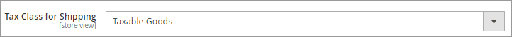
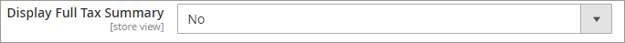
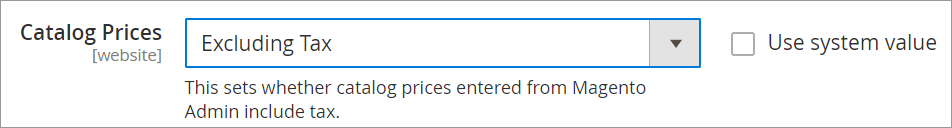
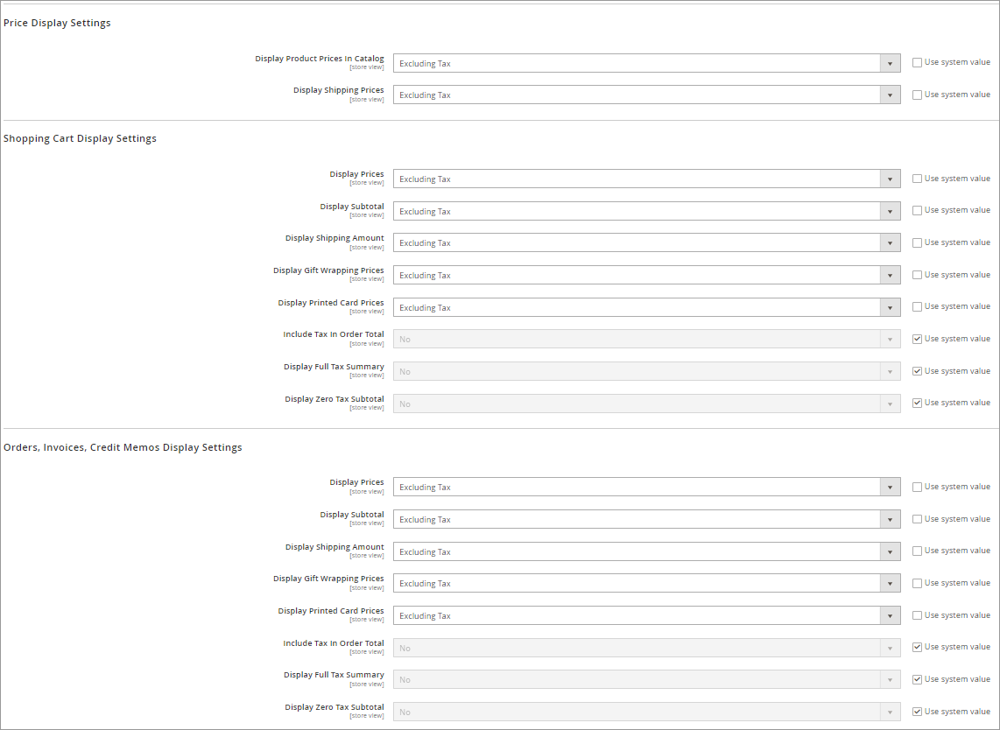
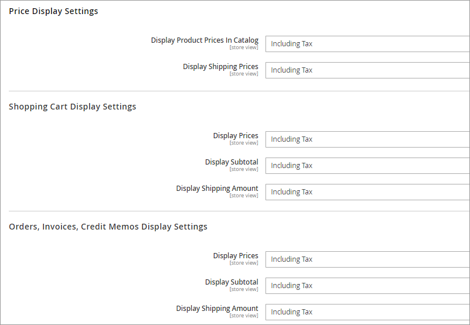
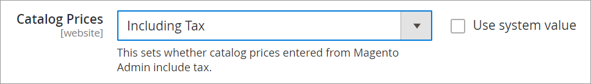

# Configuring taxes

The Digital River Extension is responsible for providing the end tax calculation for the shopper navigating the checkout. The extension supports both tax-inclusive and tax-exclusive pricing models and handles all remittance and tax liabilities to local governments globally. The transactional tax is not calculated until after the shopper confirms their billing and shipping address. Digital River does not support or allow the display of tax calculations that are not provided by Digital River. To ensure estimated tax and tax display is consistent throughout the pre-checkout pages, Digital River recommends the following configurations for tax, based on pricing models.


**Note**: Each Magento website or store should be tax-exclusive or tax-inclusive for all products and shipping. One store should not use both or a mixture of inclusive and exclusive pricing.&#x20;

**Note**: The Digital River Extension for Magento cannot be used with other Magento tax partners and payment methods.


## Tax settings

To ensure the correct display of taxes in all situations, configure your Magento tax settings as follows:

1. Select **Stores**, select **Configuration**, select **Sales**, and then click **Tax**.&#x20;
2. In the **Tax Classes** section, update **Tax Class for Shipping** to **Taxable Goods**.\
   &#x20;&#x20;
3. In the **Shopping Cart Display Settings**, keep the **Display Full Tax Summary** set to **No**.\
   &#x20;&#x20;

## Tax exclusive settings

To display tax exclusive values in your catalog, order summary, and checkout, configure your settings as follows:

1. Select **Stores**, select **Configuration**, select **Sales**, select **Tax**, and then click **Calculation Settings**.
2. Verify **Catalog Prices** is set to `Excluding Tax` —this is the default setting.\
   &#x20;&#x20;
3. On the same **Tax** page, click to expand the **Price Display Settings** section, the **Shopping Cart Display Settings** section, and the **Orders**, **Invoices**, **Credit Memos Display Settings** section. In each section, verify the following are also configured for `Excluding Tax`—these are the default settings.\
   &#x20;&#x20;
4. All prices in the catalog must be exclusive of tax.

## Tax Inclusive settings

To display tax inclusive values in your catalog, order summary, and checkout, configure your settings as follows:

1. Select **Stores**, select **Configuration**, select **Sales**, select **Tax**, and then click **Calculation Settings**.\
   &#x20;&#x20;
2. Click the **Catalog Prices** dropdown list and change the setting to `Including Tax`.\
   &#x20;&#x20;
3. On the same **Tax** page, click to expand the **Price Display Settings** section, the **Shopping Cart Display Settings** section, and the **Orders, Invoices, Credit Memos Display Settings** section. In each section, update the configuration to `Including Tax`.
