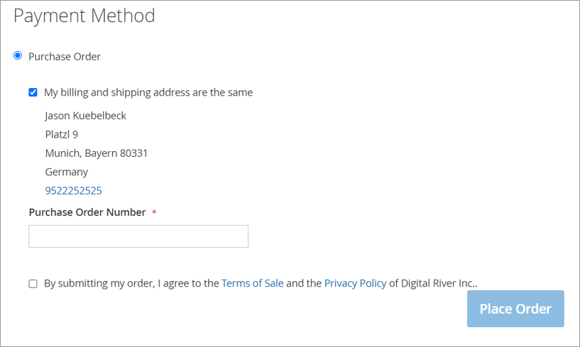

# Enabling Magento's Purchase Order payment method

To offer Magento’s native Purchase Order payment method on your stores, complete the following steps:

1. From the Magento Admin panel, select **Stores**, select **Configuration**, select **Sales**, select **Payment Methods**, and then select **Purchase Order**.
2. Set Enabled to **Yes**.

Contact your Digital River representative to discuss details of purchase order transactions.


**Note:** Digital River does not process purchase order payments. All incrementing, decrementing, dunning, collection, refunding of actual currency must be handled by the client. Orders placed using purchase order as their payment method will be created in Digital River’s systems with a payment method of `customerCredit`.


## Refunding purchase orders&#x20;

Orders placed with the Purchase Order payment method can be refunded in the Magento Admin UI, per normal Magento functionality. See note above related to the refunding of actual currency.


Magento does not display comments in the Magento admin UI for purchase order refunds. The extension follows the same behavior.

