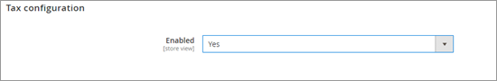
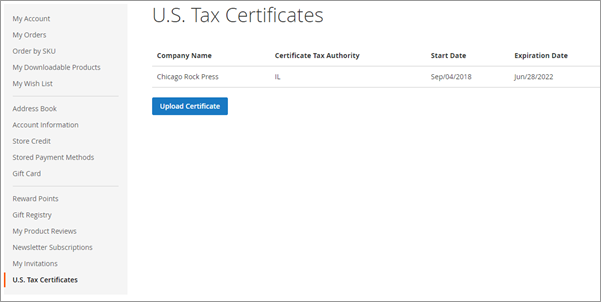
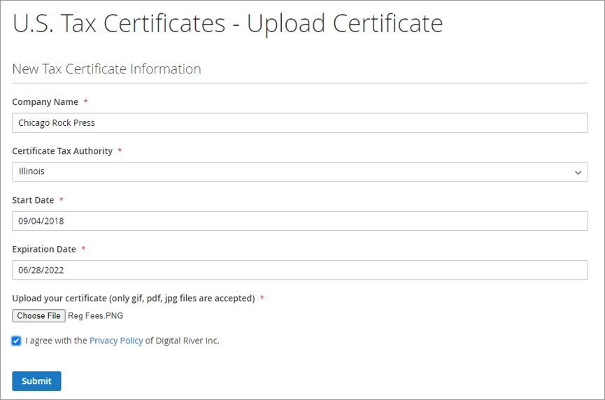

# Managing United States tax certificates

To allow shoppers to upload U.S. tax certificates, complete the following steps:

1. From the Magento Admin Panel, select **Stores**, then **Configuration,** then **Digital River Settings**.
2. Click **Tax Configuration**.
3.  Select **Yes**.

    
4. Save your configuration.
5. Clear your cache.

A shopper can upload a tax certificate by completing the following steps:

1. Log into their Magento store account.
2. Click **U.S. Tax Certificates**.
3.  Click **Upload Certificate**.

    
4. Complete the required fields in the U.S. Tax Certificates form.
5.  Click **Choose File** and select their certificate.

    
6. Select the **I agree with the Privacy Policy of Digital River Inc.** check box.
7. Click **Submit**. The uploaded tax certificate will be validated and automatically applied to any relevant transaction.
