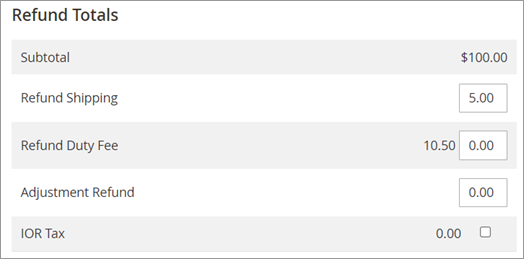

# Refunding landed costs

You can refund landed costs to the customer without refunding the items from the Credit Memo page of the Magento Admin UI. It works like any other refund.

You can refund duty fee partially or entirely by entering the desired refund amount in the Refund Duty Fee field.&#x20;

You can only refund taxes at the order level for the full amount. To refund taxes select the check box to the right of IOR Tax.

