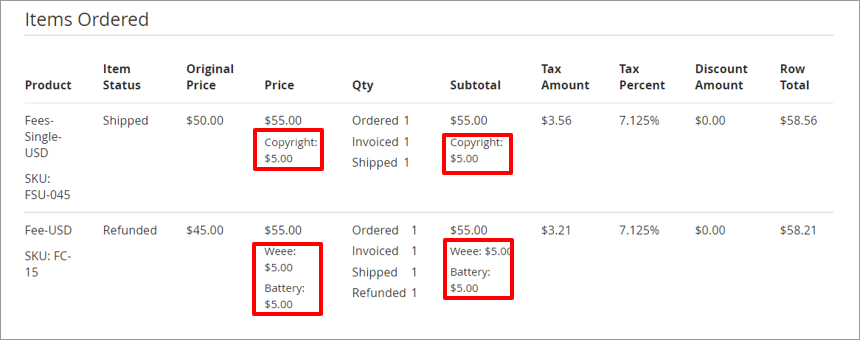

# Regulatory fee support


**Important**: Regulatory fee creation and management are outside the scope of Digital River’s Extension. Before you enable fixed product taxes, create the [regulatory fees](https://docs.digitalriver.com/digital-river-api/product-management/regulatory-fees) in Digital River’s Fee Service. [Create your own fees](https://docs.digitalriver.com/digital-river-api/product-management/regulatory-fees/managing-regulatory-fees), or work with your Digital River project manager to manage regulatory fees.



**Note:** Taxes are calculated on regulatory fees. Fees should always be created exclusive of tax.


To enable fixed product taxes in the Magento Admin interface, complete the following steps:

1. In the Admin sidebar, click **Stores**, then **Settings**, then **Configuration**.
2. In the left panel, expand Sales, and choose **Tax**.
3. Expand the Fixed Product Taxes section.
4. Set Enable FPT to **Yes**.
5. Click **Save Config**.
6. Refresh your cache.


Digital River will provide the fee name and the amount appearing in the checkout. Any names or amounts entered by you in the Magento admin will appear in all other portions of your webstore except the checkout.


## Regulatory fee display&#x20;

Regulatory fees will display in the shopper’s order totals. The fee name displayed is pulled from the `feeType` attribute in the Digital River Fee Service.


Magento does not display the fixed product tax names and amounts as line items for products configured as bundles. The extension follows the same behavior, so bundled products will not display the regulatory fee names and amounts. However, the order total will include the fee names and amounts in the order total.


Specific regulatory fees per item will appear on the order in the Magento Admin UI.

The order level regulatory fee total will appear in the Order Total column as FPT.

## **Regulatory fee refunds**

When an item containing a regulatory fee is refunded, the fee is also refunded automatically. You can **** not refund regulatory fees by themselves, but you can do an adjustment refund for the fee amount.
