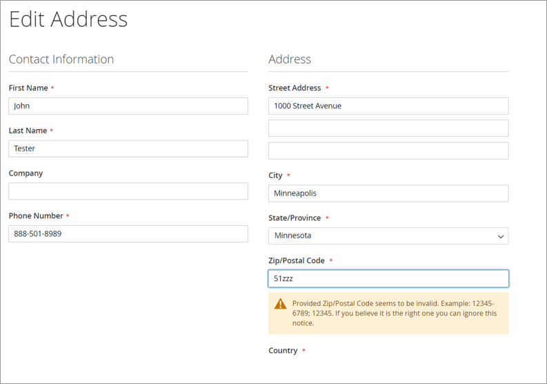

# My Account pages


**Note:** While Magento displays an error when a shopper enters an incorrect ZIP or postal code, it will allow the address to be saved with the incorrect value. This can cause Digital River Drop-in to fail to load in the checkout.


##
