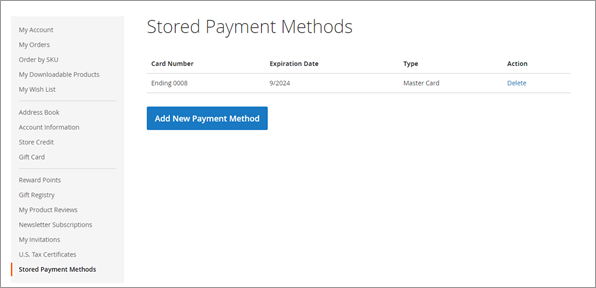
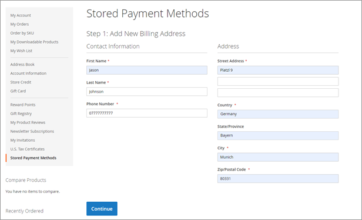
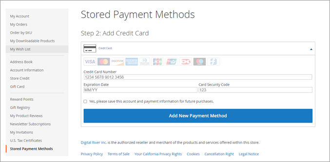
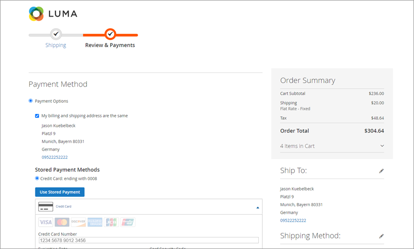

# Saving payment methods

Shoppers can save their payment methods to their account during checkout or through their store account.

## Checkout

To save a credit card during checkout, select the check box named **Yes, please** **save this account and payment information for future purchases**.&#x20;

.png>)

## My Account

To save a credit card to the shopper's account:&#x20;

1. Sign into My Account, select **Stored Payment Methods**, click **Add New Payment**. \
   \
   \

2. Enter the billing address information and click **Continue**.\
   \

3. Enter the credit card information.\
   \

4. Select the **Yes, please save this account and payment information for future purchases**, and click **Add New Payment Method**.

## Using a stored payment method

To use a stored payment method during checkout, select the radio button next to the payment method you want to use and click **Use Stored Payment**.

