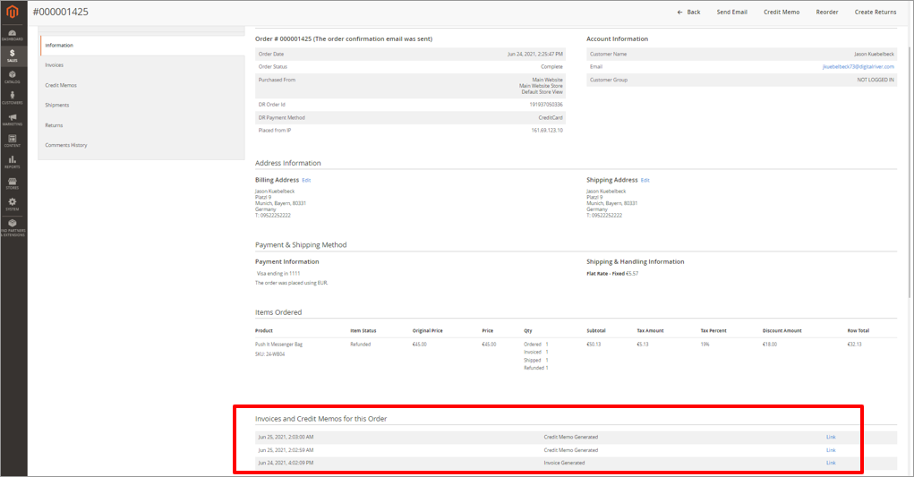

# VAT invoices and credit memos

Authenticated shoppers can find and download a PDF of their official VAT Invoices and Credit Memos on their **My Account** screen. Guest shoppers can use the **Order Lookup** screen to find and download a PDF of their official VAT Invoices and Credit Memos. As Digital River is the MOR/SOR, the official invoices must come from Digital River. To that end, the links on the **Invoice** and **Credit Memo** screens replace the standard Magento **Invoice** and **Credit Memo** display.&#x20;


**Note**: It can take up to an hour after orders have been completed or credit memos given for the links to appear on these pages.


Invoices appear on the shopper’s Invoices tab.

.png>)

Credit Memos appear on the Refunds tab.

.png>)

You can find the shopper's invoices and credit memos on the Order Information page in the Magento Admin UI.

The following image shows an example of the Digital River invoice.

.png>)
