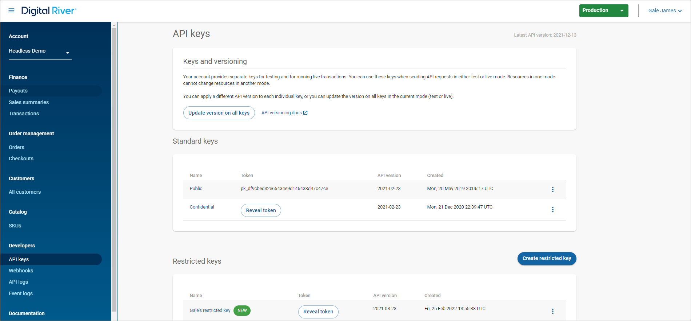

# Step 1: Retrieve API credentials

The Digital River Dashboard is your portal to your Digital River account. You can use [Dashboard](https://dashboard.digitalriver.com/login) to retrieve your API keys, view Payouts, or search API logs.&#x20;

1. Sign in to [Dashboard](https://dashboard.digitalriver.com/login).&#x20;
2. On the **API keys** page, make note of the **Standard keys** and **Restricted keys**. You will use these keys in [Step 2](step-2-configure-the-digital-river-admin-settings.md). See [Getting your API keys](https://docs.digitalriver.com/digital-river-api/administration/dashboard/developers/api-keys) in the Dashboard documentation for instructions on retrieving your API credentials. &#x20;

