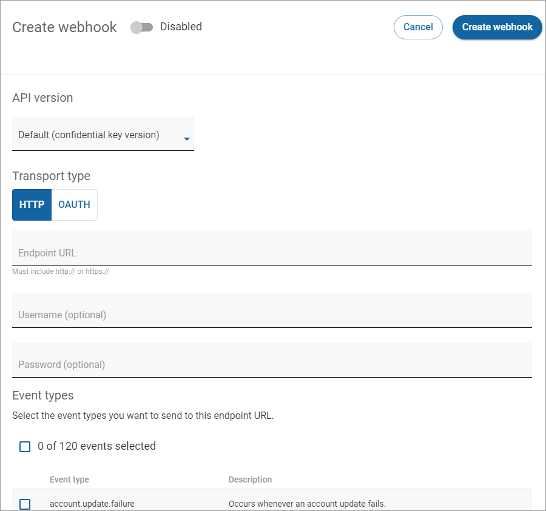

# Step 3: Create a webhook

You create webhooks to receive integration messages from Digital River. Those messages are triggered by events in Digital River’s application. When triggered, the event messaging will update the Adobe Commerce (Magento) order status (see [Exhibit B](../appendix-1.md#exhibit-b-sequence-diagram) in the Appendix section).  

Create a webhook to receive notifications using the following steps:

* [Step 3a: Open your firewall to trusted Digital River IP addresses](step-3-create-a-webhook.md#step-3a-open-your-firewall-to-trusted-digital-river-ip-addresses)
* [Step 3b: Create a webhook endpoint](step-3-create-a-webhook.md#step-3b-create-a-webhook-endpoint)
* [Step 3c: Create webhooks](step-3-create-a-webhook.md#step-3c-create-webhooks)

## Step 3a: Open your firewall to trusted Digital River IP addresses

To receive webhook notifications from Digital River, you will need to open your firewall to all the IP addresses listed in the [Digital River safelist](https://docs.digitalriver.com/digital-river-api/events-and-webhooks-1/webhooks/digital-river-safelist).

## Step 3b: Create a webhook endpoint

You can send webhook data as JSON in the POST request body. The POST request body contains the complete event details, and you can use it after parsing the JSON into an [Event ](https://www.digitalriver.com/docs/digital-river-api-reference/#tag/Events)object.

Your webhook endpoint URL should be the URL to your Magento installation + `drpay/receive` \
**Example**: `https://exmage.drgc.shop/drpay/receive`

## Step 3c: Create webhooks 

When creating webhooks, you need to add endpoints from the [Dashboard](https://dashboard.digitalriver.com):

1. From the **Webhooks** page, click **Create Webhook**.
2. Toggle **Disabled** to **Enabled**.
3. If required, select the API version you want to associate with events from the **API Version** dropdown list. By default, the confidential key version is selected.
4. Enter the URL for the endpoint in the **Endpoint URL** field.
5. Select the check box next to each event you want to associate with the endpoint or select the **Events Selected** check box to select all events. At least one event type must be selected.
6. Scroll down and click **Save**.\
     \
   Webhooks must be created for the following events:
   * `order.accepted`
   * `order.complete`
   * `order.blocked`
   * `refund.failed`
   * `order.review_opened`
   * `order.invoice.created`
   * `order.credit_memo.created`
   * `refund.failed`
   * `order.charge.refund.complete`
   * `order.charge.refund.failed`
