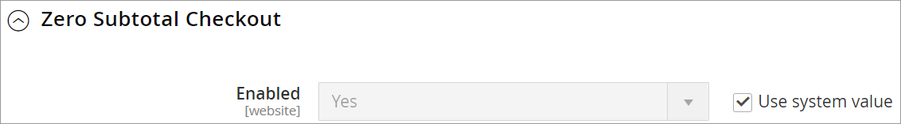
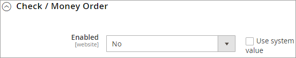
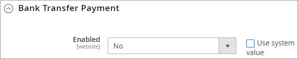
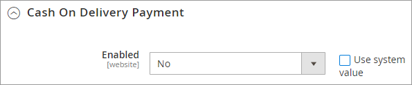
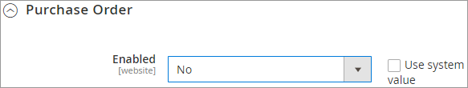
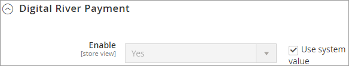

# Step 4: Configure the payment method settings

Since Digital River acts as the merchant of record on all transactions, payment methods must be configured by Digital River. Work with your Digital River representative to configure the selection and display of payment methods in the Digital River Drop-in payment integration. Enabling Digital River payment methods and other payment methods on the configuration page for the same store will result in failures.

1. From the **Magento Admin panel**, select **Stores**, select **Configuration**, select **Sales**, select **Payment Methods**.
2. In **Payment Methods**, make the following selections:
   * Select **Zero Subtotal Checkout** if you want to allow orders to use 100% store credit or gift cards.\
     
   * Select **Check/Money Order**. Then set **Enabled** to **No**.\
     
   * Select **Bank Transfer Payment**. Then set **Enabled** to **No**.
   * Select **Cash On Delivery Payment**. Then set **Enabled** to **No**.
   * Select **Purchase Order**. Then set **Enabled** to **No**. Note that the Digital River 2.3.0 extension release now supports the [Purchase Order ](enabling-magentos-purchase-order-payment-method.md)payment method. 
   * Select **Digital River Payment**. Then set **Enabled** to **Yes**. Note that you can change the title. We recommended typing `Payment Options` in the **Title** field.
