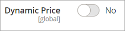
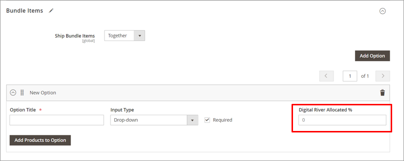

# Supporting a fixed price bundle

To calculate tax on a product bundle, Digital River needs the ECCN, tax group, tax type, and country of origin for all child products, as well as the value allocated to each child product in the bundle. For fixed price bundles, the entire product price is associated with the parent SKU. The child SKUs have no price (0) associated with them.&#x20;

Digital River added the **Digital River Allocation %** field to the catalog screens. Use this field to specify the amount of the total bundle price you want to associate with each child SKU. This field is required when you create a fixed price bundled, and set the **Dynamic Price** to **No**.

The **Digital River Allocated %** is located at the **Bundle Items** option level in the Magento catalog. It represents the percentage of the bundle price allocated to each child product. The field requires a numerical value. If your bundle product contains multiple Bundle Item Options, the value for **Digital River Allocated %** must add up to 100% across the Item Options.


**Notes:**

* We only support the Input Types **Drop Down** and **Radio Buttons**. This release does not support **Checkbox** and **Multiple Select**.
* All child products contained in your bundle must have the Digital River settings in the Magento catalog and must be [synced with the Digital River SKU Service](supporting-a-fixed-price-bundle.md#manual-catalog-sync). The parent bundle product does not need to be synced.

