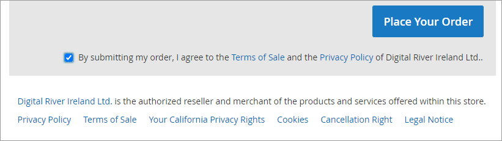

# Terms of sale, privacy policy, and acceptance

Since Digital River is the merchant of record on all transactions, our Terms of Sale, Privacy Policy, and other links must be present on checkout. No additional configuration is required. Digital River dynamically determines the appropriate Digital River selling entity for each order and displays the appropriate language, links, and check box.

See [Compliance requirements](https://docs.digitalriver.com/digital-river-api/payments/payment-integrations-1/digitalriver.js/reference/elements/compliance-elements) for more information on compliance obligations.
