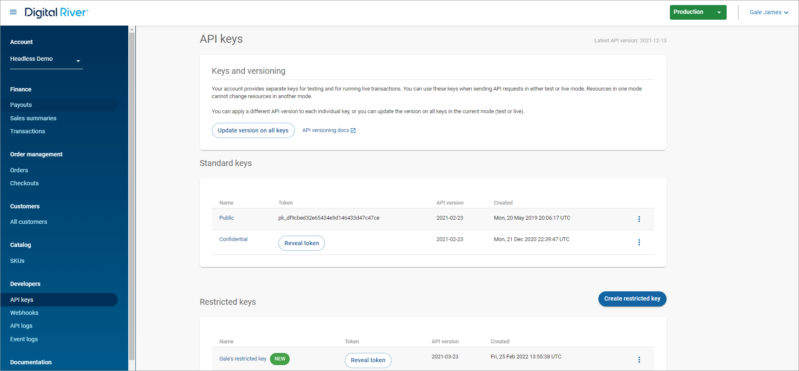
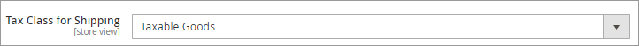
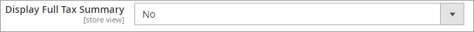
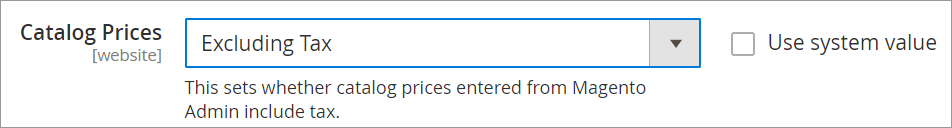
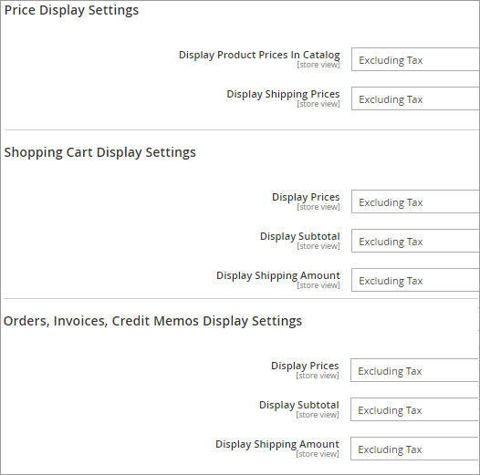
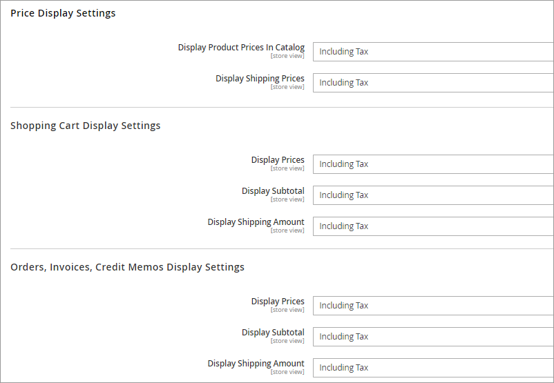
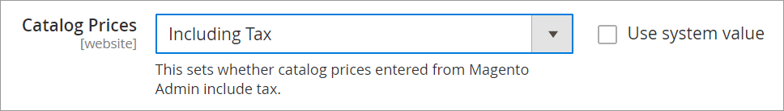
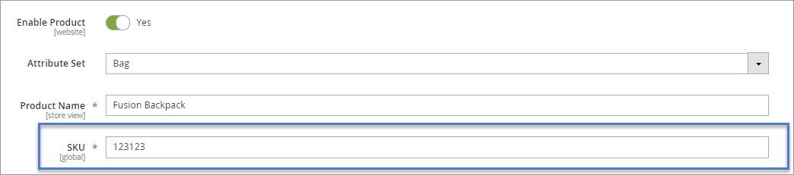
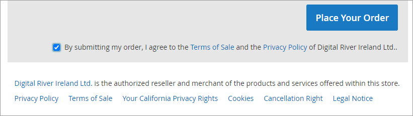

# Configure the Magento Extension

A Digital River account is required to use this extension. If you do not have a Digital River account, contact [magento@digitalriver.com](mailto:magento@digitalriver.com).

* [Step 1: Retrieve API credentials from the Digital River dashboard](configure-the-magento-extension.md#step-1-retrieve-api-credentials-from-the-digital-river-dashboard)
* [Step 2: Configure the Digital River admin settings in Magento](configure-the-magento-extension.md#step-2-configure-the-digital-river-admin-settings-in-magento)
* [Step 3: Configure the payment method settings](configure-the-magento-extension.md#step-3-configure-the-payment-method-settings)
* [Step 4: Configure other store settings in Magento](configure-the-magento-extension.md#step-4-configure-other-store-settings-in-magento)

## Step 1: Retrieve API credentials from the Digital River dashboard

The Digital River dashboard is your portal to your Digital River account. Dashboard is where you retrieve your API keys, view Payouts, or search API logs.&#x20;

Sign in to [Dashboard](https://dashboard.digitalriver.com/login). On the **API keys** page, make note of the **Standard keys** and **Restricted keys**. You will use these keys in[ Step 2](configure-the-magento-extension.md#step-2-configure-the-digital-river-admin-settings-in-magento). See [Getting your API keys](https://docs.digitalriver.com/digital-river-api/dashboard/developers/api-keys/getting-your-api-keys) in the Dashboard documentation for instructions on retrieving your API credentials.

## Step 2: Configure the Digital River admin settings in Magento

### Step 2a: Configure general settings

1. From the **Magento Admin Panel**, select **Stores**, select **Configuration**, select **Digital River Settings**, and then click **General Settings**.
2.  Click Configuration to expand it and complete the following fields:

    | Settings             | Description                                                                                                                                                                                                                                                          |
    | -------------------- | -------------------------------------------------------------------------------------------------------------------------------------------------------------------------------------------------------------------------------------------------------------------- |
    | Enabled              | Select **Yes** or **No**. By selecting **Yes**, you are electing to include all Digital River payments enabled in the **Other Payment Methods** section on the store checkout; and for all transactions to be sent and processed by Digital River per your contract. |
    | Public Key           | Enter the public API key provided by Digital River.                                                                                                                                                                                                                  |
    | Secret Key           | Enter the secret key provided by Digital River.                                                                                                                                                                                                                      |
    | Signing Secret       | Enter the signing secret provided by Digital River.                                                                                                                                                                                                                  |
    | Enable debug logging | By selecting Yes, extension errors will log debugging data.                                                                                                                                                                                                          |

### Step 2b: Catalog sync settings

1.  Click **Catalog Sync Settings** to expand it and complete the fields:

    | Settings                      | Description                                                                                                                                                                        |
    | ----------------------------- | ---------------------------------------------------------------------------------------------------------------------------------------------------------------------------------- |
    | Catalog Sync Enabled          | Select **Yes** or **No**. By selecting **Yes**, you are electing to sync your Magento catalog with the Digital River SKU Service. Ensure you have cron jobs set up and configured. |
    | Start Time                    | Set a time of day (hour:minute:second) for the sync to occur.                                                                                                                      |
    | Frequency                     | Set a frequency (Daily:Weekly:Monthly) for the sync to run.                                                                                                                        |
    | Error Email Sender            | This is the email address from which the error notification email will be sent.                                                                                                    |
    | Error Email Template          | 
Choose your email template.  <strong>Note</strong>: the default Catalog Sync Template contains file-level data that may not be included in other templates.
              |
    | Enable Debug Mode             | By selecting **Yes**, catalog syncing errors will log debugging data.                                                                                                              |
    | Error Log File Name           | The file name for the error log file.                                                                                                                                              |
    | Error Notification Via Email  | By selecting **Yes** an email will be sent when there is an error in the catalog sync job.                                                                                         |
    | Notification Email Address    | Email address to which notifications will be sent.                                                                                                                                 |
    | Catalog Batch Size Sync Limit | The number of files that will sync with each sync job. The default is 250.                                                                                                         |
2. Click **Save Config** when you are finished.

## Step 3: Configure the payment method settings

Since Digital River acts as the Merchant of Record on all transactions, payment methods must be configured by Digital River. Work with your Digital River representative to configure the selection and display of payment methods in the Digital River Drop-in payment integration. Enabling Digital River payment methods and other payment methods on the configuration page for the same store will result in failures.

From the **Magento Admin panel**, select **Stores**, select **Configuration**, select **Sales**, select **Payment Methods**, and then make the following selections:

* Select **Check/Money Order**. Then set **Enabled** to **No**.
* Select **Cash On Delivery Payment**. Then set **Enabled** to **No**.
* Select **Bank Transfer Payment**. Then set **Enabled** to **No**.
* Select **Purchase Order**. Then set **Enabled** to **No**.
* Select **Digital River Payment**. Then set **Enabled** to **Yes**.

## Step 4: Configure other store settings in Magento

From the **Magento Admin panel**, select **Stores**, then select **Configuration.**

* Select **General**, and then select **Store Information**. By default, your store address will be used as your ship from address for all transactions.
* Select **Sales**, and then select **Multishipping Settings**. Then click **No** for **Allow Shipping to Multiple Addresses**.

## Configuring taxes

The Digital River Global Commerce v. 2.1.1 Extension for Magento is responsible for providing the end tax calculation for the shopper navigating the checkout. The extension supports both tax-inclusive and tax-exclusive pricing models and handles all remittance and tax liabilities to local governments globally. The transactional tax is not calculated until after the shopper confirms their billing and shipping address. Digital River does not support or allow the display of tax calculations that are not provided by Digital River. To ensure estimated tax and tax display is consistent throughout the pre-checkout pages, Digital River recommends the following configurations for tax, based on pricing models.


**Note**: Each Magento website or store should be tax-exclusive or tax-inclusive for all products and shipping. One store should not use both or a mixture of inclusive and exclusive pricing.&#x20;

**Note**: The Magento Extension for Digital River cannot be used with other Magento tax partners.


### Tax settings

To ensure the correct display of taxes in all situations, configure your Magento tax settings as follows:

1. Select **Stores**, select **Configuration**, select **Sales**, and then click **Tax**.&#x20;
2. In the **Tax Classes** section, update **Tax Class for Shipping** to **Taxable Goods**.\
   &#x20;&#x20;
3. In the **Shopping Cart Display Settings**, keep the **Display Full Tax Summary** set to **No**.\
   &#x20;&#x20;

#### Tax exclusive settings

To display tax exclusive values in your catalog, order summary, and checkout, configure your settings as follows:

1. Select **Stores**, select **Configuration**, select **Sales**, select **Tax**, and then click **Calculation Settings**.
2. Verify **Catalog Prices** is set to `Excluding Tax` —this is the default setting.\
   &#x20;&#x20;
3. On the same **Tax** page, click to expand the **Price Display Settings** section, the **Shopping Cart Display Settings** section, and the **Orders**, **Invoices**, **Credit Memos Display Settings** section. In each section, verify the following are also configured for `Excluding Tax`—these are the default settings.\
   &#x20;&#x20;
4. All prices in the catalog must be exclusive of tax.

### Tax Inclusive settings

To display tax inclusive values in your catalog, order summary, and checkout, configure your settings as follows:

1. Select **Stores**, select **Configuration**, select **Sales**, select **Tax**, and then click **Calculation Settings**.\
   &#x20;&#x20;
2. Click the **Catalog Prices** dropdown list and change the setting to `Including Tax`.\
   &#x20;&#x20;
3. On the same **Tax** page, click to expand the **Price Display Settings** section, the **Shopping Cart Display Settings** section, and the **Orders, Invoices, Credit Memos Display Settings** section. In each section, update the configuration to `Including Tax`.

## Configuring products

Map all Magento Product SKUs to Digital River. For testing purposes only, you can assign a single Digital River SKU to any Magento demo product to allow for full end-to-end testing on your Magento demo store: “123123”. You must share all your SKU values with Digital River for Digital River to configure our payment gateway. &#x20;


**Note**: For all Digital River-initiated demo instances, any Magento product with SKU set to “123123” will work for end-to-end checkout.


Select **Catalog**, then select **Products**. Click **Edit** at the right end of the listed product you wish to edit to open a new page. Scroll down to the **Digital River** section and click to expand the section. For each product, you must define the following values prior to launching a live storefront. These values will be imported into the Digital River SKU Service and the data will be used to ensure proper taxation.

| Name              | Action                                                                                                                                                                                                                                                                                                                                                                                                                                                                                                                                                                                                                                              |
| ----------------- | --------------------------------------------------------------------------------------------------------------------------------------------------------------------------------------------------------------------------------------------------------------------------------------------------------------------------------------------------------------------------------------------------------------------------------------------------------------------------------------------------------------------------------------------------------------------------------------------------------------------------------------------------- |
| ECCN Code         | 
From the dropdown list (which is searchable), choose the ECCN that is applicable to your product, which completes the Classification number and Digital River’s Description and Notes. Notice the Notes, as they may contain important information relevant to your ECCN. If you do not find the ECCN applicable to your product, contact your Digital River account representative.

<a href="https://www.bis.doc.gov/index.php/licensing/commerce-control-list-classification/export-control-classification-number-eccn">ECCN list</a>

<a href="https://help.digitalriver.com/legal/Legal.htm#ApprovedECCNs">Approved ECCNs</a>
 |
| Tax Group         | From the dropdown list, choose the Tax Group that is applicable to your product. The Tax Group selection will determine the Tax Type options. If you have questions, contact your Digital River account representative.                                                                                                                                                                                                                                                                                                                                                                                                                             |
| Tax Type          | From the dropdown list, choose the Tax Type that is applicable to your product.                                                                                                                                                                                                                                                                                                                                                                                                                                                                                                                                                                     |
| Country of Origin | From the dropdown list, choose the Country of Origin for your product. See this [country codes list](https://www.iso.org/iso-3166-country-codes.html).                                                                                                                                                                                                                                                                                                                                                                                                                                                                                              |
| HS Code           | Enter the HS Code that is applicable to your product. This field is only used if you are set up to provide [landed costs](configure-the-magento-extension.md#enabling-landed-cost) to your shoppers. If you are interested in enabling landed costs, contact your Digital River account representative.                                                                                                                                                                                                                                                                                                                                             |


**Note**: Every product sold via the Digital River Extension for Magento will be considered Taxable Goods in the Magento production configuration screen.


### Manual catalog sync

The catalog will sync according to your Catalog Sync Settings, however, you can also sync your catalog manually. Select **Catalog**, then click **Catalog Sync Grid**, and then click **Manual Sync To Digital River**.

### Catalog sync error handling

Based on the response from Digital River the individual records in the `dr_sync_queue` will be updated as follows:

### On success

1. The `synced_to_dr_at` will be updated with the timestamp in the response field **updatedTime**.
2. The status will be updated to **Success**.
3. `Response_data` will be updated with the response received back from Digital River.

### On failure

1. The `synced_to_dr_at` will be updated with the timestamp in the response field **updatedTime**.
2. The status will be updated to **Fail** or **Pending**, depending on the error response code as listed below, and the Failure Response JSON node will be logged in the `response_data` column for tracking purposes.
   * For the **500 error**, the status will be left **Pending** so that the next time the scheduler starts it will try again to sync the data.
   * For the **400 error**, the status will be updated to **Fail**.
3. The merchant must update the product data based on the error response against that queue row.  When the merchant updates the data from **Admin**, the product will again get added in the queue with the status **Pending**, and will get synched to Digital River.
4. If there is a failure during the sync, even for a single record, then take note at the end of the sync process and try one of these adjustments, depending on the cause of failure:
   * Update the product to resolve the error.&#x20;
   * Retry the sync.


**Note**: to prevent double taxation, all of your Tax and Display settings must be set to Excluding Tax.


## Enabling landed cost

Landed costs represent the entire cost a customer must pay to purchase a product from one country and have it shipped to an address in another country. It includes product price, shipping, taxes, duties, and fees. Digital River provides an estimated landed cost for you to display to the customer and adds the cost to the order total. Digital River remits those landed costs to you. Your fulfiller relays the order to your carrier, who completes the customs paperwork, ships the package to the destination country, pays the duties and taxes on behalf of your customer, and invoices you for performing the service.

To take advantage of the landed cost feature, you'll need to complete the following steps:

* Verify your fulfiller ships packages outside their country (not all fulfillers provide this service).
* Verify your carrier offers this service. In other words, does the carrier prepay the landed costs on behalf of the customer and send the invoice to you.
* Sign an addendum in your Digital River contract to enable landed costs.
* Specify the `hsCode` parameter, which represents the Harmonized System code, when creating new SKUs or performing update or upsert operations on the SKUs in your catalog.
* Define the cross-border patterns (that is, the ship-to countries) where you want to collect landed costs.
* Provide samples of completed customs forms to Digital River's Compliance department for approval.
* Provide your Account Manager with a list of the ship from and ship to countries for which you want to enable the collection of landed costs.
* Once the feature is configured and set up, we calculate, collect, and apply landed costs to orders that contain physical goods and are shipped across borders to approved countries.

## Terms of sale, privacy policy, and acceptance check box during checkout&#x20;

Since Digital River is the Merchant of Record on all transactions, our Terms of Sale, Privacy Policy, and other links must be present on checkout. No configuration is required by the client since Digital River dynamically determines the appropriate Digital River selling entity for each order and displays the appropriate language, links, and checkboxes.

## Configuring a second website, store, or store view

The Digital River Extension for Magento is configurable by the website in the Magento Admin Panel interface. This enables administrators to offer different payment methods and different currencies to different regions.

The only field that changes is the Base Configuration locale field. Digital River will provide the locale needed to meet your language, payment, and currency requirements. Payments are also configurable via [Drop-in](https://docs.digitalriver.com/digital-river-api/payment-integrations-1/drop-in) by the website.

See [Set up multiple websites, stores, and store views in the Admin](https://devdocs.magento.com/guides/v2.3/config-guide/multi-site/ms\_websites.html) for additional information.

### Localizations and Translations

All content displayed via the Digital River Extension can be modified by adding an `/i18n` directory to the _DrPay_ folder. By default the extension supports the following languages: \[en, es, it, fr, sv, da, fi, cs, pl, hu, de, nl, pt, nl, fr] `/app/code/Digitalriver/DrPay/i18n`.

After translation files are added or updated, rerun the upgrade command:\
`$ php bin/magento setup:upgrade`

To ensure translated text is reflected on the Magento website or store view, it is important to update the locale option for that website or store view via the general Magento settings: Select **Stores**, then **Configuration**, then **Genera**l, and then click **Locale Options**.
