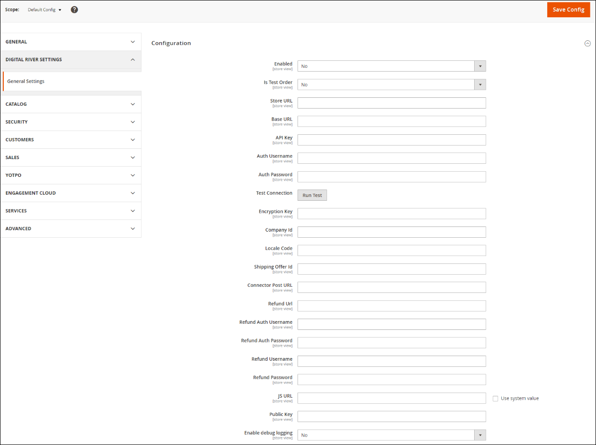

# Configure the Magento Extension

A Digital River account is required to use this extension. If you do not have a Digital River account, contact [magento@digitalriver.com](mailto:magento@digitalriver.com).

After Digital River creates your account, we will provide you with the credentials and information necessary for the configuration of the Digital River extension. The steps to configure each within the Magento application are outlined below.

* [Step 1: Configure Admin Settings in Magento Extension](configure-the-magento-extension.md#step-1-configure-admin-settings-in-magento-extension)
* [Step 2: Configure the Payment Method Settings](configure-the-magento-extension.md#step-2-configure-the-payment-method-settings)
* [Step 3: Configure the PayPal Configuration Settings](configure-the-magento-extension.md#step-3-configure-the-paypal-configuration-settings)
* [Step 4: Configure the Direct Debit Configuration Settings](configure-the-magento-extension.md#step-4-configure-the-direct-debit-configuration-settings)
* [Step 5: Configure the Apply Pay Configuration Settings](configure-the-magento-extension.md#step-5-configure-the-apple-pay-configuration-settings)
* [Step 6: Configure the Wire Transfer Configuration Settings](configure-the-magento-extension.md#step-6-configure-the-wire-transfer-configuration-settings)
* [Step 7: Configure the Klarna Configuration Settings](configure-the-magento-extension.md#step-7-configure-the-klarna-configuration-settings)
* [Step 8: Product Configuration](configure-the-magento-extension.md#step-8-product-configuration)
* [Step 9: Product Support](configure-the-magento-extension.md#step-9-product-support)
* [Step 10: Configure Tax Settings](configure-the-magento-extension.md#step-10-configure-tax-settings)

## Step 1: Configure Admin Settings in Magento Extension

1. From the **Magento Admin Panel**, select **Stores** and select **Configuration**.
2. Click the **Digital River Settings** tab to expand it.
3. Click **General Settings**.
4. Click **Configuration** to expand it and complete the **Digital River Settings** panel.\
   &#x20;&#x20;
5. Click **Save Config** when finished.

| **Settings**         | **Description**                                                                                                                                                                                                                                                                                                                                                  |
| -------------------- | ---------------------------------------------------------------------------------------------------------------------------------------------------------------------------------------------------------------------------------------------------------------------------------------------------------------------------------------------------------------- |
| Enabled              | Select **Yes** or **No**. By selecting Yes, you are electing to include all Digital River payments enabled in the OTHER PAYMENT METHODS section on the store checkout. When enabled, customers will be able to place orders with credit cards, debit cards, and PayPal.                                                                                          |
| In Test Order        | Select **Yes** or **No**. When you select No, the store UI will consider all orders processed as Live orders, and credit cards will be authorized and settled against the order amount. In a production environment, you must set the value to No. By selecting Yes, Digital River will flag orders as Test, and will not authorize credit cards for the amount. |
| Store URL            | 
Enter the store URL and Company ID provided by Digital River.  <strong>Example:</strong> http://store.digitalriver.com/store/{companyId}/
                                                                                                                                                                                                              |
| Base URL             | 
Enter the base URL received from Digital River.  <strong>Example:</strong> https://api.digitalriver.com/
                                                                                                                                                                                                                                               |
| API Key              | Enter the API key received from Digital River.                                                                                                                                                                                                                                                                                                                   |
| Auth Username        | Enter the authorized username provided by Digital River.                                                                                                                                                                                                                                                                                                         |
| Auth Password        | Enter the authorized password provided by Digital River.                                                                                                                                                                                                                                                                                                         |
| Encryption Key       | Enter the encryption key provided by Digital River.                                                                                                                                                                                                                                                                                                              |
| Shipping Offer Id    | Enter the shipping offer ID provided by Digital River. This value is required if you are selling physical goods in your Magento store.                                                                                                                                                                                                                           |
| Company Id           | Enter the company ID provided by Digital River.                                                                                                                                                                                                                                                                                                                  |
| Locale Code          | Enter the locale code provided by Digital River.                                                                                                                                                                                                                                                                                                                 |
| Connector Post URL   | 
Enter the connector post URL provided by Digital River.  <strong>Example:</strong> https://drh-ods.digitalriver.com/integration/job/request /ElectronicFulfillmentNotice/{companyId}/company/
                                                                                                                                                          |
| Refund URL           | 
Enter the refund URL provided by Digital River.  <strong>Example:</strong> https://api.digitalriver.com/
                                                                                                                                                                                                                                               |
| Refund Auth Username | Enter the authorized refund username provided by Digital River.                                                                                                                                                                                                                                                                                                  |
| Refund Auth Password | Enter the authorized refund password provided by Digital River.                                                                                                                                                                                                                                                                                                  |
| Refund Username      | Enter the refund username provided by Digital River.                                                                                                                                                                                                                                                                                                             |
| Refund Password      | Enter the refund password provided by Digital River.                                                                                                                                                                                                                                                                                                             |
| JS URL               | 
Enter the JS URL provided by Digital River.

<strong>Example:</strong> https://js.digitalriverws.com/v1/DigitalRiver.js
                                                                                                                                                                                                                              |
| Public Key           | Enter the public key provided by Digital River.                                                                                                                                                                                                                                                                                                                  |
| Enable debug logging | By selecting Yes, extension errors will provide debugging information in the storefront during testing.                                                                                                                                                                                                                                                          |

**Note:** Before configuring the Payment Methods, check to confirm Check / Money Order is disabled in the Payments Section. The Digital River extension cannot be used with other Magento payment partners.

## Step 2: Configure the Payment Method Settings

1. From the Magento Admin Panel, select **Stores** and select **Configuration**.
2. Click the **Sales** tab and select **Payment Methods**.
3. After the Merchant Location panel loads, scroll down to **Other Payment Methods**.
4. Digital River Extension offers: Credit Card, PayPal, Direct Debit, Apple Pay, Wire Transfer, and Klarna.
5. Click **Save Config** when finished.

| Settings                          | Description                                                                                                                          |
| --------------------------------- | ------------------------------------------------------------------------------------------------------------------------------------ |
| Enable Credit Card Payment        | Select **Yes** or **No**. By selecting Yes, you are electing to display the payment method on the storefront.                        |
| JS URL                            | 
Enter the JS URL provided by Digital River. 

<strong>Example:</strong> https://js.digitalriverws.com/v1/DigitalRiver.js
 |
| Public Key                        | Enter the public key provided by Digital River.                                                                                      |
| Title                             | This will be the label shown on the storefront for this payment.                                                                     |
| Sort Order                        | Sort the Credit Card payment method relative to the Digital River PayPal Configuration.                                              |
| Payment from Applicable Countries | Select the appropriate value to allow payment from applicable countries.                                                             |
| Payment from Specific Countries   | Select the appropriate value to allow payment from specific countries.                                                               |
| Allow Currencies                  | Select the appropriate currencies for your store.                                                                                    |
| Instructions                      | Enter any information about entering Payment Method information you want to provide the customer.                                    |

## Step 3: Configure the PayPal Configuration Settings

1. From the Magento Admin Panel, select **Stores** and then select **Configuration**.
2. Click the **Sales** tab and select **Payment Methods**.
3. After the Merchant Location panel loads, scroll down to **Other Payment Methods**.
4. Expand **Digital River PayPal Configuration** and configure the settings.
5. Click **Save Config** when finished.

| Settings                          | Description                                                                                                                          |
| --------------------------------- | ------------------------------------------------------------------------------------------------------------------------------------ |
| Enable PayPal Payment             | Select **Yes** or **No**. By selecting Yes, you are electing to display the payment method on the storefront.                        |
| JS URL                            | 
Enter the JS URL provided by Digital River. 

<strong>Example:</strong> https://js.digitalriverws.com/v1/DigitalRiver.js
 |
| Public Key                        | Enter the public key provided by Digital River.                                                                                      |
| Title                             | This will be the label shown on the storefront for this payment.                                                                     |
| Sort Order                        | Sort the PayPal payment method relative to the Digital River PayPal Configuration.                                                   |
| Payment from Applicable Countries | Select the appropriate value to allow payment from applicable countries.                                                             |
| Payment from Specific Countries   | Select the appropriate value to allow payment from specific countries.                                                               |
| Allow Currencies                  | Select the appropriate currencies for your store.                                                                                    |
| Instructions                      | Enter any information about entering PayPal information you want to provide the customer.                                            |

## Step 4: Configure the Direct Debit Configuration Settings

**Important:** Direct Debit requires additional configuration by Digital River before you can use it. Contact your Digital River Representative before you enable Direct Debit to ensure it is properly configured.

1. From the Magento Admin Panel, select **Stores** and select **Configuration**.
2. Click the **Sales** tab and select **Payment Methods**.
3. After the Merchant Location panel loads, scroll down to **Other Payment Methods**.
4. Expand **Digital River Direct Debit Configuration** and configure the settings.
5. Click **Save Config** when finished.

| Settings                          | Description                                                                                                                                                                                   |
| --------------------------------- | --------------------------------------------------------------------------------------------------------------------------------------------------------------------------------------------- |
| Enable Direct Debit Payment       | Select **Yes** or **No**. By selecting Yes, you are electing to display the payment method on the storefront.                                                                                 |
| JS URL                            | 
Enter the JS URL provided by Digital River. 

<strong>Example:</strong> https://js.digitalriverws.com/v1/DigitalRiver.js
                                                          |
| Public Key                        | Enter the public key provided by Digital River.                                                                                                                                               |
| Title                             | This will be the label shown on the storefront for this payment.                                                                                                                              |
| Sort Order                        | Sort the Direct Debit payment method relative to the other Digital River payments configured.                                                                                                 |
| Payment from Applicable Countries | Select the appropriate value to allow payment from applicable countries.                                                                                                                      |
| Payment from Specific Countries   | Select the appropriate value to allow payment from specific countries. See the **Direct Debit Country** list in Appendix [Exhibit A](appendix.md#exhibit-a-direct-debit-supported-countries). |
| Allow Currencies                  | Select EURO only from the allowed list for your store.                                                                                                                                        |
| Instructions                      | Enter any information about entering Direct Debit information you want to provide the customer.                                                                                               |

## Step 5: Configure the Apple Pay Configuration Settings

**Important:** Apple Pay is only available from Apple devices. It will not appear on non-Apple devices. Apple Pay requires additional configuration by Digital River before you can use it. Contact your Digital River Representative before you enable Apple Pay to ensure it is properly configured.

1. From the Magento Admin Panel, select **Stores** and select **Configuration**.
2. Click the **Sales** tab and select **Payment Methods**.
3. After the Merchant Location panel loads, scroll down to **Other Payment Methods**.
4. Expand **Digital River Apple Pay Configuration** and configure the settings.
5. Click **Save Config** when finished.

| Settings                          | Description                                                                                                                                                                                           |
| --------------------------------- | ----------------------------------------------------------------------------------------------------------------------------------------------------------------------------------------------------- |
| Enable Apple Pay Payment          | Select **Yes** or **No**. By selecting Yes, you are electing to display the payment method on the storefront.                                                                                         |
| JS URL                            | 
Enter the JS URL provided by Digital River. 

<strong>Example:</strong> https://js.digitalriverws.com/v1/DigitalRiver.js
                                                                  |
| Public Key                        | Enter the public key provided by Digital River.                                                                                                                                                       |
| Title                             | This will be the label shown on the storefront for this payment.                                                                                                                                      |
| Sort Order                        | Sort the Apple Pay payment method relative to the other Digital River payments configured.                                                                                                            |
| Payment from Applicable Countries | Select the appropriate value to allow payment from applicable countries.                                                                                                                              |
| Payment from Specific Countries   | Select the appropriate value to allow payment from specific countries. For more information, see **Supported Countries** (Appendix [Exhibit C](appendix.md#exhibit-c-apple-pay-supported-countries)). |
| Allow Currencies                  | Select the appropriate currencies for your store. For more information, see **Supported Currencies** (Appendix [Exhibit B](appendix.md#exhibit-b-apple-pay-supported-currencies)).                    |
| Instructions                      | Enter any information about entering Apple Pay information you want to provide the customer.                                                                                                          |

## Step 6: Configure the Wire Transfer Configuration Settings

1. From the Magento Admin Panel, select **Stores** and select **Configuration**.
2. Click the **Sales** tab and select **Payment Methods**.
3. After the Merchant Location panel loads, scroll down to **Other Payment Methods**.
4. Expand **Digital River Wire Transfer Configuration** and configure the settings.
5. Click **Save Config** when finished.

| Settings                          | Description                                                                                                                                                                                               |
| --------------------------------- | --------------------------------------------------------------------------------------------------------------------------------------------------------------------------------------------------------- |
| Enable Wire Transfer Payment      | Select **Yes** or **No**. By selecting Yes, you are electing to display the payment method on the storefront.                                                                                             |
| JS URL                            | 
Enter the JS URL provided by Digital River. 

<strong>Example:</strong> https://js.digitalriverws.com/v1/DigitalRiver.js
                                                                      |
| Public Key                        | Enter the public key provided by Digital River.                                                                                                                                                           |
| Title                             | This will be the label shown on the storefront for this payment.                                                                                                                                          |
| Sort Order                        | Sort the Wire Transfer payment method relative to the other Digital River payments configured.                                                                                                            |
| Payment from Applicable Countries | Select the appropriate value to allow payment from applicable countries.                                                                                                                                  |
| Payment from Specific Countries   | Select the appropriate value to allow payment from specific countries. For more information, see **Supported Countries** (Appendix [Exhibit E](appendix.md#exhibit-e-wire-transfer-supported-countries)). |
| Allow Currencies                  | Select the appropriate currencies for your store. For more information, see **Supported Currencies** (Appendix [Exhibit D](appendix.md#exhibit-d-wire-transfer-supported-currencies)).                    |
| Instructions                      | Enter any information about entering Apple Pay information you want to provide the customer.                                                                                                              |

## Step 7: Configure the Klarna Configuration Settings

1. From the Magento Admin Panel, select **Stores** and select **Configuration**.
2. Click the **Sales** tab and select **Payment Methods**.
3. After the **Merchant Location** panel loads, scroll down to **Other Payment Methods**.
4. Expand **Digital River Klarna Configuration** and configure the settings.
5. Click **Save Config** when finished.

| Settings                          | Description                                                                                                                                                                                                       |
| --------------------------------- | ----------------------------------------------------------------------------------------------------------------------------------------------------------------------------------------------------------------- |
| Enable Klarna Payment             | Select **Yes** or **No**. By selecting Yes, you are electing to display the payment method on the storefront.                                                                                                     |
| JS URL                            | 
Enter the JS URL provided by Digital River. 

<strong>Example:</strong> https://js.digitalriverws.com/v1/DigitalRiver.js
                                                                              |
| Public Key                        | Enter the public key provided by Digital River.                                                                                                                                                                   |
| Title                             | This will be the label shown on the storefront for this payment.                                                                                                                                                  |
| Sort Order                        | Sort the Klarna payment method relative to the other Digital River payments configured.                                                                                                                           |
| Payment from Applicable Countries | Select the appropriate value to allow payment from applicable countries.                                                                                                                                          |
| Payment from Specific Countries   | Select the appropriate value to allow payment from specific countries. For more information, see **Supported Countries** (Appendix [Exhibit F](appendix.md#exhibit-f-klarna-supported-countries-and-currencies)). |
| Allow Currencies                  | Select the appropriate currencies for your store. For more information, see **Supported Currencies** (Appendix [Exhibit F](appendix.md#exhibit-f-klarna-supported-countries-and-currencies)).                     |
| Instructions                      | Enter any information about entering Apple Pay information you want to provide the customer.                                                                                                                      |

## Step 8: Product Configuration

All Magento product SKUs will need to be mapped to Digital River. For testing purposes only, you can assign a single Digital River SKU to any Magento demo product to allow for full end-to-end testing on your Magento demo store: “123123”. Clients will need to share all their SKU values with Digital River in order for Digital River to configure our payment gateway. &#x20;


**Note:** For all Digital River-initiated demo instances, any Magento product with SKU set to “123123” will work for end-to-end checkout.


## Step 9: Product Support

Static Bundles are not supported via the Digital River extension due to Digital River’s requirement, as Seller of Record/Merchant of Record, to tax each line-item within the bundle.&#x20;


**Note:** Dynamic bundles are supported because the tax is calculated for each item in the bundle. Static bundles sum the price of each line-item to a top-level container product, which prevents Digital River’s extension from ensuring the proper tax is calculated at an individual line item level.


## Step 10: Configure Tax Settings

For each product clients will need to define the following values prior to launching a live storefront. These values will be imported into the Digital River tax application to ensure proper taxation.

* **Tax Group, Type, and Code**: See Appendix [Exhibit G](appendix.md#exhibit-g-eligible-tax-group-type-and-code) for approved tax codes.
* **Export Control Classification Number** (ECCN). \
  See [https://www.bis.doc.gov/index.php/licensing/commerce-control-list-classification/export-control-classification-number-eccn.0](https://www.bis.doc.gov/index.php/licensing/commerce-control-list-classification/export-control-classification-number-eccn.0).\
  Approved ECCNs can be found [here](https://help.digitalriver.com/legal/Legal.htm#ApprovedECCNs).
* **Country of Origin**: Country where the product was manufactured or originated. \
  See [https://www.iso.org/iso-3166-country-codes.html](https://www.iso.org/iso-3166-country-codes.html).


**Note:** Every product sold via the Digital River extension will be considered Taxable Goods in the Magento production configuration screen.

