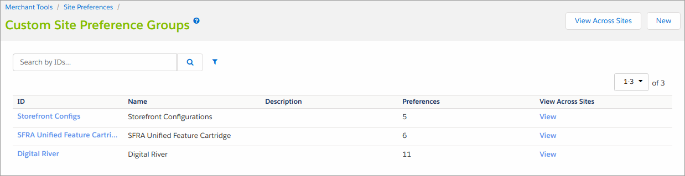
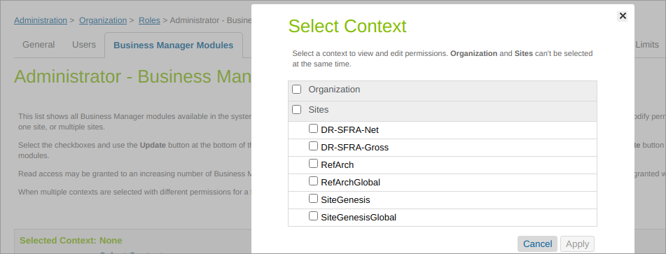
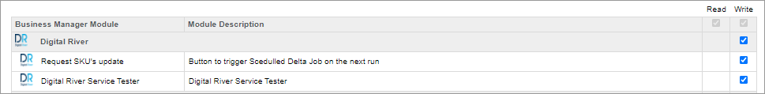

# Configure the Salesforce B2C LINK Cartridge

## Custom site preferences

After successfully importing the metadata, select **BM Merchant Tools**, select **Site Preferences**, and then select **Custom Preferences** to see **Custom Site Preferences Groups**.

Click **Digital River** to see the cartridge setup fields.&#x20;

| Field Title                            | Description                                                                                                                                                                                                                                                                                                                                                            |
| -------------------------------------- | ---------------------------------------------------------------------------------------------------------------------------------------------------------------------------------------------------------------------------------------------------------------------------------------------------------------------------------------------------------------------- |
| Enable Digital River                   | Turns on/off Digital River integration.                                                                                                                                                                                                                                                                                                                                |
| \*API Key                              | Digital River publishable API key.                                                                                                                                                                                                                                                                                                                                     |
| \*Digital River public key             | Your public API key.                                                                                                                                                                                                                                                                                                                                                   |
| Webhook Signature Token                | 
The signing secret (signature token) used by the <a href="https://docs.digitalriver.com/digital-river-api/administration/dashboard/developers/webhooks">webhooks</a> to send notifications for events such as a refund event from SFCC endpoints. Each webhook has a unique signing secret.

Each site is configured with a single endpoint URI and token.
 |
| Digital River ship from country        | The ship-from country for physical products. You can only configure a single ship from country per site under Site Preferences in the Business Manager.                                                                                                                                                                                                                |
| Digital River ship from state          | The ship-from state for physical products.                                                                                                                                                                                                                                                                                                                             |
| Digital River ship from city           | The ship-from city for physical products.                                                                                                                                                                                                                                                                                                                              |
| Digital River ship from address line 1 | The ship-from address line 1 for physical products.                                                                                                                                                                                                                                                                                                                    |
| Digital River ship from address line 2 | The ship-from address line 2 for physical products.                                                                                                                                                                                                                                                                                                                    |
| Digital River ship from postal code    | The ship-from postal code for physical products.                                                                                                                                                                                                                                                                                                                       |
| Modified SKUs update requested         | The custom attribute (flag) updated from the Business Manager extension.                                                                                                                                                                                                                                                                                               |
| All SKUs update requested              | The custom attribute (flag) updated from the Business Manager extension.                                                                                                                                                                                                                                                                                               |
| Enable US Tax exemptions               | Enable processing of tax certificates.                                                                                                                                                                                                                                                                                                                                 |
| Technical Email Address                | The email address where the webhook notifications will be sent.                                                                                                                                                                                                                                                                                                        |
| Digital River Default Entity           | The default selling entity used for compliance. Note that this value must match the [selling entity](https://docs.digitalriver.com/digital-river-api/checkouts-and-orders/shared-properties/selling-entities) format expected by the Digital River API and will be provided by Digital River.                                                                          |

\*Digital River provides the values for these fields.

## Business Manager roles and permissions

To enable the Digital River Business Manager extensions, add the **Write** permission to the targeted access role. This is optional to enable the **Digital River Service Checker** and **Request SKUs** to update the modules.

In Business Manager, select **Administration**, and then select **Roles and Permissions**. To add the Digital River modules to a role, click the role you want to modify (or create a new one). Then click one or more checkboxes to select the **Business Manager** modules for that role.

In the next menu, add the **Write** permission to the Digital River group as indicated below.

See [Business Manager](configure-the-salesforce-b2c-link-cartridge.md#business-manager) for more information about Digital River modules.

Lastly, the order status update job must be able to access the order to update the status of the order properly. To enable this job to function properly, you must change the site settings.

1. Select **Merchant Tools**, select **Site Preferences**, and click **Order**.
2. Set **Limit Storefront Order Access** to **No**.
3. Set **Storefront Order Filter by Customer Session** to **No**.&#x20;

## Updating shipping methods to support digital products

In order to meet the SFCC requirement to have a shipping method for creating an order, add a dedicated digital shipping method for digital products with a specified price amount. Set the **Exclusions** of the shipping method (as shown below). &#x20;

Ensure that if the basket contains the products without the custom attribute`drDigitalProduct`and products where that attribute is set to`false`, this digital shipping method will not be applicable. Therefore, customers are unable to select this shipping method for mixed and non-digital carts.


**Note**: All other existing shipping methods should be also configured so that they are not shown when there are only digital products in the basket. &#x20;


