# Configure the WordPress Plugin

After initial installation (Steps 1, 2, and 3), continue following the steps below to customize and configure the WordPress Plugin.

* [Step 4: Configure the plugin](configure-the-wordpress-plugin.md#step-4-configure-the-plugin)
* [Step 5: Add the menu to the header](configure-the-wordpress-plugin.md#step-5-add-the-menu-to-the-header)
* [Step 6: Set up Global Commerce content and style](configure-the-wordpress-plugin.md#step-6-set-up-global-commerce-content-and-style)

## Step 4: Configure the plugin

### Step 4a: General tab

1. Click Digital River to open the **Settings** page.
2. On the **General** tab, enter your Site ID, API Key, API Secret, Domain, Payment Services API Plugin Key, Username, and Password. \
   &#x20;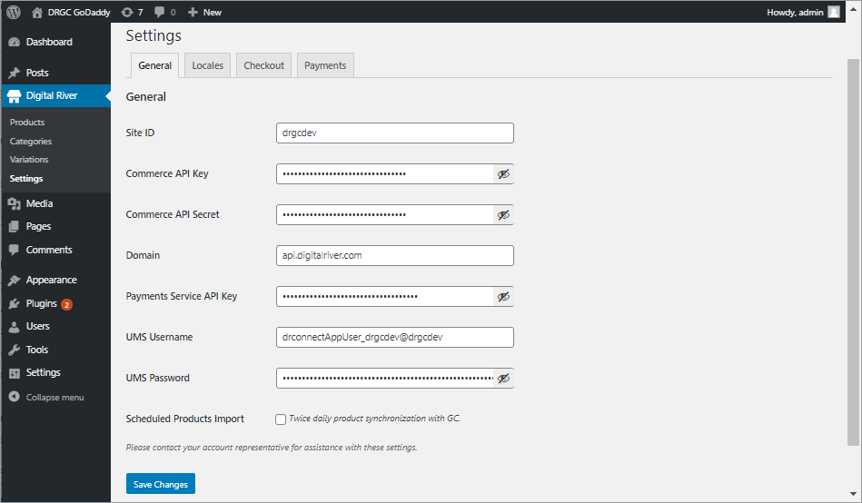 \
   Choose whether you want to run a scheduled product import or import your products manually. Leave the box unchecked to import manually. For a scheduled import, click the check box to set the import schedule. The import occurs twice daily to import and sync products every 12 hours (12 hours from the time the box is checked and the time is set).

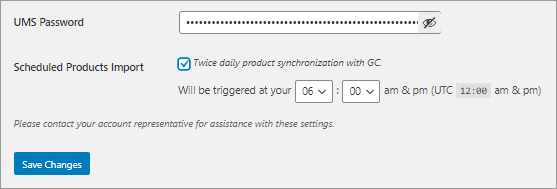

### Step 4b: Locale tab

Set up to eight locales (synched with language and currencies) on the **Locale** tab to enable localization. (Built-in translation is supported but it is an expectation that the client will audit and customize their own translated content.)

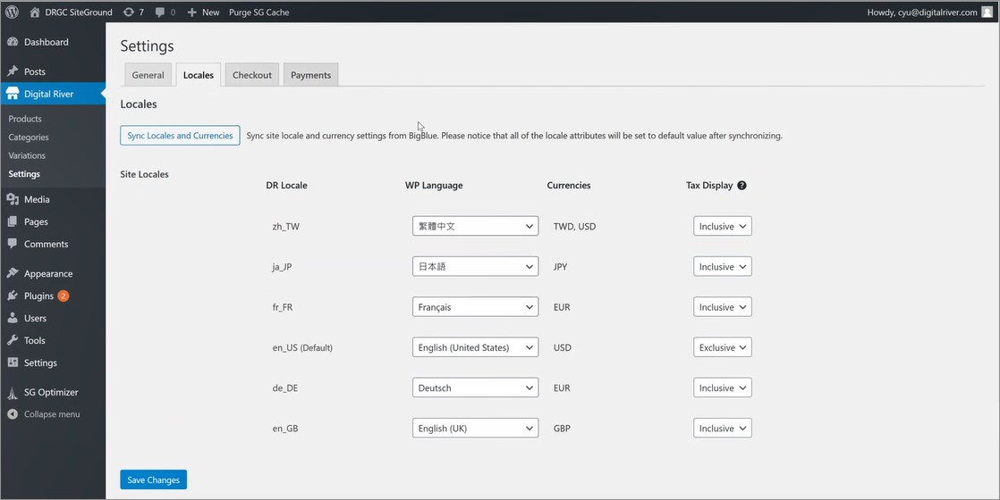

The column at the far right is labeled "Tax Display" Hover over the question mark icon to display the following description: "For the locales with tax-exclusive/inclusive price lists but still need to present tax-inclusive/exclusive prices at storefront." Please contact Digital River or your SI partner to set up tax/locale for the first time.

Note that each locale presents a dropdown menu in the Tax Display column to choose either Inclusive or Exclusive tax display.&#x20;

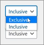

#### URL Redirects for the Home Page

URL Redirects can now be customized to remain in the user’s locale during site navigation. To keep the chosen locale, find the code on the Appearance tab as shown in the image below.

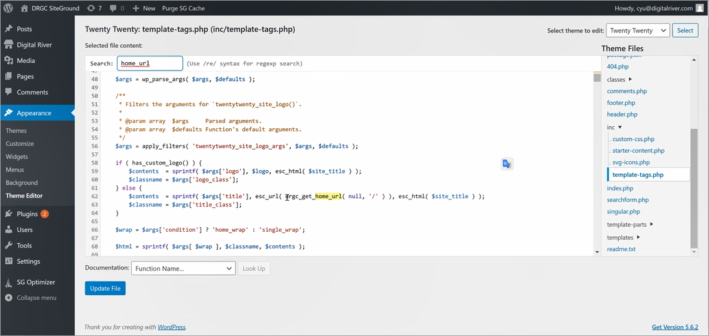

In the code page for the template or your theme, edit the code to include "**drcg\_**" __ before "**get\_home\_url**" as shown in the following image:

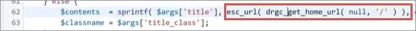

### Step 4c: Checkout tab

On the **Checkout** tab, check the boxes and click **Save Changes** to choose to:

* Enable a test order
* Display pricing as tax exclusive on the checkout flow
* Display the short description along with the product name

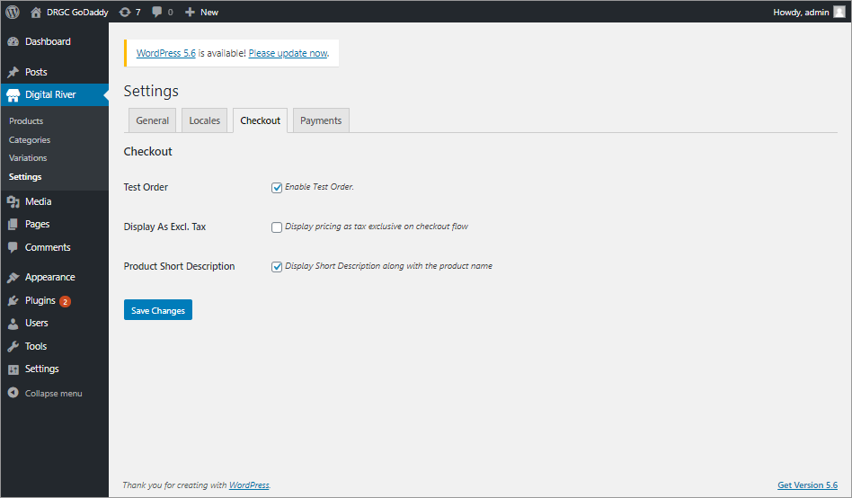

#### Test Order

Click the check box to set up a working test order. A test order helps you evaluate the flow of placing an order in your WordPress plugin site, including testing the use of payment methods such as credit cards. Test orders display a label at the top of the page, "This is a test order."&#x20;

#### Global Tax management

The plugin supports Global Tax management. Registered shoppers in the U.S. locale can apply their tax exemption in the checkout flow. When enabled for the storefront, a shopper (non-U.S. locale) can apply their "Tax Identifier" in the checkout flow. &#x20;


For non-U.S. locales, Tax ID is VAT ID at checkout. A valid ID is required and will be validated. The checkout flow displays according to your settings. The following images show a U.S. Checkout example (with tax authority specified) followed by an E.U. Checkout example.


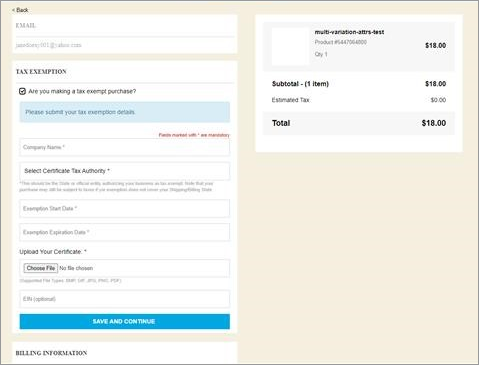

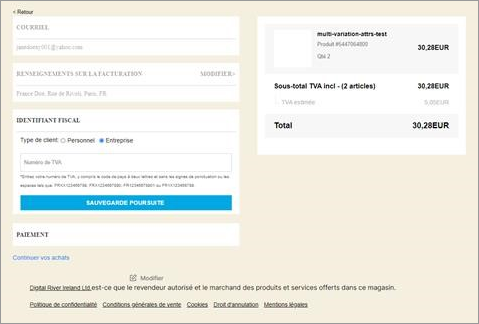

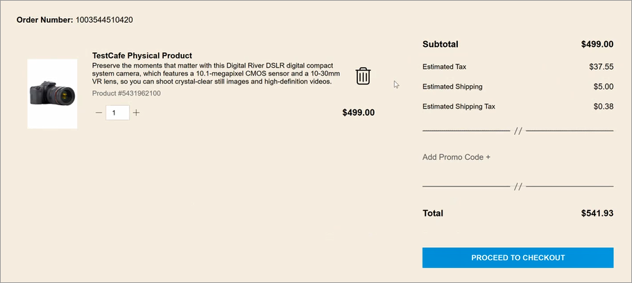

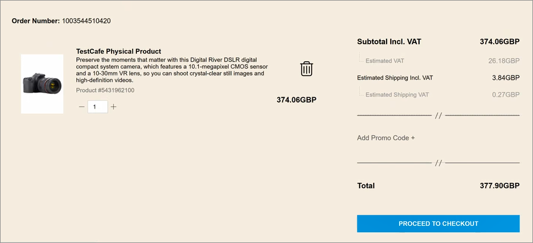

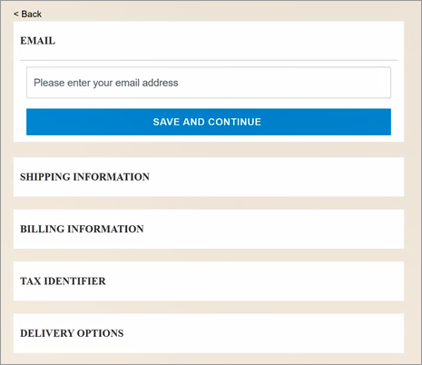

### Step 4d: Payments tab

Multiple payment types are available, such as credit cards, Apple Pay, Google Pay, PayPal, and others. Sample code can be found on the [Digitalriver.js](https://docs.digitalriver.com/commerce-api/payment-integrations-1/digitalriver.js) and [Drop-in](https://docs.digitalriver.com/commerce-api/payment-integrations-1/drop-in) documentation pages. Your Checkout page will reflect the payment types you choose to have configured for your API keys. On the **Payments** tab, click **Save Changes** to save your settings.

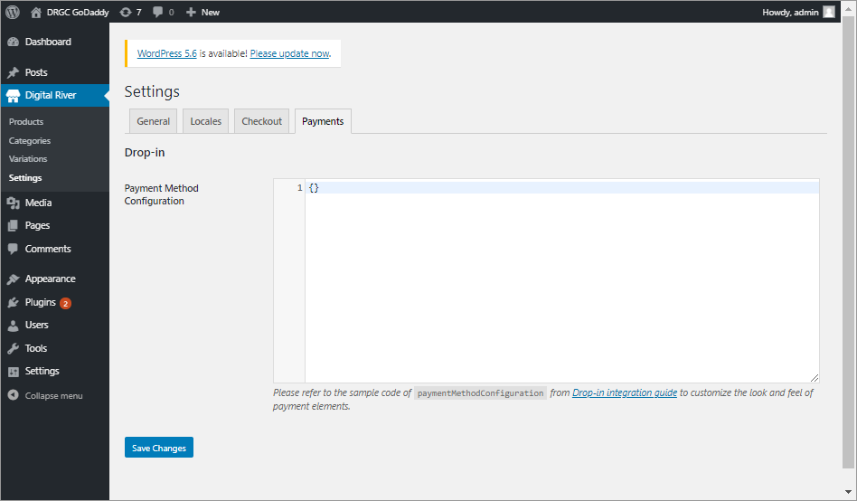

### Step 4e: Products&#x20;

1. Click **Digital River** and select **Products**.
2. To import products manually, click **Import Products** and view a progress bar during the import. \
   &#x20;&#x20;
3. Once imported, you can see your entire product catalog, including details like currencies, locales, and categories.\
   &#x20;&#x20;


**Important**: You can only update products in Global Commerce. Once updated, you must manually sync them with WordPress. See [Edit your product](configure-the-wordpress-plugin.md#edit-your-product) for instructions on updating the product.

To import updated products, you must click **Import Products** on the Digital River Products page to manually sync the product updates you made in Global Commerce.


## Step 5: Add the menu to the header

1. Click **Appearance**, click **Menus**, and then click the **Edit Menus** tab if it is not already selected. (Note that you can add a new menu by clicking **create a new menu**, which helps you name and build a new menu.)
2. In the Add menu items group, expand the **Product Categories** menu. Click either the **Most Used** or **View All** tab, and click the **Product Categories** check boxes for the menu items you want to display. Then click **Add to Menu**.\
   &#x20;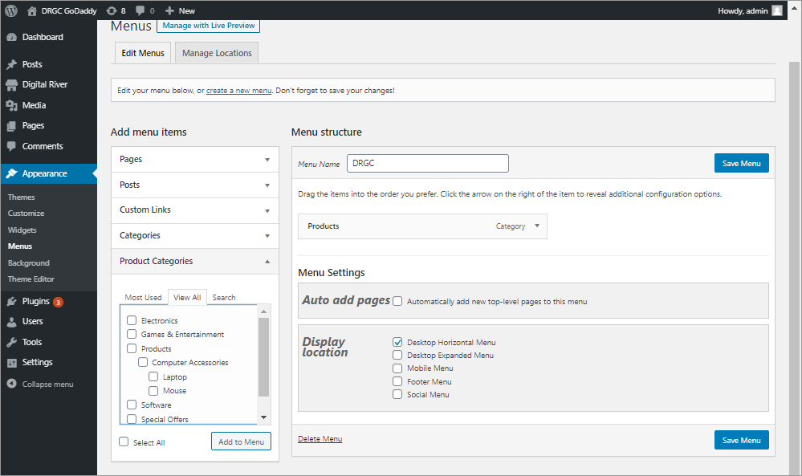 &#x20;
3.  The new choices now appear In the Menu structure group.

    Use drag and drop to arrange your menu items in the order you want them to appear.\
    &#x20;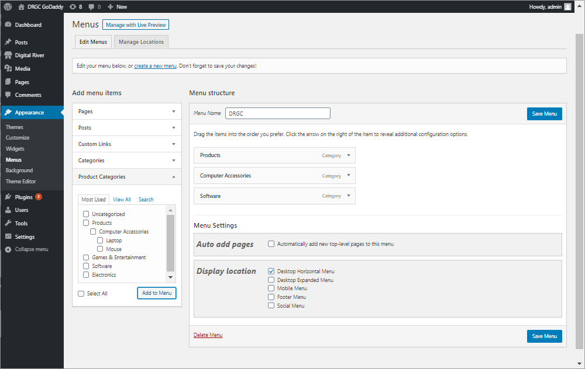&#x20;
4. In the Menu Settings group, click to select the **Auto add pages** option. In the Display location group, click one or more display locations for the menu.  &#x20;
5. When you are finished, click **Save Menu** to save your changes.
6. Verify the menu appears on the Home page.


**Tip**:  If you get a 404 error for the Category or Product Detail page, refresh your permalinks by clicking **Settings**, selecting **Permalinks**, and clicking **Save Changes**. Note that you don't need to make any changes. (Refer to [https://wordpress.stackexchange.com/questions/156978/custom-post-type-single-page-returns-404-error#answer-261763](https://wordpress.stackexchange.com/questions/156978/custom-post-type-single-page-returns-404-error#answer-261763) for additional details.)


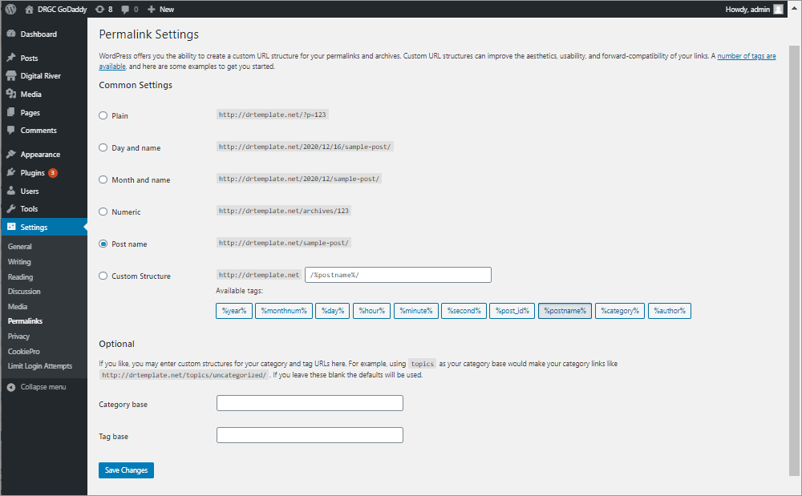

## **Step 6: Set up Global Commerce content and style**

### **Edit your product**


**Important**: We disabled all the functions of editing products and categories in WordPress. You need to access Global Commerce to edit your product or category first, then return to the Digital River Products page in WordPress and click **Import Products** to sync the data.

Note that WordPress only syncs products assigned to the category.


1. Click **Digital River** and select **Products**.
2. To locate the product you want to edit, enter the product title in the search field, and click **Search Products**.
3. Click the title of the product you want to edit.
4. Scroll to and then click the **Manage Products** link to go to Global Commerce.\
   &#x20;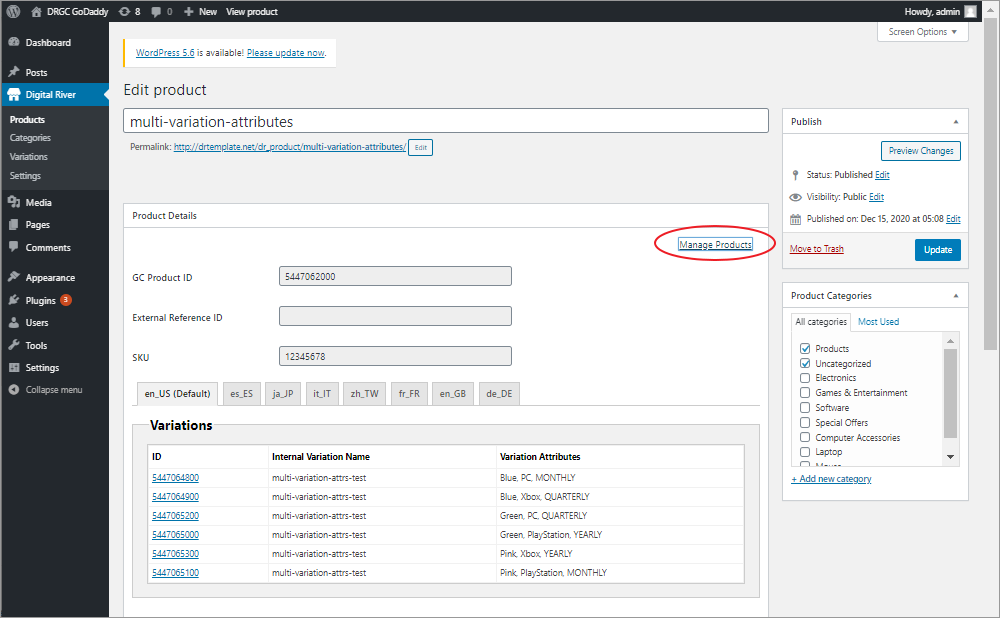&#x20;
5. Sign in to Global Commerce.
6. Select **Catalog**, select **Products**, and then click **Manage Products**.
7. Complete the search fields under the **Search** and **Filters** tab and then click **Search** to locate the specific products. The results appear in the Products list.
8. Click the internal name of the product you want to edit in the search results list.
9. Edit the product.
10. When you are finished editing the product, select **Catalog**, select **Products**, and then click **Deploy Products**.
11. Click the check box next to the product you want to deploy and click **Deploy**.
12. Return to the Digital River Products section in WordPress, and click **Import Products** to sync data.\
    &#x20;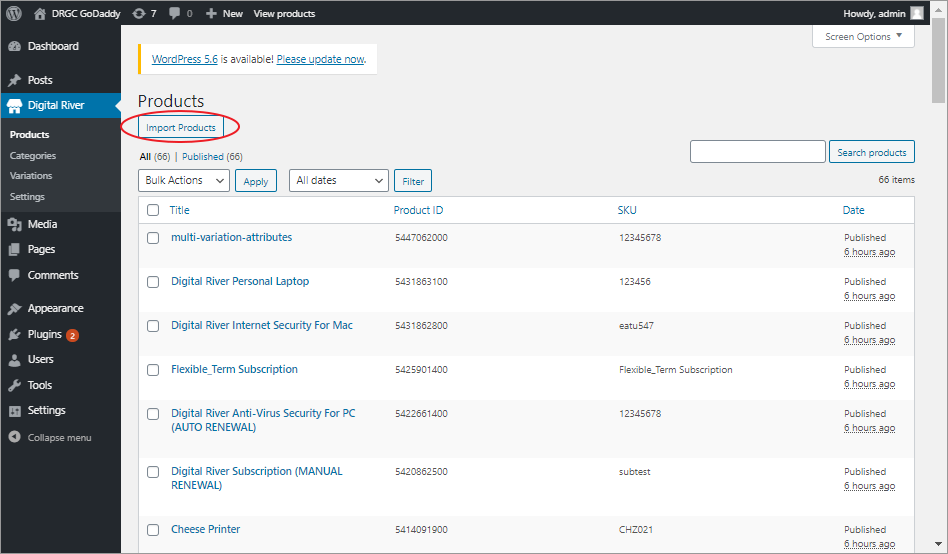&#x20;

### Edit your theme


**Important**: Only authorized Digital River users can edit the Digital River theme. If you need a customized theme, you can create a child theme under the Digital River theme.


The following table lists the file name associated with each section or page.

| Section/Page        | File Name                                      |
| ------------------- | ---------------------------------------------- |
| Header              | header.php                                     |
| Footer              | footer.php                                     |
| Homepage            | page-home.php                                  |
| CategoryProductList | taxonomy.php                                   |
| ProductList         | archive.php                                    |
| ProductDetail       | 
single.php  parts\content-single.php
 |
| Search              | search.php                                     |
| CSS                 | style.css → style.min.css                      |

## Configure payments

The WordPress Plugin 2.0.1 supports all payment methods supported by [DigitalRiver.js](https://docs.digitalriver.com/commerce-api/payment-integrations-1/digitalriver.js) and [Drop-in](https://docs.digitalriver.com/commerce-api/payment-integrations-1/drop-in). All supported methods you choose will appear as choices at checkout.

## Configuring Global Commerce

For information on configuring Global Commerce for use with your WordPress site, review "A Guide to Global Commerce", linked below.&#x20;


A Guide to Global Commerce for WordPress Clients


## Implementation information

### Subscription and profile management

Your store can be set up for anonymous and/or authenticated shopping. If you use authenticated shopping you can leverage the [subscription and profile management](operation-and-maintenance.md#implementation-information-for-wordpress-subscription-and-profile-management) features.
