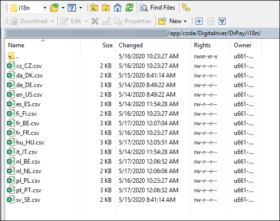

# Configuring a second web site, store, or store view

The Magento Extension is configurable by the website in the Magento Admin Panel interface. This enables administrators to offer different payment methods and different currencies to different regions.&#x20;

The only field that changes is the **Base Configuration** locale field. Digital River will provide the locale needed to meet the client’s language, payment, and currency requirements. See Appendix [Exhibit F](appendix.md#exhibit-f-klarna-supported-countries-and-currencies) for the base configuration reference. Payments are also configurable via Magento by the website.&#x20;

See [Set up multiple websites, stores, and store views in the Admin](https://devdocs.magento.com/guides/v2.3/config-guide/multi-site/ms\_websites.html) for additional information.

## Localization and translations

All content displayed via the Digital River extension can be modified by adding an `/i18n directory` to the `DrPay` folder. By default the extension supports the following languages: \
\[en, es, it, fr, sv, da, fi, cs, pl, hu, de, nl, pt, nl, fr] _/app/code/Digitalriver/DrPay/i18n_

After translation files are added or updated, rerun the upgrade command: \
&#x20;    __     `$ php bin/magento setup:upgrade`

To ensure translated text is reflected on the Magento website/store view, it is important to update the locale option for that website/store view via the general Magento settings: \
__Navigate to **Stores**, then to **Configuration**, then to **General**, and then to **Locale Options**.

