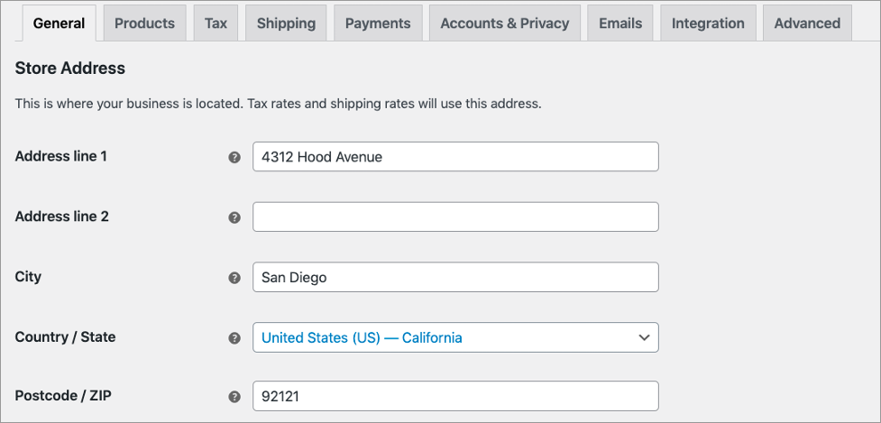
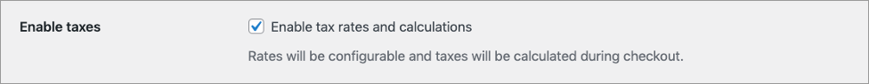
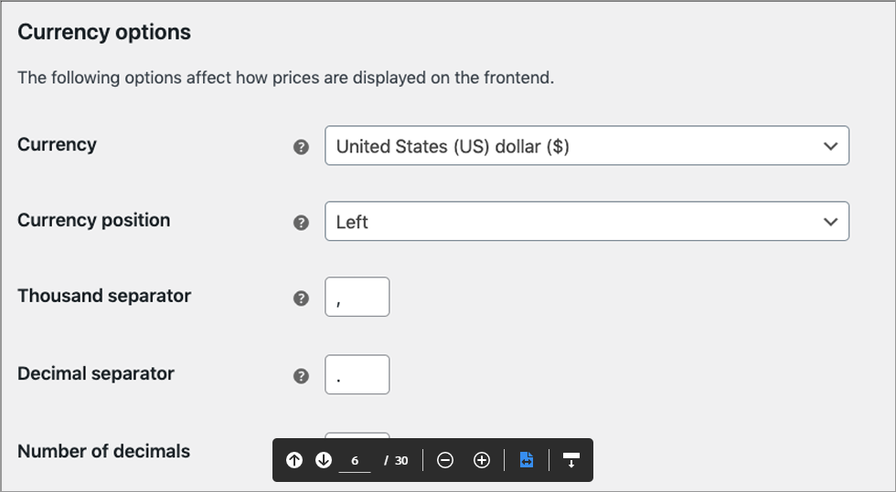

# Configure general settings

### Store address

The **Store Address** section defines your shop’s address, country, and state, where you are based as a seller. It determines the default tax rates and customer locations.&#x20;

### Enable taxes

Enable or disable taxes on your store. Disabling taxes hides the tax **Settings** page.&#x20;


This function is required for tax calculations and must be enabled in order for the plugin to function.&#x20;


### Currency options

Choose the default currency for the store and configure the currency options. You can only select one currency.

