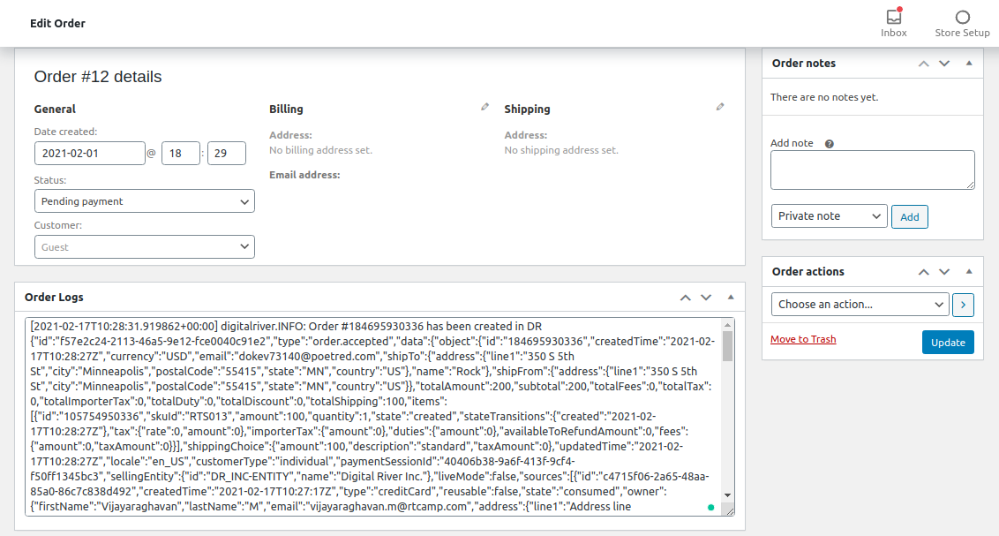

# Logger module

This module is useful for logging events related to products, orders, and charges. You can enable or disable logging directly from the **Settings** page `WooCommerce->Settings->Payment(tab)`.&#x20;

All the logs are written to the `uploads/digitalriver/logs` directory. View the logs from the **Admin Dashboard** by going to `WooCommerce->Status->Logs`.  &#x20;

## Specifications

This module logs data for all the [modules](./).

The log method will be triggered for the following API calls:

* `SKU`–Product Sync API calls
* `Order`–status and transaction API calls
* `Customer`–read and created into Digital River API calls
* `Checkout`–created and updated API calls
* `Tax calculation`–API calls&#x20;

All logs are written to specific folder-wise log files if logging is enabled from gateway settings. Find the settings in WooCommerce by selecting **Settings** and clicking the **Payment** tab under the **Digital River Gateway** section. The transaction details are displayed in a meta box on the **Order Edit** page.&#x20;

The relationship between the WooCommerce order and the Digital River order is maintained by storing the Digital River order ID as `order post_meta` managed by the `order sync` module.&#x20;

The `Logger` module will only fetch the `dr_order_id` meta value and display the logs of that order. A new log file will be created for each object.&#x20;

## Naming conventions

* `Order` related log files will be stored in `uploads/digitalriver/logs/orders/[order_id].log`.
* `SKU` related logs will go to the `uploads/digitalriver/logs/products/[product_id].log` log file.&#x20;
* `Customer` related logs will go to the `uploads/digitalriver/logs/customers/[customer_id].log` log file.
* `Checkout` related logs will go to the `uploads/digitalriver/logs/checkouts/[checkout_id].log` log file.
* `Payment Source` related logs will go to the `uploads/digitalriver/logs/sources/[source_id].log` log file.
* Any other logs will go to the `uploads/digitalriver/logs/default.log` file.
* Error logs will go to the `uploads/digitalriver/logs/errors.log` file.

### How to log an object

Trigger the action `digitalriver.api_success` with the following three parameters:

* Object
* Event name
*   Action type `(CREATE / UPDATE / DELETE)`

    **Example**: `do_action( 'digitalriver.api_success', $object, $event, $action )`

Currently, the following objects are supported as a stand-alone. The remaining objects are handled by the `GenericHandler`.&#x20;

* `Checkout`
* `Customer`
* `Order`
* `SKU`
* `Source`
* `Throwable`

### Customize how to log an object

To customize how to log an object:

1. Create a new object extending the `GenericHandler`.
2. Modify the methods `get_log_line` and `get_relative_path` as per your requirements.
3. Add a new method to the `dr_log_handler` hook.
4. The method must check whether the `classname` matches the object of interest and then return the newly created `Handler` object.&#x20;

### Log an error

Trigger the action `digitalriver.api_error` with the error as a parameter.  \
**Example**: `do_action( 'digitalriver.api_error', $exception )`&#x20;

## Logger methods

### Logger class

This class listens to events and logs them by using different `Handler`s for logging data types.

| Method       | Args, Returns, and Descriptions                                                                                                                                                                                                                                                                    |
| ------------ | -------------------------------------------------------------------------------------------------------------------------------------------------------------------------------------------------------------------------------------------------------------------------------------------------- |
| name         | 
<strong>Arg</strong>: -

<strong>Return</strong>: string 

<strong>Description</strong>: Returns the name of the module
                                                                                                                                                           |
| init         | 
<strong>Arg</strong>: -

<strong>Return</strong>: void

<strong>Description</strong>: Initializes the module
                                                                                                                                                                      |
| log          | 
<strong>Arg</strong>: Object $data, String $event, String $action

<strong>Return</strong>: void

<strong>Description</strong>: Takes in the object, the event name, and the type of action <code>(CREATE / UPDATE / DELETE)</code> and logs the data to the appropriate log file
 |
| error\_log   | 
<strong>Arg</strong>: <code>Throwable</code> $exception

<strong>Return</strong>: void

<strong>Description</strong>: Takes in the Exception and logs the error message to the <code>errors.log</code> file
                                                                       |
| get\_handler | 
<strong>Arg</strong>: Object $object

<strong>Return</strong>: void

<strong>Description</strong>: Takes in an object and returns an appropriate handler for logging the object
                                                                                                   |

#### Logger Container class

This class acts as a Dependency Injection container for providing dependencies to classes present in the `Logger` module.

| Method           | Args, Returns, and Descriptions                                                                                                                                                                                                  |
| ---------------- | -------------------------------------------------------------------------------------------------------------------------------------------------------------------------------------------------------------------------------- |
| \_\_construct    | 
<strong>Arg</strong>:<code>PimpleContainer</code>

<strong>Return</strong>: void

<strong>Description</strong>: Accepts a Dependency Injection Container as an argument and assigns it to a container attribute
 |
| define\_services | 
<strong>Arg</strong>:<code>-</code>

<strong>Return</strong>: void

<strong>Description</strong>: Defines all the classes present within the module
                                                             |

#### Logger View class

This class takes care of adding a new tab where the `digitalriver` logs can be displayed in the WooCommerce **Status Menu** tab.

| Method                 | Args, Returns, and Descriptions                                                                                                                                                                        |
| ---------------------- | ------------------------------------------------------------------------------------------------------------------------------------------------------------------------------------------------------ |
| init                   | 
<strong>Arg</strong>:<code>-</code>

<strong>Return</strong>: void

<strong>Description</strong>: Initializes the module
                                                              |
| add\_tab               | 
<strong>Arg</strong>: array $tabs

<strong>Return</strong>: array

<strong>Description</strong>: Adds a new tab called <code>Digital River Logs</code> under WooCommerce->Status menu
 |
| render                 | 
<strong>Arg</strong>: -

<strong>Return</strong>: void

<strong>Description</strong>: Renders the content to be displayed on the <code>Digital River Logs</code> tab
                  |
| get\_logger\_files     | 
<strong>Arg</strong>: String $path

<strong>Return</strong>: array

<strong>Description</strong>: Receive a directory path as an argument and return all the log files present in it
  |
| remove                 | 
<strong>Arg</strong>: String $handle

<strong>Return</strong>: bool

<strong>Description</strong>: Removes the file passed in as an argument
                                          |
| get\_log\_file\_handle | 
<strong>Arg</strong>: String $filename

<strong>Return</strong>: string

<strong>Description</strong>: Receives the filename as an argument and returns the log filehandle
            |
| delete\_log            | 
<strong>Arg</strong>: -

<strong>Return</strong>: void

<strong>Description</strong>: Receives the filehandle from <code>$_REQUEST</code> and delete the log file
                     |
| delete\_all\_log       | 
<strong>Arg</strong>: -

<strong>Return</strong>: void

<strong>Description</strong>: Deletes all the log files
                                                                       |

#### Metabox class

This class adds a metabox to the **Order Edit** page to display the order-related logs. The logs are fetched from the log file.

| Method                        | Args, Returns, and Descriptions                                                                                                                                                                                                          |
| ----------------------------- | ---------------------------------------------------------------------------------------------------------------------------------------------------------------------------------------------------------------------------------------- |
| init                          | 
<strong>Arg</strong>:<code>-</code>

<strong>Return</strong>: void

<strong>Description</strong>: Registers callback to display the metabox by making a call to the <code>order_logs_metabox()</code>
                   |
| order\_logs\_metabox          | 
<strong>Arg</strong>:<code>-</code>

<strong>Return</strong>: void

<strong>Description</strong>: Adds the metabox to the order edit screen and registers content callback as <code>order_logs_metabox_content()</code>
 |
| order\_logs\_metabox\_content | 
<strong>Arg</strong>:<code>-</code>

<strong>Return</strong>: void

<strong>Description</strong>: Displays order-related logs inside a Textarea HTML element within the metabox
                                         |

### Interfaces

The Logger module defines the `Handler` and `ErrorHandler` interfaces.

#### Handler interface

This interface declares a single method that must be implemented by all the Handlers. A new Handler class must be created for every object type.

| Method              | Args, Returns, and Descriptions                                                                                                                                                               |
| ------------------- | --------------------------------------------------------------------------------------------------------------------------------------------------------------------------------------------- |
| set\_data           | 
<strong>Arg</strong>: Object $data String $event String $action

<strong>Return</strong>: void

<strong>Description</strong>: Implements the data to the object's attributes
 |
| get\_log\_line      | 
<strong>Arg</strong>: -

<strong>Return</strong>: String

<strong>Description</strong>: Returns a string to be logged
                                                        |
| get\_relative\_path | 
<strong>Arg</strong>: -

<strong>Return</strong>: String

<strong>Description</strong>: Returns the path to which data must be logged
                                        |
| log                 | 
<strong>Arg</strong>: Object $data, String $event, String $action

<strong>Return</strong>: void

<strong>Description</strong>: Parses the object and logs it
                |

#### Error Handler interface

This interface declares a single method that must be implemented by Error Handlers.

| Method              | Args, Returns, and Descriptions                                                                                                                                                 |
| ------------------- | ------------------------------------------------------------------------------------------------------------------------------------------------------------------------------- |
| set\_data           | 
<strong>Arg</strong>: <code>Throwable</code> $exception

<strong>Return</strong>: void

<strong>Description</strong>: Sets the data to the object's attributes
 |
| get\_log\_line      | 
<strong>Arg</strong>: -

<strong>Return</strong>: String 

<strong>Description</strong>: Returns a string to be logged
                                         |
| get\_relative\_path | 
<strong>Arg</strong>: -

<strong>Return</strong>: String 

<strong>Description</strong>: Returns the path to which data must be logged
                         |
| log                 | 
<strong>Arg</strong>: <code>Throwable</code> $exception

<strong>Return</strong>: void

<strong>Description</strong>: Parses the error object and logs it
      |

### Handler classes

The following table describes the Handler classes:

| Handler class   | Description                                                                                                                      |
| --------------- | -------------------------------------------------------------------------------------------------------------------------------- |
| OrderHandler    | Stores order related logs to `orders/{order_id}.log`                                                                             |
| ProductHandler  | Stores product-related logs to `products/{product_id}.log`                                                                       |
| CheckoutHandler | Stores checkout-related logs to `checkouts/{checkout_id}.log`                                                                    |
| CustomerHandler | Stores customer-related logs to `customers/{customer_id}.log`                                                                    |
| SourceHandler   | Stores source related logs to `sources/{source_id}.log`                                                                          |
| GenericHandler  | Acts as a fallback and logs all the objects that are not handled by any other Handlers and writes them to the `default.log` file |
| ErrorHandler    | Logs any errors that arise to the `errors.log` file                                                                              |
