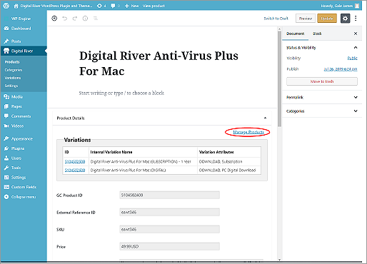
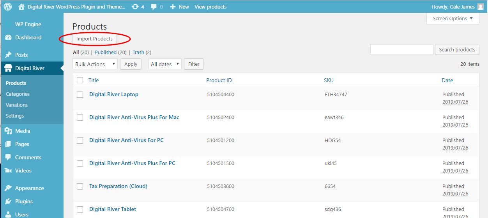

# Edit your product


**Important**: We disabled all the functions of editing products and categories in WordPress. You need to access Global Commerce to edit your product or category first, then return to the Digital River Products page in WordPress and click the Import Products button to sync the data.\
\
Note that WordPress only syncs products assigned to the category.


1. Click Digital River and select Products.
2. To locate the product you want to edit, enter the product title in the search field, and click Search Products.
3. Click the title of the product you want to edit.
4. Scroll to and then click the Manage Products link to go to Global Commerce.\
   &#x20;
5. Sign in to Global Commerce.
6. Select Catalog, select Products, and then click Manage Products.
7. Complete the search fields under the Search and Filters tab and then click Search Search to locate the specific products. The results appear in the Products list.
8. Click the internal name of the product you want to edit in the search results list.
9. Edit the product.
10. When you are done editing the product, select Catalog, Products, and then click Deploy Products.
11. Select the check box next to the product you want to deploy and click Deploy.
12. Return to the Digital River Products section in WordPress, and click Import Products to sync data.\
    &#x20;&#x20;
