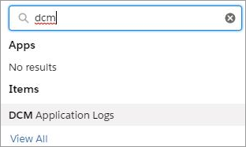

# Error log

The Digital River error log lists all errors. To access the error log:

1. Click **App Launcher** .​
2. Type `DCM` in the **Search apps and items** field and press **Enter**. \
   
3. Click **DCM Logs**. The DCM Application Error Logs page appears.
4. Click the **Recently Viewed** dropdown list and click **All** to see all error logs.&#x20;
5. Choose one of the following options.
   * To search for a specific error log, enter the values for one of the following items: **DR Error Log Id**, **Cart Id**, **Error Description**, **Error Type**, or **Method Name**. Note that you can't search by **Last Modified Date**, **Is Action Taken**, and **Created Date**. Use the column sort or **Show Filters** to narrow your search.
   * To view details for a specific error log, click the link for the error log under the **DR Error Log Id** column.
   * To add a new error log, click **New**, complete the fields, and click **Save**.
   * To import an error log, click **Import**, follow the prompts.
   * To change the owner of one or more error logs:
     1. Select the check box next to each error log or select the check box next to **DR Error log Id** to select all error logs.
     2. Click **Change Owner**.
     3. Type the name of the new owner in the **Search People** field and click **Submit**. The new owner will receive a notification by email.
   * To print the error logs, click **Printable View**, click **Print This Page**, complete the fields, and click **Save**.
   * Click **Display As Table** or **Display as Kanban** to toggle between a table and Kanban.
   * Click **Refresh** to refresh the page.
   * To edit the Cart ID, select the cell under **Cart Id**, click **Edit**, type the new identifier for the cart in the field, and click **Save**.
   * To add a filter to the error logs:
     1. Click **Show Filters**.
     2. Click **Add Filter** and complete the fields.
     3. If needed, click **Add Filter Logic** and type the filter logic in the **Filter Logic** field.
     4. Click **Done**.
     5. Click **Save**.
   * To remove all filters, click **Remove All**.

**​**
