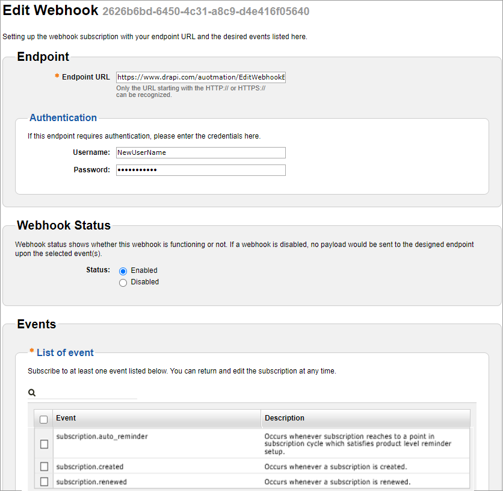

# Editing a webhook

To edit a webhook:

1. Sign in to [Global Commerce](https://gc.digitalriver.com/gc/ent/login.do).
2. Select **Administration**, and then click **Webhook Service**. The Webhook Service page appears.\
   &#x20;.png>)
3. Select the **Webhook ID** you want to disable or enable from the list and click **Edit**. The Edit Webhook page appears.\
   &#x20;&#x20;
4. Enter the URL for the endpoint in the **Endpoint URL** field.
5. Optional. Enter the user credentials for the endpoint in the **Username** and **Password** fields.\
   **Note**: If you do not need an extra layer of security, you can leave these fields blank.
6. Optional. Select **Enabled** for **Status**.\
   **Note**: If you do not select **Enabled**, the system will ask you if you want to enable the webhook when you click **Create**.
7. Select the check box next to each event you want to associate with the endpoint or select the check box next to **Event** to select all events. At least one event type must be selected.
8. Scroll down and click **Save**.  &#x20;
