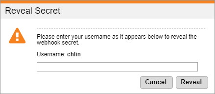

# Revealing a webhook's secret

To reveal a webhook's secret, you need to retrieve your endpoint's secret from the Webhook Service settings in Global Commerce:

1. Sign in to [Global Commerce](https://gc.digitalriver.com/gc/ent/login.do).
2. Select **Administration**, and then click **Webhook Service**. The Webhook Service page appears. \
   &#x20;
3.  Find the webhook with the secret you want to verify and click the **Reveal Secret** link.

    The Reveal Secret dialog appears.\
    &#x20;&#x20;
4. Provide your Global Commerce username and click **Reveal**. The **Reveal Secret** field under **Secret** will display the token. Note that the **Username** field is case-sensitive. The **Secret** column displays the endpoint's secret.
