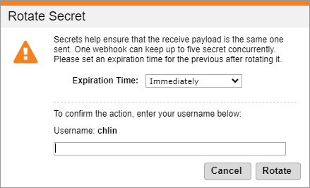

# Rotating a webhook's secret

You can rotate a webhook's secret on the Webhook Service page in Global Commerce if you think a webhook's secret is compromised. When you rotate the secret, Global Commerce blocks the old secret and generates a new one. You can choose to block the old secret immediately or allow it to expire after the specified expiration time when you rotate the secret. During that specified expiration time, both secrets work. It gives you time to make the transition from the old secret to the new secret. In either case, you can use the new secret immediately.

You can maintain up to five secrets per webhook.

To rotate a webhook's secret:

1. Sign in to [Global Commerce](https://gc.digitalriver.com/gc/ent/login.do).
2. Select **Administration**, and then click **Webhook Service**. The Webhook Service page appears. \
   &#x20;
3. Find the webhook with the secret you want to rotate and click the **Rotate Secret** link. The Reveal Secret dialog appears. \
   &#x20;
4. Choose an expiration option from the **Expiration Time** list. Your options are **Immediately**, **1 Hour**, **3 Hours**, **6 Hours**, **12 Hours**, or **24 Hours**.
5. Provide your Global Commerce username and click **Rotate**. Note that the **Username** field is case-sensitive. Click [**Reveal Secret**](revealing-a-webhooks-secret.md) if you want to see the new secret token.
