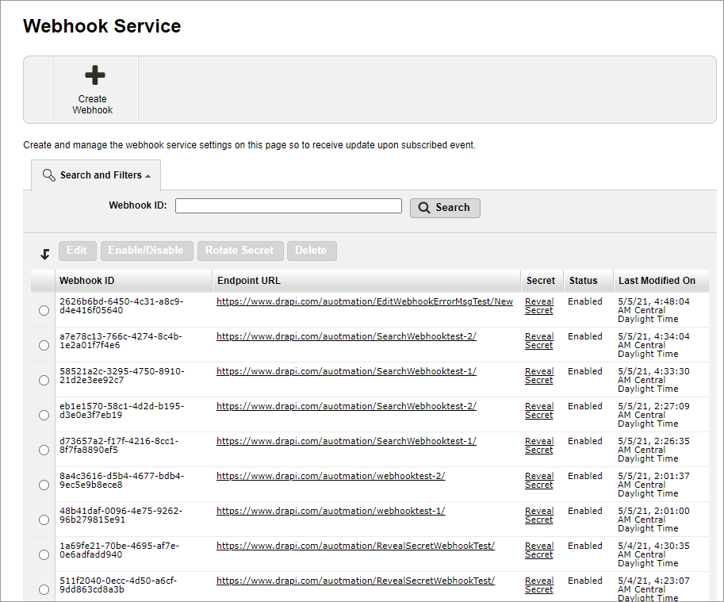
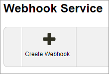

# Creating a webhook

You can create a webhook to send notifications in three easy steps.

* [Step 1: Open your firewall to trusted Digital River IP addresses](creating-a-webhook.md#step-1-open-your-firewall-to-trusted-digital-river-ip-addresses)
* [Step 2: Create webhooks](creating-a-webhook.md#step-2-create-webhooks)
* [Step 3: Respond to webhook events](creating-a-webhook.md#step-3-respond-to-webhook-events)

## Step 1: Open your firewall to trusted Digital River IP addresses

To receive webhook notifications from Digital River, you'll need to open your firewalls to all the IP addresses listed in the [Commerce API safelist](commerce-api-safelist.md).

## Step 2: Create webhooks

When creating webhooks, you need to add endpoints from Global Commerce:

1. Sign in to [Global Commerce](https://gc.digitalriver.com/gc/ent/login.do).
2. Select **Administration**, and then click **Webhook Service**. The Webhook Service page appears.\
   &#x20;&#x20;
3. From the Webhook Service page, click **Create Webhook**.  \
    \
   The Create Webhook page appears.\
   .jpg>)&#x20;
4. Enter the URL for the endpoint in the **Endpoint URL** field. The endpoint URL will receive the webhook payload. The URL must start with either `https://` or `http://`.
5. Optional. Enter your endpoint credentials in the **Username** and **Password** fields. If you do not want to leverage these authentication credentials, you can leave the two fields blank. See [Authentication](https://docs.digitalriver.com/commerce-api/getting-started/best-practices#authentication) for information on how to authenticate the client's endpoint to add another layer to security.
6. Optional. Select **Enabled** for **Status**. \
   **Note**: If you do not select **Enabled**, no payment will be sent when an event occurs. Also, the system will ask you if you want to enable the webhook when you click **Create**.
7. Select the checkbox, next to each event you want to associate with the endpoint, or select the checkbox next to **Event** to select all events. You must select at least one [event type](../events/event-types/).&#x20;
8. Scroll down and click **Create**.  &#x20;

### Create a subscription response

A webhook with a unique identifier is returned in a `201 Created` response. You can use these fields to build your email notifications and leverage our Commerce APIs to add more information.


```javascript
{
    "id": "b5cd5cd4-7ae4-4a0c-b723-9b97bf42a9e8",
    "type": "subscription.created",
    "data": {
        "object": {
            "id" : "23480199",
            "creationDate" : "2021-05-13T09:38:05.000Z",
            "activationDate" : "2021-05-13T05:00:00.000Z",
            "nextRenewalDate" : "2021-07-13T05:00:00.000Z",
            "nextBillingDate" : "2021-06-13T05:00:00.000Z",
            "expirationDate" : "2021-07-13T05:00:00.000Z",
            "graceDate" : "2021-06-20T05:00:00.000Z",
            "currentQuantity" : 1,
            "renewalQuantity" : 1,
            "autoRenewal" : true,
            "locale" : "en_US",
            "state" : "Subscribed",
            "duration" : 61,
            "frequency" : 31,
            "currentBillingCycleNumber" : 1,
            "totalNumberOfBillingCycle" : 2,
            "siteId" : "sub2test",
            "shopper" : {
                "id" : "20662635060199",
                "externalReferenceId" : "MCAGJAYW3JXJ"
            },
            "renewalPrice" : {
                "unitPrice" : 9.99,
                "locked" : true,
                "currency" : "USD"
            },
            "term" : {
                "termUnit" : "MONTHS",
                "termLength" : 1
            },
            "product" : {
                "id" : "5367865200",
                "displayName" : "APM_2_months_auto",
                "sku" : "SUBS_COMMITMENT"
            },
            "shipToAddress" : {
                "id" : "364164170199",
                "firstName" : "Subscription",
                "lastName" : "Automation",
                "companyName" : "Digital River",
                "line1" : "10380 Bren Rd W",
                "line2" : "Conjunto 304",
                "line3" : "Conjunto 304",
                "city" : "Minnetonka",
                "postalCode" : "55343",
                "countrySubdivision" : "MN",
                "country" : "US",
                "countryName" : "United States",
                "phoneNumber" : "952-253-1234",
                "emailAddress" : "subs_05132021043802AM707CSJQU@digitalriver.com",
                "countyName" : "Minnetonka"
            },
            "paymentOption" : {
                "nickName" : "VisaGJFV4P",
                "id" : "4033270199",
                "isDefault" : "true",
                "type" : "CreditCardMethod",
                "creditCard" : {
                    "expirationMonth" : "5",
                    "expirationYear" : "2023",
                    "displayableNumber" : "************1111",
                    "type" : "visa",
                    "displayName" : "Visa"
                },
                "address" : {
                    "id" : "364163290199",
                    "firstName" : "Subscription",
                    "lastName" : "Automation",
                    "companyName" : "DR",
                    "line1" : "10380 Bren Rd W",
                    "line2" : "Conjunto 304",
                    "line3" : "Conjunto 304",
                    "city" : "Minnetonka",
                    "postalCode" : "55343",
                    "countrySubdivision" : "MN",
                    "country" : "US",
                    "countryName" : "United States",
                    "phoneNumber" : "952-253-1234",
                    "emailAddress" : "subs_05132021043802AM707CSJQU@digitalriver.com",
                    "countyName" : "Minnetonka"
                }
            },
            "addOns" : [ {
                "product" : {
                    "id" : "5400082600",
                    "displayName" : "Subscription AddOn 1",
                    "sku" : "SUBS_ADDON"
                },
                "quantity" : 1,
                "renewalPrice" : {
                    "unitPrice" : 11.0,
                    "locked" : true,
                    "currency" : "USD"
                }
            } ]
        }
    }
}
```


In the example above, the initial id represents the subscription identifier. The subscription identifier appears as `subId` in the Subscription resource. For example, use `subId` to list all orders associated with a subscription in `https://www.digitalriver.com/v1/subscriptions/{subId}/orders`.&#x20;

### Retrieve an anonymous shopper's orders and production information

If you need to retrieve an anonymous shopper's order and product information, send the following request and include the shopper `id`. You can find the shopper `id` in the payload under `shopper`.

```markup
POST https://api.digitalriver.com/oauth20/token?grant_type=client_credentials&dr_userid={anonymousShopperId}
```

After reviving the session, you can leverage the following APIs:

* [Get Product](https://www.digitalriver.com/docs/commerce-api-reference/#tag/Products/paths/\~1v1\~1shoppers\~1me\~1products\~1{productId}/get): `GET https://api.digitalriver.com/v1/shoppers/me/products/{productId}?expand=all`
* [Get Order](https://www.digitalriver.com/docs/commerce-api-reference/#tag/Orders/paths/\~1v1\~1shoppers\~1me\~1orders/get): `GET https://api.digitalriver.com/v1/shoppers/me/orders?expand=all`

## Step 3: Respond to webhook events

Your endpoint must return a `2xx` HTTP status code to acknowledge the receipt of an event. If the endpoint fails to acknowledge events over several days, your endpoint will be disabled.

If Digital River receives **any** [response codes](../../common-shopper-and-admin-apis/error-codes/) outside this range, it indicates that you did not receive the event. For example, Digital River treats a URL redirection as a failure.
