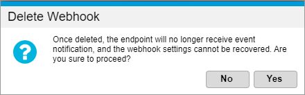

# Deleting a webhook

To delete a webhook:

1. Sign in to [Global Commerce](https://gc.digitalriver.com/gc/ent/login.do).
2. Select **Administration**, and then click **Webhook Service**. The Webhook Service page appears. \
   &#x20;
3. Select the **Webhook ID** you want to delete from the list and click **Delete**. The Delete Webhook dialog appears.\
   &#x20;&#x20;
4. Click **Yes** to delete the webhook. Note that once you delete a webhook, you cannot recover it.
