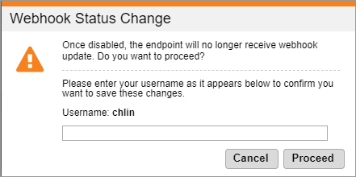

# Enabling or disabling webhooks

To enable or disable webhooks:

1. Sign in to [Global Commerce](https://gc.digitalriver.com/gc/ent/login.do).
2. Select **Administration**, and then click **Webhook Service**. The Webhook Service page appears.\
   &#x20;
3. Select the **Webhook ID** you want to disable or enable from the list and click **Enable/Disable**.
4. From the **Webhook Status Change** dialog, enter your Global Commerce username in the field and click **Proceed**. Note that the **Username** field is case-sensitive. The **Secret** column displays the endpoint's secret.\
   &#x20;
