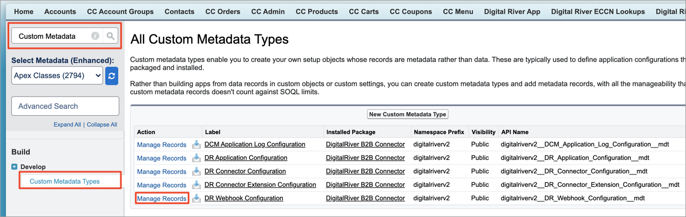

# Extend the App Webhook Framework

The Salesforce B2B Commerce—Digital River Connector App comes with a Webhook framework that is capable of accepting and consuming any webhook that can be configured in the DR Dashboard. OOTB (Out of the box), the App currently provides an implementation for the Webhook events `order.accepted`, `order.complete` and `order.invoice.created`. You can always extend this framework to implement custom code that will fire upon receipt of a [Webhook](../integrating-the-digital-river-salesforce-b2b-commerce-app/step-9-set-up-webhooks.md) from Digital River.

## Extend the webhook framework

To implement custom business logic for your Organization, you can write subscriber code that extends the default Webhook Framework Extension point class `digitalriverv2.DRB2B_WebhookHandler`.

For example, suppose you want to implement custom business logic for the event `refund.pending`:

1. In your Organization, create an Apex class that extends the extension point class `digitalriverv2.DRB2B_WebhookHandler` global with sharing class DRB2B\_RefundPendingWebhook extends digitalriverv2.DRB2B\_WebhookHandler { }
2.  Inside the class definition, override the method **processWebhookEvent** of the extension point class `digitalriverv2.DRB2B_WebhookHandler`. This method will have the Event Payload as one of its Input parameters.

    ```
    global class DRB2B_RefundPendingWebhook extends digitalriverv2.DRB2B_WebhookHandler {
        
        global override void processWebhookEvent(RestResponse response, String webhookEventPayload, List<digitalriverv2.DCM_ApplicationLog> appLogList) {
            // Custom Implementation
        }
     
    }
    ```

    &#x20;&#x20;
3.  Inside your method override, add your custom business logic. Make sure the RestResponse status code is set to 200 as shown in the sample implementation for the `refund.pending` webhook event below.

    ```
    global class DRB2B_RefundPendingWebhook  extends digitalriverv2.DRB2B_WebhookHandler {
     
        global override void processWebhookEvent(RestResponse response, String webhookEventPayload, List<digitalriverv2.DCM_ApplicationLog> appLogList) {
            String methodName = 'processWebhookEvent';
            // Log the event to Application log object
            appLogList.add(new digitalriverv2.DCM_ApplicationLog(System.LoggingLevel.INFO, 'Digital River', 'Webhook Event',
                                                        'DRB2B_RefundPendingWebhook', methodName, null,
                                                        'Refund Pending Webhook Event Payload: ' + webhookEventPayload, 'Event: refund.pending',
                                                        '', null, null, '', true));
            
            // Send Email
            Messaging.SingleEmailMessage email = new Messaging.SingleEmailMessage();
            email.setSubject('Process Webhook for event: refund.pending');
            email.setToAddresses(new List<String> { 'test@example.com' });
            email.setHtmlBody(webhookEventPayload + '<br/> <br/>');
            Messaging.sendEmail(new Messaging.SingleEmailMessage[] { email });
            
            response.statusCode = 200;
        }
     
    }
    ```
4. Save your class and resolve any compilation errors.
5. Your Apex class needs to be configured so that the Connector is aware and executes this Custom Webhook handler implementation whenever it receives the event `refund.pending` from Digital River.
   1. Go to the Custom Metadata Type `digitalriverv2__DR_Webhook_Configuration__mdt` and click `Manage Records`.\
      &#x20;&#x20;
   2. Create a new Metadata Type Record for DR Webhook Configuration.
      1. Label: Refund Pending Webhook Handler Name.
      2. DR Webhook Configuration Name: `Refund_Pending_Webhook_Handler_Name`.
      3. Config Name: `refund.pending` (This is the Event Type).
      4. Config Value: DRB2B\_RefundPendingWebhook (this will be the Custom Class Name).
      5. Click Save.\
         &#x20;&#x20;
6. Set up the Webhook for the Event Type `refund.pending` in Digital River [Dashboard](https://dashboard.digitalriver.com/login).
   1. Log in to the Digital River Dashboard.
   2. Configure the Webhook for this event by going to Webhooks and clicking on the Webhooks endpoint configured for your Organization for `order.invoice.created` (registered in [Step 9](../integrating-the-digital-river-salesforce-b2b-commerce-app/step-9-set-up-webhooks.md)). It will have an address of `<<SF_My_Domain_Name>>/services/apexrest/digitalriverv2/webhooks/`\
      &#x20;
   3. Select the event `refund.pending` for the Webhook Endpoint selected in the previous step.\
      .png>)
