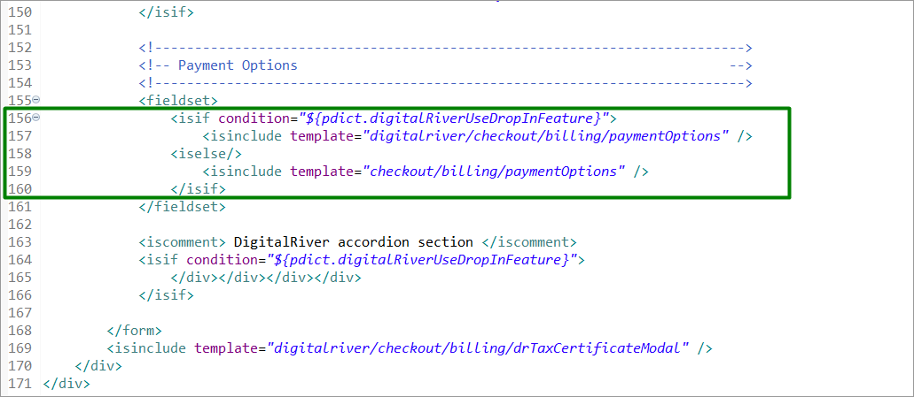

# Extending the Salesforce B2C LINK Cartridge

## Custom code <a href="#custom-code" id="custom-code"></a>


**IMPORTANT**: Follow the instructions below only when you can’t use the cartridge directly, or you need to resolve conflicts with other cartridges on your project. Otherwise, you must compile the client-side scripts and styles, upload the cartridge, and add it to your storefront cartridge path. Cartridge **int\_digitalriver\_sfra** already contains all templates and script changes described in [Custom code](configure-the-salesforce-b2c-link-cartridge.md#custom-code).


### Templates

Make the following changes to the template files:

* Template: **cartridge\templates\default\account\payment\addPayment.isml** Add this Digital River script to Drop-in functionality on the page.

And apply the changes to Drop-in styles.

```
<script src="
https://js.digitalriverws.com/v1/DigitalRiver.js">
</script>
```

And apply the changes to Drop-in styles.

```
assets.addCss('/css/digitalRiver.css');
```


Put the following condition inside the card-body `div`.

```
<iscomment> Include Digital River Drop-In </iscomment>
<isset name="useDigitalRiverDropIn" value="${require('dw/system/Site').getCurrent().getCustomPreferenceValue('drUseDropInFeature')}" scope="page" />
<isif condition="${useDigitalRiverDropIn}">
    <isinclude template="account/payment/dropinForm"/>
<iselse/>
<iscomment> Default Payment form </iscomment>
    <isinclude template="account/payment/paymentForm"/>
</isif>
```


* Template: **cartridge\templates\default\cart\cartTotals.isml**. Include the **Digital River Duty** section in the cart totals template after the discount section.

```
<!-- Digital River Duty -->
<isif condition="${require('dw/system/Site').getCurrent().getCustomPreferenceValue('drUseDropInFeature')
    && pdict.totals.duty.value !== 0}">
    <div class="row">
        <div class="col-8">
            <p>${Resource.msg('label.order.sales.duty','digitalriver', null)}</p>
        </div>
        <div class="col-4">
            <p class="text-right duty-total">${pdict.totals.duty.formatted}</p>
        </div>
    </div>
</isif>
```

.png>)

* Template: **cartridge\templates\default\checkout\billing\paymentOptions\paymentOptionsSummary.isml**.\
  Extend the condition with the `‘DIGITAL_RIVER_DROPIN’` payment method.

```
<iselseif condition="${payment.paymentMethod === 'DIGITAL_RIVER_DROPIN'}" />
    <isinclude template="checkout/billing/paymentOptions/dropInSummary" />
```


* Template: **cartridge\templates\default\checkout\billing\billing.isml**. Include the Digital River payment options template.

```
<isif condition="${pdict.digitalRiverUseDropInFeature}">
    <isinclude template="digitalriver/checkout/billing/paymentOptions" />
<iselse/>
    <isinclude template="checkout/billing/paymentOptions" />
</isif>
```



* Template: **cartridge\templates\default\checkout\billing\storedPaymentInstruments.isml**. Extend the `card-image` class condition as follows:

```
 <iscomment> Digital River - if enabled no cvv needed thus pictures are always shown instead of input </iscomment>

… security-code-input goes here

</isif>
```


* Template: **cartridge\templates\default\checkout\shipping\shippingAddress.isml**. Extend the shipping address form with the email address input field.

```
<isif condition="${pdict.digitalRiverUseDropInFeature}">
<div class="row">
    <div class="col-sm-12">
        <div class="form-group
            <isif condition=${pdict.forms.billingForm.contactInfoFields.email.mandatory === true}>required</isif>
            ${pdict.forms.billingForm.contactInfoFields.email.htmlName}">
            <label class="form-control-label" for="email">${Resource.msg('field.customer.email','checkout',null)}</label>

            <button type="button" class="info-icon">
                <span class="icon" aria-hidden="true">i</span>
                <span class="sr-only">${Resource.msg('button.help.assistive.text','common',null)}</span>
                <span class="tooltip d-none">
                    ${Resource.msg('tooltip.email','creditCard',null)}
                </span>
            </button>

            <input type="text" class="form-control email" id="email"
                value="${pdict.order.orderEmail||''}" <isprint value=${pdict.forms.billingForm.contactInfoFields.email.attributes} encoding="off"/>
                aria-describedby="emailInvalidMessage" >
            <div class="invalid-feedback" id="emailInvalidMessage"></div>
        </div>
    </div>
</div>
</isif>
```


* Template: **cartridge\templates\default\checkout\checkout.isml**. \
  Include the Digital River styles.

```
assets.addCss('/css/digitalRiver.css');
```


Add a condition that will control the submit payment button display.

```
<isset name="submitPaymentShow" value="${!pdict.digitalRiverUseDropInFeature || (pdict.customer.registeredUser && pdict.customer.customerPaymentInstruments.length)  ? '' : 'digitalriver-hide'}" scope="page" />
<button
```


* Template: **cartridge\templates\default\checkout\orderTotalSummary.isml**. \
  Add the **Digital River Duty** section.

```
<!--- Digital River Duty --->
<isif condition="${require('dw/system/Site').getCurrent().getCustomPreferenceValue('drUseDropInFeature')}">
    <div class="row leading-lines duty-item ${pdict.order.totals.duty.value === 0 ? 'hide-order-discount': ''}">
        <div class="col-6 start-lines">
            <p class="order-receipt-label"><span>${Resource.msg('label.order.sales.duty','digitalriver', null)}</span></p>
        </div>
        <div class="col-6 end-lines">
            <p class="text-right"><span class="duty-total">${pdict.order.totals.duty.formatted}</span></p>
        </div>
    </div>
</isif>
```


### Client scripts

Make the following changes to the client script files:


**Note**: Do not forget to compile client-side scripts after implementing changes in the source code.


* Script **cartridge\client\default\js\checkout.js** \
  Include the **drDropIn** script on the checkout page.

```
processInclude(require('./checkout/drDropIn'));
```


* Script **cartridge\client\default\js\checkout\checkout.js** \
  Add the following code to the shipping submit success handler.

```
if (!data.error) {
    $('body').trigger('digitalRiver:dropIn', data.digitalRiverConfiguration); // Digital River integration: call dropIn feature after checkoutCreate
}
```


Extend the code on line 222 as follows:

```
var paymentMethod = $('.payment-information').data('payment-method-id');
if (paymentMethod === 'CREDIT_CARD' || paymentMethod === 'DIGITAL_RIVER_DROPIN') { // Extended by Digital River Drop-in integration
```


* Script **cartridge\client\default\js\checkout\billing.js** \
  Extend the condition inside the function.

```
if (!$('#dropInContainer').data('enabled')
    && billing.payment && billing.payment.selectedPaymentInstruments
    && billing.payment.selectedPaymentInstruments.length > 0) {
```


Add the `<getCreditCardPaymentInfoHtml>` **** function.

```
/**
 * Creates html to display payment summary for credit card payment
 * @param {Object} order current order model
 * @param {Object} selectedPaymentInstrument selected payment instrument model
 * @returns {string} html for credit card payment
 */
function getCreditCardPaymentInfoHtml(order, selectedPaymentInstrument) {
    return '<span>' + order.resources.cardType + ' '
    + selectedPaymentInstrument.type
    + '</span><div>'
    + selectedPaymentInstrument.maskedCreditCardNumber
    + '</div><div><span>'
    + order.resources.cardEnding + ' '
    + selectedPaymentInstrument.expirationMonth
    + '/' + selectedPaymentInstrument.expirationYear
    + '</span></div>';
}
```

And use it for creating HTML inside the `<updatePaymentInformation>` function.

```
var selectedPaymentInstrument = order.billing.payment.selectedPaymentInstruments[0];
if (selectedPaymentInstrument.paymentMethod === 'DIGITAL_RIVER_DROPIN') {
    switch (selectedPaymentInstrument.paymentType) {
        case 'creditCard':
            htmlToAppend += getCreditCardPaymentInfoHtml(order, selectedPaymentInstrument);
            break;
        default: // extend switch with new cases or extend default if you want to show extended data for non-card payment types
            htmlToAppend += '<span>' + selectedPaymentInstrument.paymentType
        + '</span>';
    }
} else {
    htmlToAppend += getCreditCardPaymentInfoHtml(order, selectedPaymentInstrument);
}
```


Wrap the `<clearCreditCardForm>` function content with the following condition.

```
if (!$('#dropInContainer').data('enabled')) {

… function content goes here

}
```


Wrap the `<handleCreditCardNumber>` content with the following condition.

```
if ($('.cardNumber').length > 0) { // if Digital River enabled card form will be replaced with Drop-in functionality
    cleave.handleCreditCardNumber('.cardNumber', '#cardType');
}
```

Add the condition inside the `<selectSavedPaymentInstrument>`.

```
if (!$('#dropInContainer').data('enabled')) { // Digital River - if enabled no cvv needed thus pictures are always shown instead of input
    $('.saved-payment-instrument .card-image').removeClass('checkout-hidden');
    $('.saved-payment-instrument .security-code-input').addClass('checkout-hidden');
    $('.saved-payment-instrument.selected-payment'
        + ' .card-image').addClass('checkout-hidden');
    $('.saved-payment-instrument.selected-payment '
        + '.security-code-input').removeClass('checkout-hidden');
}
```


Add the following code in the `<addNewPaymentInstrument>` function.

```
// Digital River Drop-in section
if ($('#dropInContainer').data('enabled')) {
    $('.drop-in-container').removeClass('checkout-hidden'); // show drop-in form to enter new payment
    $('.submit-payment').addClass('digitalriver-hide'); // next step will be launched from drop-in button instead
}
```

Add the following code in the `<addNewPaymentInstrument>` function.

```
// Digital River Drop-in section
if ($('#dropInContainer').data('enabled')) {
    $('.submit-payment').removeClass('digitalriver-hide');
    $('.drop-in-container').addClass('checkout-hidden');
}
```


* Script **cartridge\client\default\js\paymentInstruments.js** \
  Add the **Drop-in** script to the page.

```
processInclude(require('./paymentInstruments/paymentInstrumentsDropIn'));
```


## External interfaces <a href="#external-interfaces" id="external-interfaces"></a>

The cartridge uses the Digital River API endpoints. You can find API service documentation on the Digital River website: [https://docs.digitalriver.com/digital-river-api/](https://docs.digitalriver.com/digital-river-api/).

There is a service sharing one profile and one credential.

* DigitalRiver.http.service

Also, this cartridge uses the [Digital River Drop-in](https://docs.digitalriver.com/digital-river-api/payment-integrations-1/drop-in) external script to handle client payments.


**Important**: The DIGITAL\_RIVER\_DROPIN payment integration represents not one but multiple payment types such as credit card, PayPal, Wire Transfer, and so on. The Drop-in integration provides the selection of payment types, and the client-side/backend scripts handle it. We designed this cartridge mainly to handle the credit card payment type, though it will also successfully process any other payment type provided by the Drop-in integration. To add any business logic for a specific payment type or provide shoppers with a better customer experience, you can extend Drop-in data handlers as described below:


### **int\_digitalriver\cartridge\scripts\digitalRiver\dropinHelper.js** <a href="#int_digitalriver-cartridge-scripts-digitalriver-dropinhelper-js" id="int_digitalriver-cartridge-scripts-digitalriver-dropinhelper-js"></a>

* `switch(source.type)` in function `saveDropInPaymentToWallet`—to save any specific payment data from Drop-in to the customer wallet which will be used in further checkouts.
* `switch(paymentType)` in function `getPaymentInformationFromPaymentInstrument`—to handle any payment type specific data which was saved in the customer profile.
* `switch(source.type)` in function `getPaymentInformationFromDropIn`—to handle any payment type-specific data which was provided by Drop-in.

### **int\_digitalriver\_sfra\cartridge\models\payment.js** <a href="#int_digitalriver_sfra-cartridge-models-payment-js" id="int_digitalriver_sfra-cartridge-models-payment-js"></a>

* function `extendDigitalRiverInfo`—extract all information you want to be available in templates or be provided to the client-side as JSON.

### **int\_digitalriver\_sfra\cartridge\client\default\js\checkout\billing.js** <a href="#int_digitalriver_sfra-cartridge-client-default-js-checkout-billing-js" id="int_digitalriver_sfra-cartridge-client-default-js-checkout-billing-js"></a>

* `switch(selectedPaymentInstrument.paymentType)` in function `updatePaymentInformation`—add payment information to html. Make sure you have the necessary data provided by the Payment model.
