# Extending the Salesforce B2C LINK Cartridge

## Custom code <a href="#custom-code" id="custom-code"></a>


**IMPORTANT**: Follow the instructions below only when you can’t use the cartridge directly, or you need to resolve conflicts with other cartridges on your project. Otherwise, you must compile the client-side scripts and styles, upload the cartridge, and add it to your storefront cartridge path. Cartridge **int\_digitalriver\_sfra** already contains all templates and script changes described in [Custom code](configure-the-salesforce-b2c-link-cartridge.md#custom-code).


### SFRA version 5.3.0 templates

We provide the following templates and describe how to change them.

* [Add payment](extending-the-salesforce-b2c-link-cartridge.md#add-payment)
* [Dashboard profile cards](extending-the-salesforce-b2c-link-cartridge.md#dashboard-profile-cards)
* [Cart totals](extending-the-salesforce-b2c-link-cartridge.md#cart-totals)
* [Payment options summary](extending-the-salesforce-b2c-link-cartridge.md#payment-options-summary)
* [Billing](extending-the-salesforce-b2c-link-cartridge.md#billing)
* [Stored payment instruments](extending-the-salesforce-b2c-link-cartridge.md#stored-payment-instruments)
* [Confirmation](extending-the-salesforce-b2c-link-cartridge.md#confirmation)
* [Shipping address](extending-the-salesforce-b2c-link-cartridge.md#shipping-address)
* [Checkout](extending-the-salesforce-b2c-link-cartridge.md#checkout)
* [Order total summary](extending-the-salesforce-b2c-link-cartridge.md#order-total-summary)

#### Add payment

The add payment (`addPayment.isml`) template allows you to add payment cards to the customer's account. Modify the template to add Drop-in functionality (DigitalRiver.js), Drop-in styles (DigitalRiver.css), and place Drop-in on the account page.

**Template path**: `cartridge\templates\default\account\payment\addPayment.isml`&#x20;


Add this Digital River script to Drop-in functionality on the page and apply the changes to Drop-in styles.

```markup
<script src="https://js.digitalriverws.com/v1/DigitalRiver.js"></script>
<link rel="stylesheet" href="https://js.digitalriverws.com/v1/css/DigitalRiver.css" type="text/css"/>
```

And apply the changes to Drop-in styles.

```markup
assets.addCss('/css/digitalRiver.css');
```


Put the following condition inside the `card-body` `div`.

```markup
<iscomment> Include Digital River Drop-in </iscomment>
<isset name="useDigitalRiverDropIn" value="${require('dw/system/Site').getCurrent().getCustomPreferenceValue('drUseDropInFeature')}" scope="page" />
<isif condition="${useDigitalRiverDropIn}">
    <isinclude template="account/payment/dropinForm"/>
    <isinclude url="${URLUtils.url('DigitalRiver-DisplayCompliance', 'complianceId', 'compliancePayment')}" />
<iselse/>
<iscomment> Default Payment form </iscomment>
    <isinclude template="account/payment/paymentForm"/>
<iscomment> Default Payment form </iscomment>
    <isinclude template="account/payment/paymentForm"/>
</isif>
```


#### Dashboard profile cards

The dashboard profile cards (`dashboardProfileCards.isml`) template contains the script required to add a Digital River Tax Certificates section to your Profile Dashboard page.  The following image shows the out-of-the-box (OOTB) Dashboard Profile Dashboard page for Salesforce B2C Link Cartridge.


When you apply the dashboard profile cards template, it adds Tax Certificates.


**Template**: `cartridge\templates\default\account\dashboardProfileCards.isml`

Add the Digital River tax certificate section on the page.

```markup
<!---Digital River Tax Certificates--->
<isinclude template="digitalriver/account/drTaxCertificateCard"/>
```


#### Cart totals&#x20;

The cart totals (`cartTotals.isml`) template allows you to include the Digital River Order Summary on your Checkout page.&#x20;

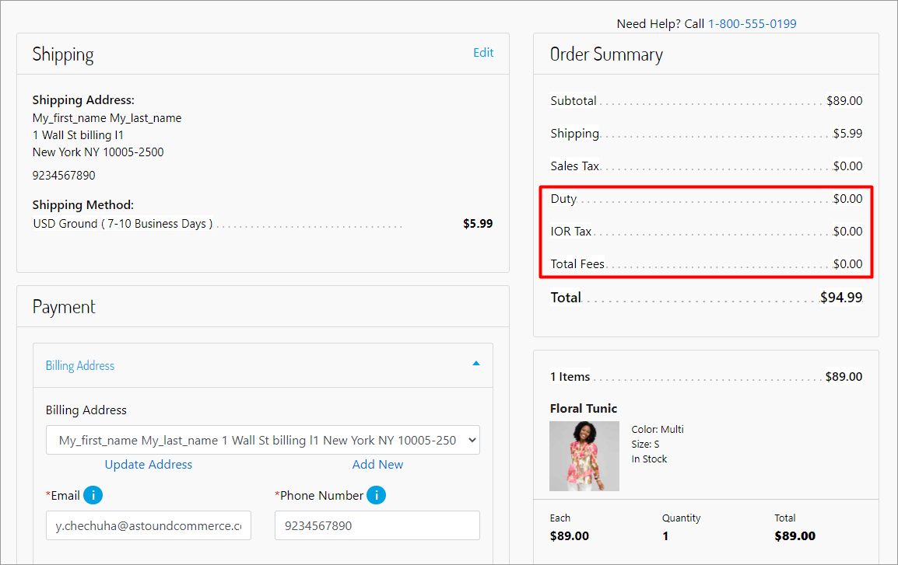

**Template path**: `cartridge\templates\default\cart\cartTotals.isml`

Include the **Digital River Taxations** section in the cart totals template after the discount section.

```markup
<!-- Digital River Taxations -->
<isif condition="${require('dw/system/Site').getCurrent().getCustomPreferenceValue('drUseDropInFeature')}">
    <isif condition="${pdict.totals.isImporterOfRecordTax || pdict.totals.duty.value !== 0}">
        <div class="row">
            <div class="col-8">
                <p>${Resource.msg('label.order.sales.duty','digitalriver', null)}</p>
            </div>
            <div class="col-4">
                <p class="text-right duty-total">${pdict.totals.duty.formatted}</p>
            </div>
        </div>
    </isif>
    <isif condition="${pdict.totals.isImporterOfRecordTax || pdict.totals.importerTax.value !== 0}">
        <div class="row">
            <div class="col-8">
                <p>${Resource.msg('label.order.sales.importerTax','digitalriver', null)}</p>
            </div>
            <div class="col-4">
                <p class="text-right importerTax-total">${pdict.totals.importerTax.formatted}</p>
            </div>
        </div>
    </isif>
    <isif condition="${pdict.totals.isImporterOfRecordTax || pdict.totals.totalFees.value !== 0}">
        <div class="row">
            <div class="col-8">
                <p>${Resource.msg('label.order.sales.totalFees','digitalriver', null)}</p>
            </div>
            <div class="col-4">
                <p class="text-right totalFees-total">${pdict.totals.totalFees.formatted}</p>
            </div>
        </div>
    </isif>
</isif>
```


#### Payment options summary

The payment options summary (`paymentOptionsSummary.isml`) template allows you to extend the payment condition with the `DIGITAL_RIVER_DROPIN` payment method on the Checkout page.&#x20;

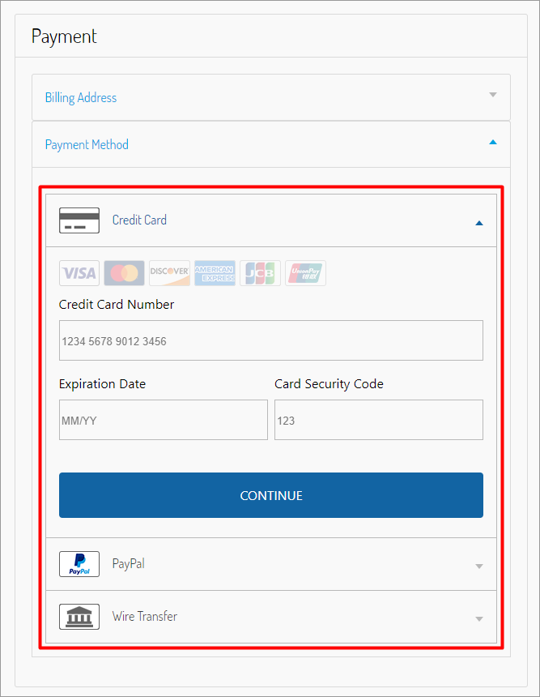

**Template path**: `cartridge\templates\default\checkout\billing\paymentOptions\paymentOptionsSummary.isml`

Extend the condition with the `‘DIGITAL_RIVER_DROPIN’` payment method.

```markup
<iselseif condition="${payment.paymentMethod === 'DIGITAL_RIVER_DROPIN'}" />
    <isinclude template="checkout/billing/paymentOptions/dropInSummary" />
```


#### Billing&#x20;

The billing (`billing.isml`) template allows you to add accordion components to the Billing page. The following image shows the out-of-the-box (OOTB) Payment section of the Checkout page for Salesforce B2C Link Cartridge.

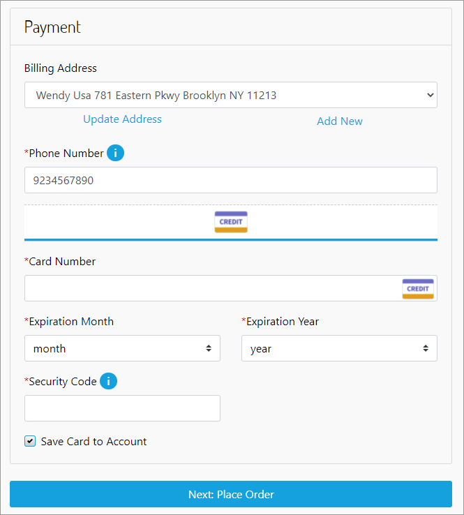

When you apply the dashboard profile cards template, it adds the ability to choose whether the purchase is tax-exempt and the payment method.


**Template path**: `cartridge\templates\default\checkout\billing\billing.isml`&#x20;


There were changes to `paymentOptions.isml` between version 5.3.0 AND 6.0.


Add the accordion components to the billing page.

```markup
<iscomment> DigitalRiver accordion section </iscomment>
<isif condition="${pdict.digitalRiverUseDropInFeature}">
    <div class="accordion" id="accordionBilling">
        <div class="dr-accordion-card">
            <div class="dr-accordion-card-header" id="headingBilling">
                <h2 class="mb-0">
                    <span class="btn btn-link dr-accordion-btn" data-toggle="collapse" data-target="#collapse-billing" aria-expanded="true" aria-controls="collapse-billing">
                        ${Resource.msg('button.billing', 'digitalriver', null)}
                    </span>
                </h2>
            </div>
        <div id="collapse-billing" class="collapse show" aria-labelledby="headingBilling" data-parent="#accordionBilling">
    <div class="dr-accordion-card-body">
</isif>
```


```markup
<isinclude template="digitalriver/checkout/billing/drTaxCertificatesSection" />
<iscomment> DigitalRiver accordion section </iscomment>
<isif condition="${pdict.digitalRiverUseDropInFeature}">
    </div></div></div>
    <iscomment>DigitalRiver tax identifier</iscomment>
    <isif condition="${pdict.digitalRiverUseTaxIdentifier}">
        <div class="dr-accordion-card">
            <div class="dr-accordion-card-header" id="headingTaxIdentifier">
                <h2 class="mb-0">
                    <span class="btn btn-link dr-accordion-btn" data-toggle="collapse" data-target="#collapse-taxidentifier" aria-expanded="false" aria-controls="collapse-taxidentifier">
                        ${Resource.msg('button.taxidentifier', 'digitalriver', null)}
                    </span>
                </h2>
            </div>
            <div id="collapse-taxidentifier" class="collapse" aria-labelledby="headingTaxIdentifier" data-parent="#accordionBilling">
                <div class="dr-accordion-card-body">
                    <div id="tax-id" data-config-url="${URLUtils.url('DigitalRiver-TaxIdentifierConfig')}"></div>
                    <button class="btn btn-block btn-primary dr-btn-taxidentifier-submit" type="button" data-apply-url="${URLUtils.url('DigitalRiver-TaxIdentifierApply')}">
                            ${Resource.msg('button.submit.taxidentifier', 'digitalriver', null)}
                    </button>
                    <div id="dr-list-of-applied-identifiers" data-delete-url="${URLUtils.url('DigitalRiver-TaxIdentifierDelete')}"></div>
                </div>
            </div>
        </div>
    </isif>
    <iscomment>End of DigitalRiver tax identifier</iscomment>
    <div class="dr-accordion-card">
        <div class="dr-accordion-card-header" id="headingPayment">
            <h2 class="mb-0">
                <span class="btn btn-link dr-accordion-btn" data-toggle="collapse" data-target="#collapse-payment" aria-expanded="false" aria-controls="collapse-payment">
                    ${Resource.msg('button.payment', 'digitalriver', null)}
                </span>
            </h2>
        </div>
    <div id="collapse-payment" class="collapse" aria-labelledby="headingPayment" data-parent="#accordionBilling">
        <div class="dr-accordion-card-body">
</isif>
```


Include the Digital River payment options template.

```
<isif condition="${pdict.digitalRiverUseDropInFeature}">
    <isinclude template="digitalriver/checkout/billing/paymentOptions" />
<iselse/>
    <isinclude template="checkout/billing/paymentOptions" />
</isif>
```


Add the accordion components to the Billing page

```markup
<iscomment> Digital River accordion section </iscomment>
<isif condition="${pdict.digitalRiverUseDropInFeature}">
    </div></div></div></div>
</isif>
Include Add Tax certificate modal window component
<isinclude template="digitalriver/checkout/billing/drTaxCertificateModal" />
```

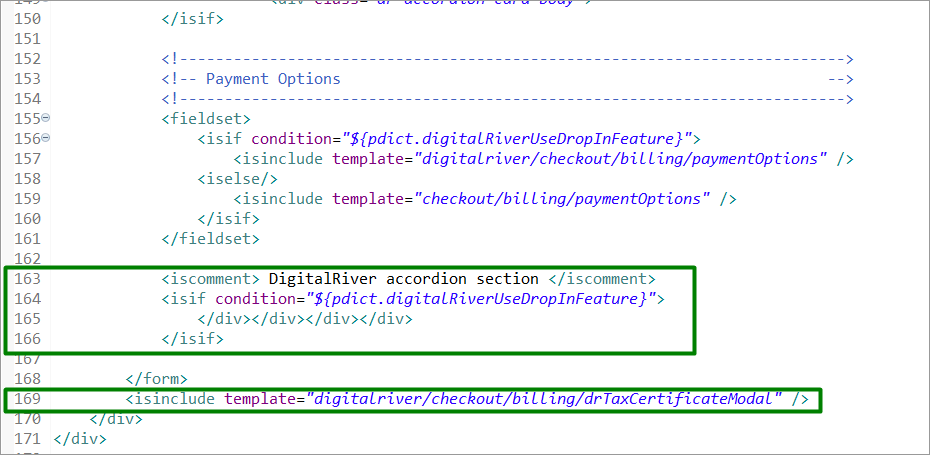

#### **Stored payment instruments**&#x20;

The stored payment instruments (`storedPaymentInstruments.isml`) template allows you to display the stored payment instruments on the Billing page a list of saved payment cards in the customer's account.&#x20;

**Template path**: `cartridge\templates\default\checkout\billing\storedPaymentInstruments.isml`


At the beginning of the file add the following code:

```markup
<isset name="isDRDropInEnabled" value="${require('dw/system/Site').getCurrent().getCustomPreferenceValue('drUseDropInFeature')}" scope="page" />
<div class="invalid-feedback" id="savedPaymentNotSelectedMessage">${Resource.msg('error.select.stored.card', 'digitalriver', null)}</div>
```

Extend the `card-image` class condition as follows:

```markup

```

Also, wrap the security-code-input div with the following condition:

```markup
<isif condition="${!isDRDropInEnabled}"> <iscomment> Digital River - if enabled no cvv needed thus pictures are always shown instead of input </iscomment>
    <div class="security-code-input ${loopState.first ? '' : 'checkout-hidden'}">
        <label class="form-control-label" for="saved-payment-security-code">${Resource.msg('label.credit.card-security.code','checkout',null)}</label>
… security-code-unput goes here
    </div>
</isif>
```


#### Confirmation

We modified the standard confirmation (`confirmation.isml`) template for the B2C LINK Cartridge to include the Digital River compliance statement.

The customer should agree to the Terms of Sale and the Privacy Policy of Digital River and set the check box to complete the order. For more information on the [Terms of Sale](https://www.digitalriver.com/legal/terms-conditions/) and the [Privacy Policy](https://www.digitalriver.com/privacy-policy/) of Digital River, visit the [Digital River Legal Documentation](https://www.digitalriver.com/legal-information/) website.

Compliance links are required to be displayed several different places throughout the storefront. The out-of-the-box (OOTB) cartridge displays the compliance links in all required locations. Consult your Digital River Project Manager before making modifications for your storefront. For more detailed information on the purpose of the compliance links, visit [Compliance ](https://www.digitalriver.com/compliance/)on the [Digital River Legal Documentation](https://www.digitalriver.com/legal-information/) website.

**Template path**: `cartridge\templates\default\checkout\confirmation\confirmation.isml`

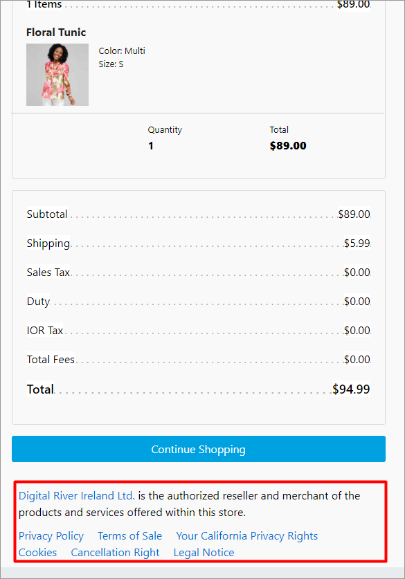

Add the DigitalRiver.js script to the page.

```markup
<script type="text/javascript" src="https://js.digitalriverws.com/v1/DigitalRiver.js"></script>
    <link rel="stylesheet" href="https://js.digitalriverws.com/v1/css/DigitalRiver.css" type="text/css"/>
```

Add the Digital River compliance section to the page.

```markup
<div class="row">
    <div class="${pdict.returningCustomer ? 'col-sm-6 offset-sm-3' : 'col-sm-6 offset-sm-3 offset-md-0 pull-md-6' }">
        <isinclude template="digitalriver/compliance" />
    </div>
</div>
```


#### Shipping address&#x20;

The shipping address (`shippingAddress.isml`) template allows you to extend the shipping address form with the email address input field. This information appears in the Shipping section on the Checkout page.

**Template path** : `cartridge\templates\default\checkout\shipping\shippingAddress.isml`&#x20;


Extend the shipping address form with the email address input field.

```
<isif condition="${pdict.digitalRiverUseDropInFeature}">
<div class="row">
    <div class="col-sm-12">
        <div class="form-group
            <isif condition=${pdict.forms.billingForm.contactInfoFields.email.mandatory === true}>required</isif>
            ${pdict.forms.billingForm.contactInfoFields.email.htmlName}">
            <label class="form-control-label" for="email">${Resource.msg('field.customer.email','checkout',null)}</label>

            <button type="button" class="info-icon">
                <span class="icon" aria-hidden="true">i</span>
                <span class="sr-only">${Resource.msg('button.help.assistive.text','common',null)}</span>
                <span class="tooltip d-none">
                    ${Resource.msg('tooltip.email','creditCard',null)}
                </span>
            </button>

            <input type="text" class="form-control email" id="email"
                value="${pdict.order.orderEmail||''}" <isprint value=${pdict.forms.billingForm.contactInfoFields.email.attributes} encoding="off"/>
                aria-describedby="emailInvalidMessage" >
            <div class="invalid-feedback" id="emailInvalidMessage"></div>
        </div>
    </div>
</div>
</isif>
```


#### Checkout&#x20;

The checkout (`checkout.isml`) template adds the Digital River styles, the Drop-in styles, and the check box to confirm agreement with the Terms of Sale and the Privacy Policy of Digital River to the Checkout page when the customer is ready to place an order. The customer should agree to the Terms of Sale and the Privacy Policy of Digital River and set the check box to complete the order.&#x20;

**Template**: `cartridge\templates\default\checkout\checkout.isml`


There were no changes to `checkout.isml` between version 5.3.0 and 6.0.0.



Add the Digital River Drop-in styles.

```markup
<link rel="stylesheet" href="https://js.digitalriverws.com/v1/css/DigitalRiver.css" type="text/css"/>
```

Include the Digital River styles.

```
assets.addCss('/css/digitalRiver.css');
assets.addCss('/css/drAccordion.css');
```


Add the Digital River confirm disclosure checkbox to the checkout page.

```markup
<isinclude template="digitalriver/confirmDisclosure" />
```

Add a condition that will control the submit payment button display.

```
<isset name="submitPaymentShow" value="${!pdict.digitalRiverUseDropInFeature || (pdict.customer.registeredUser && pdict.customer.customerPaymentInstruments.length)  ? '' : 'digitalriver-hide'}" scope="page" />
<button class="btn btn-primary btn-block submit-payment ${submitPaymentShow}" type="submit" name="submit" value="submit-payment">
```

Add the Digital River compliance section to the checkout page.

```markup
<div class="row">
    <div class="col-12 next-step-button">
        <div class="mb-sm-3" id="ch">
            <isinclude url="${URLUtils.url('DigitalRiver-DisplayCompliance', 'complianceId', 'checkoutCompliance')}" />
        </div>
    </div>
</div>
```


#### Order total summary

The order total summary (`orderTotalSummary.isml`) template allows you to add the Digital River Taxations section to your Checkout page.&#x20;

**Template**: `cartridge\templates\default\checkout\orderTotalSummary.isml`&#x20;


There were no changes to `orderTotalSummary.isml` between version 5.3.0 and 6.0.0.



Add the **Digital River Taxations** section.

```markup
<!--- Digital River Taxations --->
<isif condition="${require('dw/system/Site').getCurrent().getCustomPreferenceValue('drUseDropInFeature')}">
    <div class="row leading-lines duty-item ${!pdict.order.totals.isImporterOfRecordTax && pdict.order.totals.duty.value === 0 ? 'hide-order-discount': ''}">
        <div class="col-6 start-lines">
            <p class="order-receipt-label"><span>${Resource.msg('label.order.sales.duty','digitalriver', null)}</span></p>
        </div>
        <div class="col-6 end-lines">
            <p class="text-right"><span class="duty-total">${pdict.order.totals.duty.formatted}</span></p>
        </div>
    </div>
    <div class="row leading-lines importerTax-item ${!pdict.order.totals.isImporterOfRecordTax && pdict.order.totals.importerTax.value === 0 ? 'hide-order-discount': ''}">
        <div class="col-6 start-lines">
            <p class="order-receipt-label"><span>${Resource.msg('label.order.sales.importerTax','digitalriver', null)}</span></p>
        </div>
        <div class="col-6 end-lines">
            <p class="text-right"><span class="importerTax-total">${pdict.order.totals.importerTax.formatted}</span></p>
        </div>
    </div>
    <div class="row leading-lines totalFees-item ${!pdict.order.totals.isImporterOfRecordTax && pdict.order.totals.totalFees.value === 0 ? 'hide-order-discount': ''}">
        <div class="col-6 start-lines">
            <p class="order-receipt-label"><span>${Resource.msg('label.order.sales.totalFees','digitalriver', null)}</span></p>
        </div>
        <div class="col-6 end-lines">
            <p class="text-right"><span class="totalFees-total">${pdict.order.totals.totalFees.formatted}</span></p>
        </div>
    </div>
</isif>
```

### SFRA version 5.3.0 client scripts

We provide the following client scripts and describe how to change them.

* [Checkout](extending-the-salesforce-b2c-link-cartridge.md#checkout-1)
* [Billing](extending-the-salesforce-b2c-link-cartridge.md#billing-1)
* [Payment instruments](extending-the-salesforce-b2c-link-cartridge.md#payment-instruments)


**Note**: Do not forget to compile client-side scripts after implementing changes in the source code.


#### Checkout

The checkout (`checkout.js`) script is loaded on the Checkout page and includes the page frontend event handler. The script loads the base event handler (checkout.js) and additionally loads the Digital River US Tax Certificate handler (stdrCertificate.js) on the shipping stage of the checkout and the Global Tax ID handler (drTaxId.js) on the billing stage of checkout.

**Script**: `cartridge\client\default\js\checkout.js`&#x20;

Include the additional scripts on the checkout page.

```javascript
processInclude(require('./checkout/drDropIn'));
processInclude(require('./checkout/drCertificate'));
processInclude(require('./checkout/drTaxId'));
```

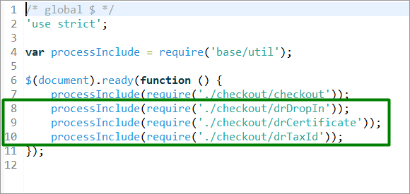

The checkout script (`checkout.js) is` loaded on the Checkout page and includes a basic page frontend event handler. The changes introduced by this script extend the base functionality to correctly handle Digital River extensions.

**Script path**: `cartridge\client\default\js\checkout\checkout.js`

Add the following line at the beginning of the file.

```markup
var drHelper = require('./drHelper');
```


Add the retrieve stored card global variable at the beginning of the checkout function.

```markup
// --- Digital River Retrieve Stored Card ---
var drStoredPayment = null;
```


Add the following code to the shipping submit success handler.

```javascript
if (!data.error && data.digitalRiverConfiguration) {
    drHelper.updateComplianceEntity(data.digitalRiverComplianceOptions.compliance.entity);
    $('body').trigger('digitalRiver:dropIn', data.digitalRiverConfiguration); // Digital River integration: call dropIn feature after checkoutCreate
    $('body').trigger('digitalRiver:taxIdentifier', data.digitalRiverTaxIdConfig);
    if (data.digitalRiverTaxExemptEnable) {
        $('.us-tax-certificate-block').show();
    } else {
        $('.us-tax-certificate-block').hide();
    }
}
```


Add the following code to line 230.

```markup
drStoredPayment = null; // --- Digital River Retrieve Stored Card ---
```

Extend the code on line 235 as follows:

```markup
var paymentMethod = $('.payment-information').data('payment-method-id');
if (paymentMethod === 'CREDIT_CARD' || paymentMethod === 'DIGITAL_RIVER_DROPIN') { // Extended by Digital River Drop-in integration
```

Add the following code to line 237.

```markup
if ($('.saved-payment-instrument.selected-payment').length === 0) {
    $('#savedPaymentNotSelectedMessage').show();
    $('#collapse-payment').collapse('show');
    defer.reject();
    return defer;
}
```

Add the following code to line 265.

```markup
/ --- Digital River Retrieve Stored Card ---
drStoredPayment = $savedPaymentInstrument.data('uuid');
```


Extend the code on line 282 as follows:

```markup
$('#collapse-billing').collapse('show');
```


Extend the code on line 324 as follows:

```markup
drHelper.renderDRConfirm();
```


Wrap the contents of the `placeOrder` stage function.

```markup
// --- Digital River Retrieve Stored Card ---
var placeOrder = function (defer) {

… 'placeOrder' stage content goes here

}
drHelper.retrieveStoredCard(drStoredPayment, defer, placeOrder);
```


#### Billing&#x20;

The billing (`billing .js`) script is loaded into the checkout page and includes a basic frontend event handler for the billing stage. The changes introduced by this script extend the basic functionality for the correct processing of Digital River payment instruments and payment cards stored in the customer's account.

**Script path**: `cartridge\client\default\js\checkout\billing.js`&#x20;

Extend the condition inside the function.

```
if (!$('#dropInContainer').data('enabled')
    && billing.payment && billing.payment.selectedPaymentInstruments
    && billing.payment.selectedPaymentInstruments.length > 0) {
```


Add the `<getCreditCardPaymentInfoHtml>` **** function.

```
/**
 * Creates html to display payment summary for credit card payment
 * @param {Object} order current order model
 * @param {Object} selectedPaymentInstrument selected payment instrument model
 * @returns {string} html for credit card payment
 */
function getCreditCardPaymentInfoHtml(order, selectedPaymentInstrument) {
    return '<span>' + order.resources.cardType + ' '
    + selectedPaymentInstrument.type
    + '</span><div>'
    + selectedPaymentInstrument.maskedCreditCardNumber
    + '</div><div><span>'
    + order.resources.cardEnding + ' '
    + selectedPaymentInstrument.expirationMonth
    + '/' + selectedPaymentInstrument.expirationYear
    + '</span></div>';
}
```

And use it for creating HTML inside the `<updatePaymentInformation>` function. For `switch (selectedPaymentInstrument.paymentType)`, add the payment information (for example, `DIGITAL_RIVER_DROPIN`).&#x20;


**Important**: The `DIGITAL_RIVER_DROPIN` payment integration represents not one but multiple payment types such as credit card, PayPal, Wire Transfer, and so on. The Drop-in integration provides the selection of payment types, and the client-side/backend scripts handle it. We designed this cartridge mainly to handle the credit card payment type, though it will also successfully process any other payment type provided by the Drop-in integration. To add any business logic for a specific payment type or provide shoppers with a better customer experience, you can extend [Drop-in data handlers](extending-the-salesforce-b2c-link-cartridge.md#external-interfaces).


Make sure you have the necessary data provided by the Payment model.

```
var selectedPaymentInstrument = order.billing.payment.selectedPaymentInstruments[0];
if (selectedPaymentInstrument.paymentMethod === 'DIGITAL_RIVER_DROPIN') {
    switch (selectedPaymentInstrument.paymentType) {
        case 'creditCard':
            htmlToAppend += getCreditCardPaymentInfoHtml(order, selectedPaymentInstrument);
            break;
        default: // extend switch with new cases or extend default if you want to show extended data for non-card payment types
            htmlToAppend += '<span>' + selectedPaymentInstrument.paymentType
        + '</span>';
    }
} else {
    htmlToAppend += getCreditCardPaymentInfoHtml(order, selectedPaymentInstrument);
}
```


Wrap the `<clearCreditCardForm>` function content with the following condition.

```
if (!$('#dropInContainer').data('enabled')) {

… function content goes here

}
```


Wrap the `<handleCreditCardNumber>` content with the following condition.

```
if ($('.cardNumber').length > 0) { // if Digital River enabled card form will be replaced with Drop-in functionality
    cleave.handleCreditCardNumber('.cardNumber', '#cardType');
}
```

Add the condition inside the `<selectSavedPaymentInstrument>`.

```
if (!$('#dropInContainer').data('enabled')) { // Digital River - if enabled no cvv needed thus pictures are always shown instead of input
    $('.saved-payment-instrument .card-image').removeClass('checkout-hidden');
    $('.saved-payment-instrument .security-code-input').addClass('checkout-hidden');
    $('.saved-payment-instrument.selected-payment'
        + ' .card-image').addClass('checkout-hidden');
    $('.saved-payment-instrument.selected-payment '
        + '.security-code-input').removeClass('checkout-hidden');
}
```


Add the following code in the `<addNewPaymentInstrument>` function.

```
// Digital River Drop-in section
if ($('#dropInContainer').data('enabled')) {
    $('.drop-in-container').removeClass('checkout-hidden'); // show drop-in form to enter new payment
    $('.submit-payment').addClass('digitalriver-hide'); // next step will be launched from drop-in button instead
}
```

Add the following code in the `<cancelNewPayment>` function.

```
// Digital River Drop-in section
if ($('#dropInContainer').data('enabled')) {
    $('.submit-payment').removeClass('digitalriver-hide');
    $('.drop-in-container').addClass('checkout-hidden');
}
```


#### **Payment instruments**&#x20;

The default storefront on the Checkout page uses the payment instruments (paymentInstruments.js) script. This JavaScript includes the frontend handler for payment cards. This frontend JavaScript must be completed and compiled before used on the site. When this JavaScript  is loaded on the Checkout page, the script loads the base handler (`paymentInstruments.js`) and additionally loads the handler for the Digital River payment cards (`paymentInstrumentsDropIn.js`).

Use `proccessInclude` to extend the default paymentInstruments.js script. Once compiled, the `paymentInstrumentsDropIn` will extend Checkout page to display the available payment methods. The script contains functions to launch Drop-in, handle errors, and handle submitted payments.

**Script path**: `cartridge\client\default\js\paymentInstruments.js`&#x20;

Add the **Drop-in** script to the page.

```
processInclude(require('./paymentInstruments/paymentInstrumentsDropIn'));
```


### SFRA version 6.0.0 templates

We provide the following templates and describe how to change them.

* [Add payment](extending-the-salesforce-b2c-link-cartridge.md#add-payment-1)
* [Dashboard profile cards](extending-the-salesforce-b2c-link-cartridge.md#dashboard-profile-cards-1)
* [Cart totals](extending-the-salesforce-b2c-link-cartridge.md#cart-totals-1)
* [Payment options summary](extending-the-salesforce-b2c-link-cartridge.md#payment-options-summary-1)
* [Billing](extending-the-salesforce-b2c-link-cartridge.md#billing-1)
* [Stored payment instruments](extending-the-salesforce-b2c-link-cartridge.md#stored-payment-instruments-1)
* [Confirmation](extending-the-salesforce-b2c-link-cartridge.md#confirmation-1)
* [Checkout](extending-the-salesforce-b2c-link-cartridge.md#checkout-2)
* [Order total summary](extending-the-salesforce-b2c-link-cartridge.md#order-total-summary-1)

#### Add payment

The add payment (`addPayment.isml`) template allows you to add payment cards to the customer's account. Modify the template to add Drop-in functionality (DigitalRiver.js), Drop-in styles (DigitalRiver.css), and place Drop-in on the account page.

**Template**: `cartridge\templates\default\account\payment\addPayment.isml`&#x20;


Add this Digital River script to Drop-in functionality on the page and apply the changes to Drop-in styles.

```markup
<script src="https://js.digitalriverws.com/v1/DigitalRiver.js"></script>
<link rel="stylesheet" href="https://js.digitalriverws.com/v1/css/DigitalRiver.css" type="text/css"/>
```

And apply the changes to Drop-in styles.

```markup
assets.addCss('/css/digitalRiver.css');
```


Put the following condition inside the `card-body` `div`.

```markup
<iscomment> Include Digital River Drop-in </iscomment>
<isset name="useDigitalRiverDropIn" value="${require('dw/system/Site').getCurrent().getCustomPreferenceValue('drUseDropInFeature')}" scope="page" />
<isif condition="${useDigitalRiverDropIn}">
    <isinclude template="account/payment/dropinForm"/>
    <isinclude url="${URLUtils.url('DigitalRiver-DisplayCompliance', 'complianceId', 'compliancePayment')}" />
<iselse/>
<iscomment> Default Payment form </iscomment>
    <isinclude template="account/payment/paymentForm"/>
<iscomment> Default Payment form </iscomment>
    <isinclude template="account/payment/paymentForm"/>
</isif>
```


#### Dashboard profile cards

The dashboard profile cards (`dashboardProfileCards.isml`) template contains the script required to add a Digital River Tax Certificates section to your Profile Dashboard page.  The following image shows the out-of-the-box (OOTB) Dashboard Profile Dashboard page for Salesforce B2C Link Cartridge.


When you apply the dashboard profile cards template, it adds Tax Certificates.


**Template path**: `cartridge\templates\default\account\dashboardProfileCards.isml`

Add the Digital River tax certificate section on the page.

```markup
<!---Digital River Tax Certificates--->
<isinclude template="digitalriver/account/drTaxCertificateCard"/>
```


#### Cart totals&#x20;

The cart totals (`cartTotals.isml`) template allows you to include the Digital River Order Summary section on your Checkout page.&#x20;


**Template**: `cartridge\templates\default\cart\cartTotals.isml`

Include the **Digital River Taxations** section in the cart totals template after the discount section.

```markup
<!-- Digital River Taxations -->
<isif condition="${require('dw/system/Site').getCurrent().getCustomPreferenceValue('drUseDropInFeature')}">
    <isif condition="${pdict.totals.isImporterOfRecordTax || pdict.totals.duty.value !== 0}">
        <div class="row">
            <div class="col-8">
                <p>${Resource.msg('label.order.sales.duty','digitalriver', null)}</p>
            </div>
            <div class="col-4">
                <p class="text-right duty-total">${pdict.totals.duty.formatted}</p>
            </div>
        </div>
    </isif>
    <isif condition="${pdict.totals.isImporterOfRecordTax || pdict.totals.importerTax.value !== 0}">
        <div class="row">
            <div class="col-8">
                <p>${Resource.msg('label.order.sales.importerTax','digitalriver', null)}</p>
            </div>
            <div class="col-4">
                <p class="text-right importerTax-total">${pdict.totals.importerTax.formatted}</p>
            </div>
        </div>
    </isif>
    <isif condition="${pdict.totals.isImporterOfRecordTax || pdict.totals.totalFees.value !== 0}">
        <div class="row">
            <div class="col-8">
                <p>${Resource.msg('label.order.sales.totalFees','digitalriver', null)}</p>
            </div>
            <div class="col-4">
                <p class="text-right totalFees-total">${pdict.totals.totalFees.formatted}</p>
            </div>
        </div>
    </isif>
</isif>
```


#### Payment options summary

The payment options summary (`paymentOptionsSummary.isml`) template allows you to extend the payment condition with the `DIGITAL_RIVER_DROPIN` payment method on the Checkout page.&#x20;


**Template path**: `cartridge\templates\default\checkout\billing\paymentOptions\paymentOptionsSummary.isml`

Extend the condition with the `‘DIGITAL_RIVER_DROPIN’` payment method.

```markup
<iselseif condition="${payment.paymentMethod === 'DIGITAL_RIVER_DROPIN'}" />
    <isinclude template="checkout/billing/paymentOptions/dropInSummary" />
```



**Important**: The `DIGITAL_RIVER_DROPIN` payment integration represents not one but multiple payment types such as credit card, PayPal, Wire Transfer, and so on. The Drop-in integration provides the selection of payment types, and the client-side/backend scripts handle it. We designed this cartridge mainly to handle the credit card payment type, though it will also successfully process any other payment type provided by the Drop-in integration. To add any business logic for a specific payment type or provide shoppers with a better customer experience, you can extend [Drop-in data handlers](extending-the-salesforce-b2c-link-cartridge.md#external-interfaces).


#### Billing&#x20;

The billing (`billing.isml`) template allows you to add accordion components to the Billing page. The following image shows the out-of-the-box (OOTB) Payment section of the Checkout page for Salesforce B2C Link Cartridge.


When you apply the dashboard profile cards template, it adds the ability to choose whether the purchase is tax-exempt and the payment method.


**Template path**: `cartridge\templates\default\checkout\billing\billing.isml`&#x20;

Add the accordion components to the billing page.

```markup
<iscomment> DigitalRiver accordion section </iscomment>
<isif condition="${pdict.digitalRiverUseDropInFeature}">
    <div class="accordion" id="accordionBilling">
        <div class="dr-accordion-card">
            <div class="dr-accordion-card-header" id="headingBilling">
                <h2 class="mb-0">
                    <span class="btn btn-link dr-accordion-btn" data-toggle="collapse" data-target="#collapse-billing" aria-expanded="true" aria-controls="collapse-billing">
                        ${Resource.msg('button.billing', 'digitalriver', null)}
                    </span>
                </h2>
            </div>
        <div id="collapse-billing" class="collapse show" aria-labelledby="headingBilling" data-parent="#accordionBilling">
    <div class="dr-accordion-card-body">
</isif>
```


```markup
<isinclude template="digitalriver/checkout/billing/drTaxCertificatesSection" />
<iscomment> DigitalRiver accordion section </iscomment>
<isif condition="${pdict.digitalRiverUseDropInFeature}">
    </div></div></div>
    <iscomment>DigitalRiver tax identifier</iscomment>
    <isif condition="${pdict.digitalRiverUseTaxIdentifier}">
        <div class="dr-accordion-card">
            <div class="dr-accordion-card-header" id="headingTaxIdentifier">
                <h2 class="mb-0">
                    <span class="btn btn-link dr-accordion-btn" data-toggle="collapse" data-target="#collapse-taxidentifier" aria-expanded="false" aria-controls="collapse-taxidentifier">
                        ${Resource.msg('button.taxidentifier', 'digitalriver', null)}
                    </span>
                </h2>
            </div>
            <div id="collapse-taxidentifier" class="collapse" aria-labelledby="headingTaxIdentifier" data-parent="#accordionBilling">
                <div class="dr-accordion-card-body">
                    <div id="tax-id" data-config-url="${URLUtils.url('DigitalRiver-TaxIdentifierConfig')}"></div>
                    <button class="btn btn-block btn-primary dr-btn-taxidentifier-submit" type="button" data-apply-url="${URLUtils.url('DigitalRiver-TaxIdentifierApply')}">
                            ${Resource.msg('button.submit.taxidentifier', 'digitalriver', null)}
                    </button>
                    <div id="dr-list-of-applied-identifiers" data-delete-url="${URLUtils.url('DigitalRiver-TaxIdentifierDelete')}"></div>
                </div>
            </div>
        </div>
    </isif>
    <iscomment>End of DigitalRiver tax identifier</iscomment>
    <div class="dr-accordion-card">
        <div class="dr-accordion-card-header" id="headingPayment">
            <h2 class="mb-0">
                <span class="btn btn-link dr-accordion-btn" data-toggle="collapse" data-target="#collapse-payment" aria-expanded="false" aria-controls="collapse-payment">
                    ${Resource.msg('button.payment', 'digitalriver', null)}
                </span>
            </h2>
        </div>
    <div id="collapse-payment" class="collapse" aria-labelledby="headingPayment" data-parent="#accordionBilling">
        <div class="dr-accordion-card-body">
</isif>
```


Include the Digital River payment options template.

```
<isif condition="${pdict.digitalRiverUseDropInFeature}">
    <isinclude template="digitalriver/checkout/billing/paymentOptions" />
<iselse/>
    <isinclude template="checkout/billing/paymentOptions" />
</isif>
```

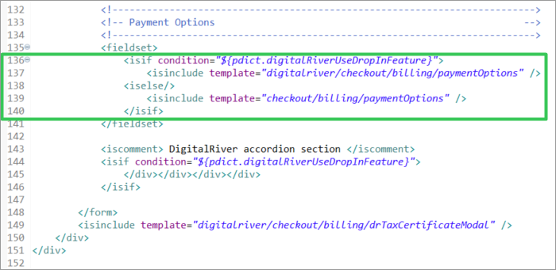

Add the accordion components to the billing page

```markup
<iscomment> Digital River accordion section </iscomment>
<isif condition="${pdict.digitalRiverUseDropInFeature}">
    </div></div></div></div>
</isif>
Include Add Tax certificate modal window component
<isinclude template="digitalriver/checkout/billing/drTaxCertificateModal" />
```


#### **Stored payment instruments**&#x20;

The stored payment instruments (`storedPaymentInstruments.isml`) template allows you to display the stored payment instruments on the Billing page a list of saved payment cards in the customer's account.&#x20;

**Template path**: `cartridge\templates\default\checkout\billing\storedPaymentInstruments.isml`


At the beginning of the file add the following code:

```markup
<isset name="isDRDropInEnabled" value="${require('dw/system/Site').getCurrent().getCustomPreferenceValue('drUseDropInFeature')}" scope="page" />
<div class="invalid-feedback" id="savedPaymentNotSelectedMessage">${Resource.msg('error.select.stored.card', 'digitalriver', null)}</div>
```

Extend the `card-image` class condition as follows:

```markup

```

Also, wrap the security-code-input div with the following condition:

```markup
<isif condition="${!isDRDropInEnabled}"> <iscomment> Digital River - if enabled no cvv needed thus pictures are always shown instead of input </iscomment>
    <div class="security-code-input ${loopState.first ? '' : 'checkout-hidden'}">
        <label class="form-control-label" for="saved-payment-security-code">${Resource.msg('label.credit.card-security.code','checkout',null)}</label>
… security-code-unput goes here
    </div>
</isif>
```


#### Confirmation

We modified the standard confirmation (`confirmation.isml`) template for the B2C LINK Cartridge to include the Digital River compliance statement.

The customer should agree to the Terms of Sale and the Privacy Policy of Digital River and set the check box to complete the order. For more information on the [Terms of Sale](https://www.digitalriver.com/legal/terms-conditions/) and the [Privacy Policy](https://www.digitalriver.com/privacy-policy/) of Digital River, visit the [Digital River Legal Documentation](https://www.digitalriver.com/legal-information/) website.

Compliance links are required to be displayed several different places throughout the storefront. The out-of-the-box (OOTB) cartridge displays the compliance links in all required locations. Consult your Digital River Project Manager before making modifications for your storefront. For more detailed information on the purpose of the compliance links, visit [Compliance ](https://www.digitalriver.com/compliance/)on the [Digital River Legal Documentation](https://www.digitalriver.com/legal-information/) website.

**Template path**: `cartridge\templates\default\checkout\confirmation\confirmation.isml`


Add the DigitalRiver.js script to the page.

```markup
<script type="text/javascript" src="https://js.digitalriverws.com/v1/DigitalRiver.js"></script>
    <link rel="stylesheet" href="https://js.digitalriverws.com/v1/css/DigitalRiver.css" type="text/css"/>
```

Add the Digital River compliance section to the page.

```markup
<div class="row">
    <div class="${pdict.returningCustomer ? 'col-sm-6 offset-sm-3' : 'col-sm-6 offset-sm-3 offset-md-0 pull-md-6' }">
        <isinclude template="digitalriver/compliance" />
    </div>
</div>
```


#### Checkout&#x20;

The checkout (`checkout.isml`) template adds the Digital River styles, the Drop-in styles, and the check box to confirm agreement with the Terms of Sale and the Privacy Policy of Digital River to the Checkout page when the customer is ready to place an order. The customer should agree to the Terms of Sale and the Privacy Policy of Digital River and set the check box to complete the order.&#x20;

**Template**: `cartridge\templates\default\checkout\checkout.isml`


Add the Digital River Drop-in styles.

```markup
<link rel="stylesheet" href="https://js.digitalriverws.com/v1/css/DigitalRiver.css" type="text/css"/>
```

Include the Digital River styles.

```
assets.addCss('/css/digitalRiver.css');
assets.addCss('/css/drAccordion.css');
```


Add the Digital River confirm disclosure checkbox to the checkout page.

```markup
<isinclude template="digitalriver/confirmDisclosure" />
```

Add a condition that will control the submit payment button display.

```
<isset name="submitPaymentShow" value="${!pdict.digitalRiverUseDropInFeature || (pdict.customer.registeredUser && pdict.customer.customerPaymentInstruments.length)  ? '' : 'digitalriver-hide'}" scope="page" />
<button class="btn btn-primary btn-block submit-payment ${submitPaymentShow}" type="submit" name="submit" value="submit-payment">
```

Add the Digital River compliance section to the checkout page.

```markup
<div class="row">
    <div class="col-12 next-step-button">
        <div class="mb-sm-3" id="ch">
            <isinclude url="${URLUtils.url('DigitalRiver-DisplayCompliance', 'complianceId', 'checkoutCompliance')}" />
        </div>
    </div>
</div>
```


#### Order total summary

The order total summary (`orderTotalSummary.isml`) template allows you to add the Digital River Taxations section to your Checkout page.&#x20;

**Template path**: `cartridge\templates\default\checkout\orderTotalSummary.isml`&#x20;


Add the **Digital River Taxations** section.

```markup
<!--- Digital River Taxations --->
<isif condition="${require('dw/system/Site').getCurrent().getCustomPreferenceValue('drUseDropInFeature')}">
    <div class="row leading-lines duty-item ${!pdict.order.totals.isImporterOfRecordTax && pdict.order.totals.duty.value === 0 ? 'hide-order-discount': ''}">
        <div class="col-6 start-lines">
            <p class="order-receipt-label"><span>${Resource.msg('label.order.sales.duty','digitalriver', null)}</span></p>
        </div>
        <div class="col-6 end-lines">
            <p class="text-right"><span class="duty-total">${pdict.order.totals.duty.formatted}</span></p>
        </div>
    </div>
    <div class="row leading-lines importerTax-item ${!pdict.order.totals.isImporterOfRecordTax && pdict.order.totals.importerTax.value === 0 ? 'hide-order-discount': ''}">
        <div class="col-6 start-lines">
            <p class="order-receipt-label"><span>${Resource.msg('label.order.sales.importerTax','digitalriver', null)}</span></p>
        </div>
        <div class="col-6 end-lines">
            <p class="text-right"><span class="importerTax-total">${pdict.order.totals.importerTax.formatted}</span></p>
        </div>
    </div>
    <div class="row leading-lines totalFees-item ${!pdict.order.totals.isImporterOfRecordTax && pdict.order.totals.totalFees.value === 0 ? 'hide-order-discount': ''}">
        <div class="col-6 start-lines">
            <p class="order-receipt-label"><span>${Resource.msg('label.order.sales.totalFees','digitalriver', null)}</span></p>
        </div>
        <div class="col-6 end-lines">
            <p class="text-right"><span class="totalFees-total">${pdict.order.totals.totalFees.formatted}</span></p>
        </div>
    </div>
</isif>
```


### SFRA version 6.0.0 client scripts

We provide the following client scripts and describe how to change them.

* [Checkout](extending-the-salesforce-b2c-link-cartridge.md#checkout-1)
* [Billing](extending-the-salesforce-b2c-link-cartridge.md#billing-1)
* [Payment instruments](extending-the-salesforce-b2c-link-cartridge.md#payment-instruments)


**Note**: Do not forget to compile client-side scripts after implementing changes in the source code.


#### Checkout

The checkout (`checkout.js`) script is loaded on the Checkout page and includes the page frontend event handler. The script loads the base event handler (`checkout.js`) and additionally loads the Digital River US Tax Certificate handler (`stdrCertificate.js`) on the shipping stage of the checkout and the Global Tax ID handler (`drTaxId.js`) on the billing stage of checkout.

**Script path**: `cartridge\client\default\js\checkout.js`&#x20;

Include the additional scripts on the checkout page.

```javascript
processInclude(require('./checkout/drDropIn'));
processInclude(require('./checkout/drCertificate'));
processInclude(require('./checkout/drTaxId'));
```


The checkout script (`checkout.js) is` loaded on the Checkout page and includes a basic page frontend event handler. The changes introduced by this script extend the base functionality to correctly handle Digital River extensions.

**Script path**: `cartridge\client\default\js\checkout\checkout.js`

Add the following line at the beginning of the file.

```markup
var drHelper = require('./drHelper');
```


Add the retrieve stored card global variable at the beginning of the checkout function.

```markup
// --- Digital River Retrieve Stored Card ---
var drStoredPayment = null;
```


Add the following code to the shipping submit success handler.

```javascript
if (!data.error && data.digitalRiverConfiguration) {
    drHelper.updateComplianceEntity(data.digitalRiverComplianceOptions.compliance.entity);
    $('body').trigger('digitalRiver:dropIn', data.digitalRiverConfiguration); // Digital River integration: call dropIn feature after checkoutCreate
    $('body').trigger('digitalRiver:taxIdentifier', data.digitalRiverTaxIdConfig);
    if (data.digitalRiverTaxExemptEnable) {
        $('.us-tax-certificate-block').show();
    } else {
        $('.us-tax-certificate-block').hide();
    }
}
```


Add the following code to line 265.

```javascript
drStoredPayment = null; // --- Digital River Retrieve Stored Card ---
```

Extend the code on line 269 as follows:

```javascript
var paymentMethod = $('.payment-information').data('payment-method-id');
if (paymentMethod === 'CREDIT_CARD' || paymentMethod === 'DIGITAL_RIVER_DROPIN') { // Extended by Digital River Drop-in integration
if ($('.saved-payment-instrument.selected-payment').length === 0) {
    $('#savedPaymentNotSelectedMessage').show();
    $('#collapse-payment').collapse('show');
    defer.reject();
    return defer;
}
```

Add the following code to line 300.

```javascript
// --- Digital River Retrieve Stored Card ---
drStoredPayment = $savedPaymentInstrument.data('uuid');
```


Extend the code on line 317 as follows:

```markup
$('#collapse-billing').collapse('show');
```

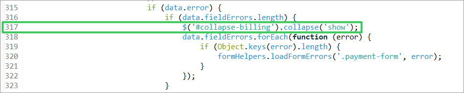

Extend the code on line 359 as follows:

```markup
drHelper.renderDRConfirm();
```

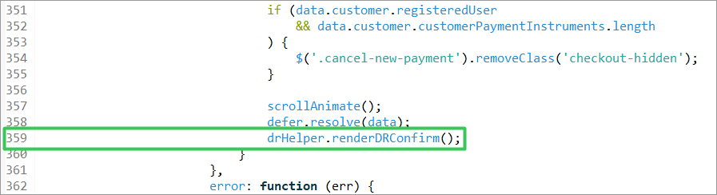

Wrap the contents of the `placeOrder` stage function.

```markup
// --- Digital River Retrieve Stored Card ---
var placeOrder = function (defer) {

… 'placeOrder' stage content goes here

}
drHelper.retrieveStoredCard(drStoredPayment, defer, placeOrder);
```

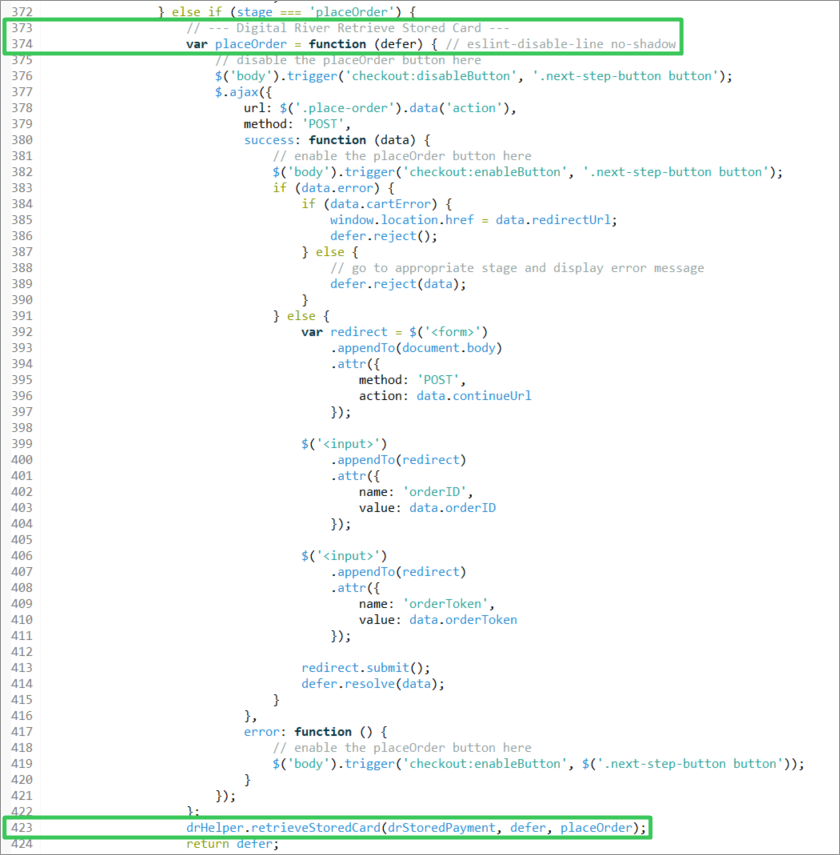

#### Payment instruments

The default storefront on the Checkout page uses the payment instruments (`paymentInstruments.js`) script. This JavaScript includes the frontend handler for payment cards. This frontend JavaScript must be completed and compiled before used on the site. When this JavaScript  is loaded on the Checkout page, the script loads the base handler (`paymentInstruments.js`) and additionally loads the handler for the Digital River payment cards (`paymentInstrumentsDropIn.js`).

Use `proccessInclude` to extend the default paymentInstruments.js script. Once compiled, the `paymentInstrumentsDropIn.js` will extend the Checkout page to display the available payment methods. The script contains functions to launch Drop-in, handle errors, and handle submitted payments.

**Script path**: `cartridge\client\default\js\paymentInstruments.js`&#x20;

```javascript
if ($('#dropInContainer').data('enabled')) return;
```


Edit the `updatePaymentInformation` as follows:

```javascript
if (order.billing.payment && order.billing.payment.selectedPaymentInstruments
    && order.billing.payment.selectedPaymentInstruments.length > 0) {
    if (order.billing.payment.selectedPaymentInstruments[0].paymentType === 'creditCard') {
        htmlToAppend += '<span>' + order.resources.cardType + ' '
            + order.billing.payment.selectedPaymentInstruments[0].type
            + '</span><div>'
            + order.billing.payment.selectedPaymentInstruments[0].maskedCreditCardNumber
            + '</div><div><span>'
            + order.resources.cardEnding + ' '
            + order.billing.payment.selectedPaymentInstruments[0].expirationMonth
            + '/' + order.billing.payment.selectedPaymentInstruments[0].expirationYear
            + '</span></div>';
    } else {
        htmlToAppend += '<span>' + order.billing.payment.selectedPaymentInstruments[0].paymentType + '</span>';
    }
}
```

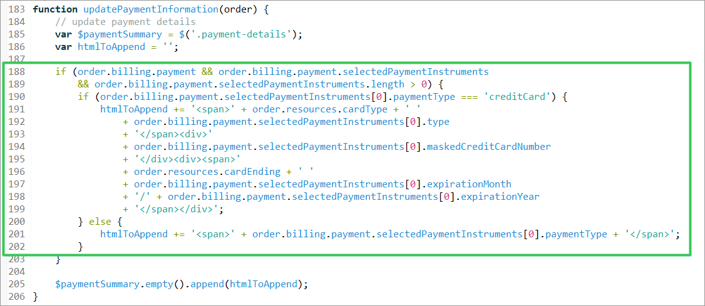

Add the `<clearCreditCardForm>` **** function content and include the following condition:

```javascript
if ($('#dropInContainer').data('enabled')) return;
```

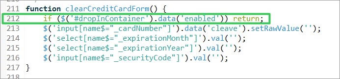

Add the `<handleCreditCardNumber>` fuction and include the following condition:

```javascript
if ($('.cardNumber').length === 0) return;
```


Add the following condition inside the `<selectSavedPaymentInstrument>` function.

```javascript
if ($('#dropInContainer').data('enabled')) { // Digital River - if enabled no cvv needed thus pictures are always shown instead of input
    $('#savedPaymentNotSelectedMessage').hide();
} else {
    $('.saved-payment-instrument .card-image').removeClass('checkout-hidden');
    $('.saved-payment-instrument .security-code-input').addClass('checkout-hidden');
    $('.saved-payment-instrument.selected-payment'
        + ' .card-image').addClass('checkout-hidden');
    $('.saved-payment-instrument.selected-payment '
        + '.security-code-input').removeClass('checkout-hidden');
}
```

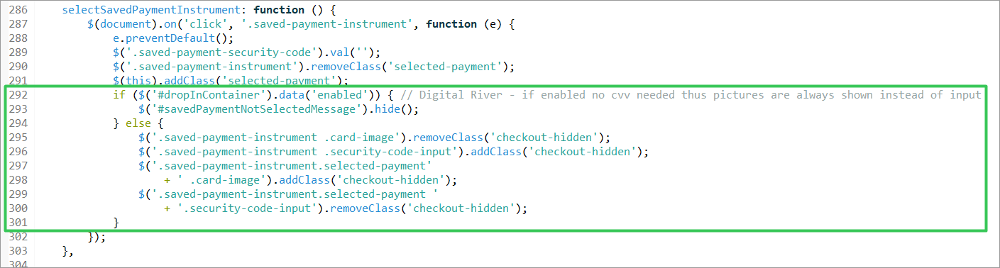

Add the following code to the `<addNewPaymentInstrument>` function:

```javascript
// Digital River Drop-in section
if ($('#dropInContainer').data('enabled')) {
    $('.drop-in-container').removeClass('checkout-hidden'); // show drop-in form to enter new payment
    $('.submit-payment').addClass('digitalriver-hide'); // next step will be launched from drop-in button instead
}
```

Add the following code to  the `<canceNewPayment>` function:

```javascript
// Digital River Drop-in section
if ($('#dropInContainer').data('enabled')) {
    $('.submit-payment').removeClass('digitalriver-hide');
    $('.drop-in-container').addClass('checkout-hidden');
}
```


## Drop-in data handlers <a href="#external-interfaces" id="external-interfaces"></a>

The cartridge uses the [Digital River API](https://docs.digitalriver.com/digital-river-api/) endpoints and the [Digital River Drop-in](https://docs.digitalriver.com/digital-river-api/payment-integrations-1/drop-in) external script to handle client payments. The DigitalRiver.http.service shares one profile and one credential.

### dropinHelper.js

Use the dropinHelper.js to configure specific payment data used by Drop-in.

**Path**: `int_digitalriver\cartridge\scripts\digitalRiver\dropinHelper.js`

You can use use the following elements in dropinHelper.js to configure the payment data.

* `switch(source.type)`—saves payment data (for example, `creditCard`) from Drop-in to the customer's wallet where it can be used the next time the customer goes to the Checkout page.
* `switch(paymentType)`—returns object with specific fields from the SFCC `paymentInstrument` object.
* `switch(source.type)`—returns object with specific fields from the Drop-In response object.

### payment.js

The payments.js script adds specific attributes to the core payment object. Templates and client-side scripts (JSON) use this object.

**Path**: int\_digitalriver\_sfra\cartridge\models\payment.js

* `extendDigitalRiverInfo`—extract data (such as `paymentType`, `maskedCreditCardNumber`, and so on) and makes it available in templates or the client-side as JSON.

## Webhook handler

The webhook handler consists of a [controller](operations-and-maintenance.md#controller), a [helper script](operations-and-maintenance.md#helper-script), and a [handler script](operations-and-maintenance.md#handler-script).

* **Endpoint URL structure**: `{sandbox}/{site}/{locale}/HooksObserver-Debug`
* **Example of endpoint URL**: `https://zzrk-032.sandbox.us01.dx.commercecloud.salesforce.com/on/demandware.store/Sites-DR-SFRA-Net-Site/en_US/HooksObserver-Debug`


You only need to configure a single endpoint per site regardless of the number of locales supported.


### Controller

A controller is prepared to:

* [Step 1: Catch request data](operations-and-maintenance.md#step-1-catch-request-data)
* [Step 2: Use helper scripts to log request data](operations-and-maintenance.md#step-2-use-helper-script-to-log-request-data)
* [Step 3: Check the signature and handle hook](operations-and-maintenance.md#step-3-check-the-signature-and-handle-hook)
* [Step 4: Send an email](operations-and-maintenance.md#step-4-send-an-email)
* [Step 5: Return the response](operations-and-maintenance.md#step-5-return-the-response)

**File**: `cartridges/int_digitalriver/cartridge/controllers/HooksObserver.js`

#### Step 1: Catch request data

```javascript
// get the hook data
var drSignature = request.getHttpHeaders().get('digitalriver-signature') || '';
var requestBodyAsString = request.httpParameterMap.getRequestBodyAsString() || '{}';
var hook = JSON.parse(requestBodyAsString);
var hookType = hook.type ? hook.type : 'error';
var hookHandlerResponse;
var checkSignature = drHooksHelper.checkSignature(drSignature, requestBodyAsString);
```

#### Step 2: Use helper script to log request data

```javascript
// log info
var DRLogger = logger.getLogger("drWebhooks", hookType); // hook type, e.g. refund.pending
DRLogger.info(requestBodyAsString);
```

#### Step 3: Check the signature and handle hook



```javascript
// check signature
if (checkSignature.error) {
    hookType = 'error';
    DRLogger.error(checkSignature.errorMessage);
    // handle hook with error log
    hookHandlerResponse = drHooksHandler.default(hookType, hook.data);
} else if (drHooksHandler[hookType]) {    // signature is ok, handle hooks
    hookHandlerResponse = drHooksHandler[hookType](hook.data);
} else {
    hookHandlerResponse = drHooksHandler.default(hookType, hook.data);
}
```



#### Step 4: Send an email

Individual handlers, not the controller, can optionally send an email.

```javascript
// email section
drHooksHelper.sendTechnicalMail(hookType + ' reques
```

#### Step 5: Return the response

```javascript
// response
response.setStatus(hookHandlerResponse.statusCode);
```

### Helper script

The helper script contains functions to:

* Send an email (`sendTechnicalMail(title, content)`).
  * Set the email address in Business Manager site preferences
* Check the received request (`checkSignature(signature, requestBodyAsString)`).
  * Set webhook signature token in Business Manager site preferences. Otherwise, the handler returns an error and `500` response code. You can find the webhook signature token under Signing secret under [Webhooks ](https://docs.digitalriver.com/digital-river-api/administration/dashboard/developers/webhooks)in the [Dashboard](https://dashboard.digitalriver.com).

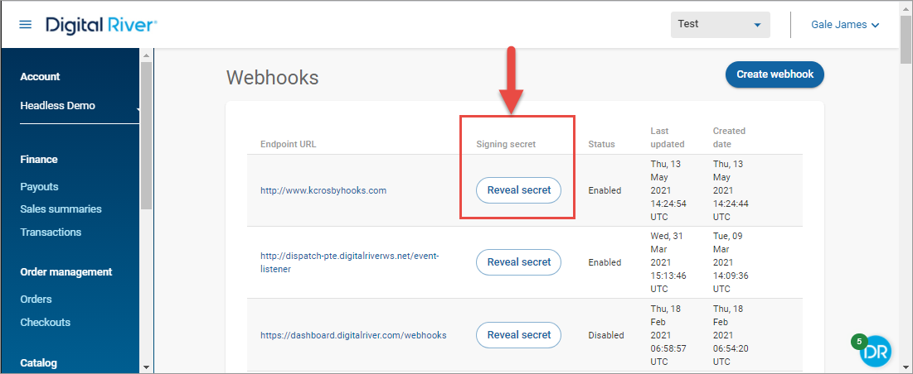

**File**: `cartridges/int_digitalriver/cartridge/scripts/digitalRiver/hooksObserver/drHooksHelper.js`

### Handler script

The handler script contains simple examples of handlers, which can be modified and extended for custom handling. Examples are prepared for the following event types:

* `refund.pending`
* `refund.complete`

If the `hookType` (webhook's [event type](https://docs.digitalriver.com/digital-river-api/events-and-webhooks-1/events-1/event-types)) is set in the request body (see [Step 1: Catch request data](operations-and-maintenance.md#step-1-catch-request-data) in [Controller](operations-and-maintenance.md#controller)), the handler script handles events by the event type and returns a `200 OK` response.


If a handler with a selected `hookType` does not exist or if the `hookType` is not set, the “default” handler is used and processes all other types and returns `200` response code.

If an error occurs, the handler returns a `500` response code.

To add a handler for a specific event type, simply create a function with a data attribute that returns a response code (for example, `200`) and add a function name to the `module.exports` object.


**File**: cartridge`es/int_digitalriver/cartridge/scripts/digitalRiver/hooksObserver/drHooksHandler.js`

### Creating webhooks

To receive a notification when an event occurs (for example, when a refund occurs), you need to create a webhook for that event in the [Digital River Dashboard](https://dashboard.digitalriver.com/login).

1. Sign in to the [Digital River Dashboard](https://dashboard.digitalriver.com/login).
2. Click **Webhooks**.
3. [Create one webhook per site and configure each webhook to send one or more events](https://docs.digitalriver.com/digital-river-api/administration/dashboard/developers/webhooks/creating-a-webhook) using your production or test environment.&#x20;
