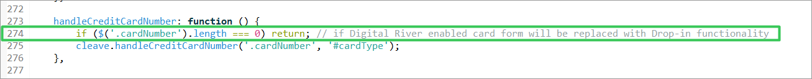

# Extend the Salesforce B2C LINK Cartridge

You can extend the functionality and features of the Salesforce B2C LINK Cartridge to meet your integration needs.  Read the following section to learn how you can do this.&#x20;

## Custom code <a href="#custom-code" id="custom-code"></a>


**Important**: Follow the instructions below only when you cannot use the cartridge directly and unmodified, or you need to resolve conflicts with other cartridges on your project. Otherwise, you must compile the client-side scripts and styles, upload the cartridge, and add it to your storefront cartridge path. \
\
Cartridge **int\_digitalriver\_sfra** already contains all templates and script changes.


## SFRA version 6.0.0 templates

This section describes changes applied to the most recent 6.0.0 templates provided with the cartridge. In addition, the section describes changes that may need to be made to templates to support specific client use cases and integration choices.

The following templates and their changes are described in this section:

* [Add payment](./#add-payment)
* [Dashboard profile cards](./#dashboard-profile-cards)
* [Cart totals](./#cart-totals)
* [Payment options summary](./#payment-options-summary)
* [Billing](./#billing)
* [Stored payment instruments](./#stored-payment-instruments)
* [Confirmation](./#confirmation)
* [Checkout](./#checkout)
* [Order total summary](./#order-total-summary)


<mark style="color:blue;">Note: All line numbers referred to in the following code samples and example screenshots are relative.  For the location of the code changes being discussed, refer to the highlighted areas in the screenshots that are isolated with a green or red border around the code.</mark>


### Add payment

Use the add payment (`addPayment.isml`) template to add payment cards to the customer's account. You can use the template to add Drop-in functionality (DigitalRiver.js) and Drop-in styles (DigitalRiver.css), as well as place Drop-in on an account page.

**Template**: `cartridge/templates/default/account/payment/addPayment.isml`&#x20;


Added this Digital River script to provide Drop-in functionality on the page and apply related changes to Drop-in styles.

```markup
<script src="https://js.digitalriverws.com/v1/DigitalRiver.js"></script>
<link rel="stylesheet" href="https://js.digitalriverws.com/v1/css/DigitalRiver.css" type="text/css"/>
```

Applied the changes to Drop-in styles.

```markup
assets.addCss('/css/digitalRiver.css');
```


Added the following condition inside the `card-body` `div`.

```markup
<iscomment> Include Digital River Drop-in </iscomment>
<isset name="useDigitalRiverDropIn" value="${require('dw/system/Site').getCurrent().getCustomPreferenceValue('drUseDropInFeature')}" scope="page" />
<isif condition="${useDigitalRiverDropIn}">
    <isinclude template="account/payment/dropinForm"/>
    <isinclude url="${URLUtils.url('DigitalRiver-DisplayCompliance', 'complianceId', 'compliancePayment')}" />
<iselse/>
<iscomment> Default Payment form </iscomment>
    <isinclude template="account/payment/paymentForm"/>
<iscomment> Default Payment form </iscomment>
    <isinclude template="account/payment/paymentForm"/>
</isif>
```


### Dashboard profile cards

Use the dashboard profile cards (`dashboardProfileCards.isml`) template to add a Digital River Tax Certificates section to your Profile Dashboard page.  The following image shows the out-of-the-box (OOTB) Dashboard Profile Dashboard page for Salesforce B2C Link Cartridge.


When you apply the dashboard profile cards template, it adds Tax Certificates.


**Template path**: `cartridge/templates/default/account/dashboardProfileCards.isml`

Added the Digital River tax certificate section on the page. In this example, tax certificates are displayed in My account only for the US locale. This section is available for US locale only. <mark style="color:green;"></mark>&#x20;

```markup
<!---Digital River Tax Certificates--->
<isif condition "${pdict.localeCountry === 'US'}">
    <isinclude template="digitalriver/account/drTaxCertificateCard"/>
</isif>
```


### Cart totals&#x20;

Use the cart totals (`cartTotals.isml`) template to include the Digital River Order Summary section on your Checkout page.&#x20;


**Template**: `cartridge/templates/default/cart/cartTotals.isml`

Included the **Digital River Taxations** section in the cart totals template after the discount section.

```markup
<!-- Digital River Taxations -->
<isif condition="${require('dw/system/Site').getCurrent().getCustomPreferenceValue('drUseDropInFeature')}">
    <isif condition="${pdict.totals.isImporterOfRecordTax || pdict.totals.duty.value !== 0}">
        <div class="row">
            <div class="col-8">
                <p>${Resource.msg('label.order.sales.duty','digitalriver', null)}</p>
            </div>
            <div class="col-4">
                <p class="text-right duty-total">${pdict.totals.duty.formatted}</p>
            </div>
        </div>
    </isif>
    <isif condition="${pdict.totals.isImporterOfRecordTax || pdict.totals.importerTax.value !== 0}">
        <div class="row">
            <div class="col-8">
                <p>${Resource.msg('label.order.sales.importerTax','digitalriver', null)}</p>
            </div>
            <div class="col-4">
                <p class="text-right importerTax-total">${pdict.totals.importerTax.formatted}</p>
            </div>
        </div>
    </isif>
    <isif condition="${pdict.totals.isImporterOfRecordTax || pdict.totals.totalFees.value !== 0}">
        <div class="row">
            <div class="col-8">
                <p>${Resource.msg('label.order.sales.totalFees','digitalriver', null)}</p>
            </div>
            <div class="col-4">
                <p class="text-right totalFees-total">${pdict.totals.totalFees.formatted}</p>
            </div>
        </div>
    </isif>
</isif>
```


### Payment options summary

As part of Billing, you can use the payment options summary template (`paymentOptionsSummary.isml`) to extend the payment condition with the `DIGITAL_RIVER_DROPIN` payment method on the Checkout page.&#x20;


**Template path**: `cartridge\templates\default\checkout\billing\paymentOptions\paymentOptionsSummary.isml`

This change extended the payment condition with the `‘DIGITAL_RIVER_DROPIN’` payment method.

```markup
<iselseif condition="${payment.paymentMethod === 'DIGITAL_RIVER_DROPIN'}" />
    <isinclude template="checkout/billing/paymentOptions/dropInSummary" />
```



**Important**: The `DIGITAL_RIVER_DROPIN` payment integration represents not one but multiple payment types such as credit card, PayPal, Wire Transfer, and so on. The Drop-in integration provides the selection of payment types, and the client-side/backend scripts handle it. We designed this cartridge mainly to handle the credit card payment type, though it will also successfully process any other payment type provided by the Drop-in integration. To add any business logic for a specific payment type or provide shoppers with a better customer experience, you can extend [Drop-in data handlers](./#external-interfaces).


### Billing&#x20;

Use the billing (`billing.isml`) template to add accordion components to the Billing page. The following image shows the out-of-the-box (OOTB) Payment section of the Checkout page for Salesforce B2C Link Cartridge.


When you apply the dashboard profile cards template, it adds the ability to choose whether the purchase is tax-exempt and the payment method.


**Template path**: `cartridge/templates/default/checkout/billing/billing.isml`&#x20;

Added the accordion components to the billing page. In this example, accordion billing is used by extending the tag with `id="accordionBilling"`.

```
<div class="accordion" id="accordionBilling" data-digital-cart="${pdict.isDigitalCart}">
```

.png>)

Introduced a new templated purchase site within the parent template.

```
<isinclude template=
    "digitalriver/checkout/billing/drPurchaseTypeSection"/>
```

Extended the Digital River tax identifier section `<div>` tag  with the `dr-accordion-card` class and the remove wrap expression in highlighted code.

```
<div id="tax-id-accordion" class="dr-accordion-card ${pdict.digitalRiverUseTaxIdentifier ? '' : 'hidden'}">
```


Added accordion components to the billing page.

```markup
<iscomment> Digital River accordion section </iscomment>
<isif condition="${pdict.digitalRiverUseDropInFeature}">
    </div></div></div></div>
</isif>
     ude Add Tax certificate modal window component
<isinclude template="digitalriver/checkout/billing/drTaxCertificateModal" />
```


### Stored payment instruments&#x20;

Use the stored payment instruments (`storedPaymentInstruments.isml`) template to display the stored payment instruments on the Billing page as a list of saved payment cards in the customer's account.&#x20;

**Template path**: `cartridge/templates/default/checkout/billing/storedPaymentInstruments.isml`


Added the following code at the beginning of the file:

```markup
<isset name="isDRDropInEnabled" value="${require('dw/system/Site').getCurrent().getCustomPreferenceValue('drUseDropInFeature')}" scope="page" />
<div class="invalid-feedback" id="savedPaymentNotSelectedMessage">${Resource.msg('error.select.stored.card', 'digitalriver', null)}</div>
```

Extended the `card-image` class condition as follows:

```markup

```

Wrapped the security-code-input div with the following condition:

```markup
<isif condition="${!isDRDropInEnabled}"> <iscomment> Digital River - if enabled no cvv needed thus pictures are always shown instead of input </iscomment>
    <div class="security-code-input ${loopState.first ? '' : 'checkout-hidden'}">
        <label class="form-control-label" for="saved-payment-security-code">${Resource.msg('label.credit.card-security.code','checkout',null)}</label>
… security-code-unput goes here
    </div>
</isif>
```


### Confirmation

Use the standard confirmation (`confirmation.isml`) template for the B2C LINK Cartridge to include the Digital River compliance statement.

The customer should agree to the Terms of Sale and the Privacy Policy of Digital River and set the check box to complete an order. For more information on the [Terms of Sale](https://www.digitalriver.com/legal/terms-conditions/) and the [Privacy Policy](https://www.digitalriver.com/privacy-policy/) of Digital River, visit the [Digital River Legal Documentation](https://www.digitalriver.com/legal-information/) website.

Compliance links are required to be displayed several different places throughout the storefront. The out-of-the-box (OOTB) cartridge displays the compliance links in all required locations. Consult your Digital River Project Manager before making modifications for your storefront. For more detailed information on the purpose of the compliance links, visit [Compliance ](https://www.digitalriver.com/compliance/)on the [Digital River Legal Documentation](https://www.digitalriver.com/legal-information/) website.

**Template path**: `cartridge/templates/default/checkout/confirmation/confirmation.isml`


Added the DigitalRiver.js script to the page.

```markup
<script type="text/javascript" src="https://js.digitalriverws.com/v1/DigitalRiver.js"></script>
    <link rel="stylesheet" href="https://js.digitalriverws.com/v1/css/DigitalRiver.css" type="text/css"/>
```

Added the Digital River compliance section to the page.

```markup
<div class="row">
    <div class="${pdict.returningCustomer ? 'col-sm-6 offset-sm-3' : 'col-sm-6 offset-sm-3 offset-md-0 pull-md-6' }">
        <isinclude template="digitalriver/compliance" />
    </div>
</div>
```


Added a Digital River styles file.

```
assets.addCss('/css/digitalRiver.css');
```

.png>)

Added an `include`of `delayedPaymentInstructions` (first highlighted section).

```
<isinclude template="digitalriver/delayedPaymentInstructions" />
```

Added an `include` of `delayedPaymentInstructions` (second highlighted section)<mark style="color:green;">.</mark>

```
<isif condition="${pdict.returningCustomer}">
    <isinclude template="digitalriver/delayedPaymentInstructions" />
</isif>

```

.png>)

### Checkout&#x20;

Use the checkout (`checkout.isml`) template to add Digital River styles, the Drop-in styles, and the check box to confirm agreement with the Terms of Sale and the Privacy Policy of Digital River to the Checkout page when the customer is ready to place an order. The customer should agree to the Terms of Sale and the Privacy Policy of Digital River and set the check box to complete the order.&#x20;


**Note:** Refer to the [Use Customer Credit](use-customer-credit.md) section of this documentation for more information on how to use the Checkout template when using the Customer Credit feature and the`int_digitalriver_customercredit`cartridge.


**Template**: `cartridge/templates/default/checkout/checkout.isml`


Added the Digital River Drop-in styles.

```markup
<link rel="stylesheet" href="https://js.digitalriverws.com/v1/css/DigitalRiver.css" type="text/css"/>
```

Included the Digital River styles.

```
assets.addCss('/css/digitalRiver.css');
assets.addCss('/css/drAccordion.css');
```


Added the Digital River confirm disclosure checkbox to the checkout page.

```markup
<isinclude template="digitalriver/confirmDisclosure" />
```

Added a condition that will control the submit payment button display.

```
<isset name="submitPaymentShow" value="${!pdict.digitalRiverUseDropInFeature || (pdict.customer.registeredUser && pdict.customer.customerPaymentInstruments.length)  ? '' : 'digitalriver-hide'}" scope="page" />
<button class="btn btn-primary btn-block submit-payment ${submitPaymentShow}" type="submit" name="submit" value="submit-payment">
```

Added the Digital River compliance section to the checkout page.

```markup
<div class="row">
    <div class="col-12 next-step-button">
        <div class="mb-sm-3" id="ch">
            <isinclude url="${URLUtils.url('DigitalRiver-DisplayCompliance', 'complianceId', 'checkoutCompliance')}" />
        </div>
    </div>
</div>
```


### Order total summary

Use the order total summary (`orderTotalSummary.isml`) template to add the Digital River Taxations section to your Checkout page.&#x20;

**Template path**: `cartridge/templates/default/checkout/orderTotalSummary.isml`&#x20;


Added the "Sales Tax" information text as conditional HTML content.

```markup
<isif condition="${dw.order.TaxMgr.getTaxationPolicy() !== dw.order.TaxMgr.TAX_POLICY_GROSS}">
    <div class="row leading-lines sales-tax-item">

        … 'Sales Tax' html content goes here

    </div>
</isif>
```

.png>)

Added the **Digital River Taxations** section.

```
<!--- Digital River Taxations --->
<isif condition="${require('dw/system/Site').getCurrent().getCustomPreferenceValue('drUseDropInFeature')}">
    <div class="row leading-lines duty-item ${!pdict.order.totals.isImporterOfRecordTax && pdict.order.totals.duty.value === 0 ? 'hide-order-discount': ''}">
        <div class="col-6 start-lines">
            <p class="order-receipt-label"><span>${Resource.msg('label.order.sales.duty','digitalriver', null)}</span></p>
        </div>
        <div class="col-6 end-lines">
            <p class="text-right"><span class="duty-total">${pdict.order.totals.duty.formatted}</span></p>
        </div>
    </div>
    <div class="row leading-lines importerTax-item ${!pdict.order.totals.isImporterOfRecordTax && pdict.order.totals.importerTax.value === 0 ? 'hide-order-discount': ''}">
        <div class="col-6 start-lines">
            <p class="order-receipt-label"><span>${Resource.msg('label.order.sales.importerTax','digitalriver', null)}</span></p>
        </div>
        <div class="col-6 end-lines">
            <p class="text-right"><span class="importerTax-total">${pdict.order.totals.importerTax.formatted}</span></p>
        </div>
    </div>
    <div class="row leading-lines totalFees-item ${!pdict.order.totals.isImporterOfRecordTax && pdict.order.totals.totalFees.value === 0 ? 'hide-order-discount': ''}">
        <div class="col-6 start-lines">
            <p class="order-receipt-label"><span>${Resource.msg('label.order.sales.totalFees','digitalriver', null)}</span></p>
        </div>
        <div class="col-6 end-lines">
            <p class="text-right"><span class="totalFees-total">${pdict.order.totals.totalFees.formatted}</span></p>
        </div>
    </div>
</isif>
```


Added the Digital River gross site VAT info to the end of the file.

```
<!--- Digital River Gross Site VAT Info --->
<isif condition="${require('dw/system/Site').getCurrent().getCustomPreferenceValue('drUseDropInFeature') && dw.order.TaxMgr.getTaxationPolicy() === dw.order.TaxMgr.TAX_POLICY_GROSS}">
    <isif condition="${!pdict.order.orderNumber}">
        <p class="vat-msg vat-included-msg ${pdict.order.totals.drTaxDiscountTotal.value === 0  ? '': 'hidden'}">
            ${Resource.msg('msg.vat.included', 'digitalriver', null)}
        </p>
        <p class="vat-msg vat-exempted-msg ${pdict.order.totals.drTaxDiscountTotal.value === 0  ? 'hidden': ''}">
            <span class="vat-exempted-value">${pdict.order.totals.drTaxDiscountTotal.formatted}</span> ${Resource.msg('msg.vat.exempted', 'digitalriver', null)}
        </p>
    </isif>
    <isif condition="${pdict.vatReflectMsg}">
        <p class="vat-msg vat-reflect-msg">${pdict.vatReflectMsg}</p>
    </isif>
</isif>
```


## SFRA version 6.0.0 client scripts

This section describes the changes applied to the most recent 6.0.0 client scripts provided with the cartridge. In addition, the section describes changes that you may need to may need to be make to the client scripts to support your specific use cases and integration choices.

The following scripts and their changes are described in this section:

* [Checkout script](./#checkout-script)
* [Billing script](./#billing-script)
* [Payment instruments script](./#payment-instruments-script)
* [Summary script](./#summary-script-customer-credit)


**Note:** All line numbers in the following code samples and example screenshots are relative.  For the location of the code changes being discussed, refer to the highlighted areas in the screenshots that are isolated with a green or red border around the code.



**Note**: Do not forget to compile client-side scripts after implementing changes in the source code.


### Checkout script

The checkout (`checkout.js`) script is loaded on the Checkout page and includes the page frontend event handler. The script loads the base event handler (`checkout.js`) and additionally loads the Digital River US Tax Certificate handler (`drCertificate.js`) on the shipping stage of the checkout and the Global Tax ID handler (`drTaxId.js`) on the billing stage of checkout.

**Script path**: `cartridge/client/default/js/checkout.js`

Included the additional scripts on the checkout page.

```javascript
processInclude(require('./checkout/drDropIn'));
processInclude(require('./checkout/drCertificate'));
processInclude(require('./checkout/drTaxId'));
```


**Script path:** cartridge/client/default/js/checkout/checkout.js

The checkout script (`checkout.js`) is loaded on the Checkout page and includes a basic page frontend event handler. The changes introduced by this script extend the base functionality to correctly handle Digital River extensions.

Added the following line at the beginning of the file:

```markup
var drHelper = require('./drHelper');
```


Added the retrieve stored card global variable at the beginning of the checkout function.

```markup
// --- Digital River Retrieve Stored Card ---
var drStoredPayment = null;
```


Added the following code to the shipping submit success handler.

```
if (!data.error && data.digitalRiverConfiguration) {
                                    drHelper.updateComplianceEntity(data.digitalRiverComplianceOptions.compliance.entity);
                                    $('body').trigger('digitalRiver:dropIn', data.digitalRiverConfiguration); // Digital River integration: call dropIn feature after checkoutCreate
                                    $('body').trigger('digitalRiver:taxIdentifier', data.digitalRiverTaxIdConfig);
                                    $('body').trigger('digitalRiver:taxCertificate', data.digitalRiverTaxExemptData);
                                }

```


Added the following code to the Retrieve stored card section.

```javascript
drStoredPayment = null; // --- Digital River Retrieve Stored Card ---
```

Extended the code as follows.

```javascript
var paymentMethod = $('.payment-information').data('payment-method-id');
if (paymentMethod === 'CREDIT_CARD' || paymentMethod === 'DIGITAL_RIVER_DROPIN') { // Extended by Digital River Drop-in integration
if ($('.saved-payment-instrument.selected-payment').length === 0) {
    $('#savedPaymentNotSelectedMessage').show();
    $('#collapse-payment').collapse('show');
    defer.reject();
    return defer;
}
```

Added the following code to the Retrieve stored card section.

```javascript
// --- Digital River Retrieve Stored Card ---
drStoredPayment = $savedPaymentInstrument.data('uuid');
```


Extended the billing code as follows:

```markup
$('#collapse-billing').collapse('show');
```


Extended the code as follows:

```markup
drHelper.renderDRConfirm();
```


Wrapped the contents of the `placeOrder` stage function.

```markup
// --- Digital River Retrieve Stored Card ---
var placeOrder = function (defer) {

… 'placeOrder' stage content goes here

}
drHelper.retrieveStoredCard(drStoredPayment, defer, placeOrder);
```


```
$('body').trigger('digitalRiver:taxCertificate', data.digitalRiverTaxExemptData);
```

.png>)

### Billing script

Use the `billing.js` script to extend the checkout script functionality.&#x20;

**Script path**: `cartridge/client/default/js/checkout/billing.js`

Modified _updatePaymentInformation_ function. Also modified row (see highlighted area).&#x20;

```
$('[name$=' + element + ']', form).val(attrs[attr]).trigger('change');
```

.png>)

The default storefront on the Checkout page uses the payment instruments (`paymentInstruments.js`) script. This JavaScript includes the frontend handler for payment cards. This frontend JavaScript must be completed and compiled before used on the site. When this JavaScript  is loaded on the Checkout page, the script loads the base handler (`paymentInstruments.js`) and additionally loads the handler for the Digital River payment cards (`paymentInstrumentsDropIn.js`).

Used `proccessInclude` to extend the default paymentInstruments.js script. Once compiled, the `paymentInstrumentsDropIn.js` extends the Checkout page to display the available payment methods. The script contains functions to launch Drop-in, handle errors, and handle submitted payments.

**Script path**: `cartridge/client/default/js/checkout/billing.js`

```javascript
if ($('#dropInContainer').data('enabled')) return;
```


Edit the `updatePaymentInformation` as follows:

```javascript
if (order.billing.payment && order.billing.payment.selectedPaymentInstruments
    && order.billing.payment.selectedPaymentInstruments.length > 0) {
    if (order.billing.payment.selectedPaymentInstruments[0].paymentType === 'creditCard') {
        htmlToAppend += '<span>' + order.resources.cardType + ' '
            + order.billing.payment.selectedPaymentInstruments[0].type
            + '</span><div>'
            + order.billing.payment.selectedPaymentInstruments[0].maskedCreditCardNumber
            + '</div><div><span>'
            + order.resources.cardEnding + ' '
            + order.billing.payment.selectedPaymentInstruments[0].expirationMonth
            + '/' + order.billing.payment.selectedPaymentInstruments[0].expirationYear
            + '</span></div>';
    } else {
        htmlToAppend += '<span>' + order.billing.payment.selectedPaymentInstruments[0].paymentType + '</span>';
    }
}
```


Modify the _selectBillingAddress_ function. An example is shown in line 267 of the following screenshot:

```
$('[name$=' + element + ']', form).val(attrs[attr]).trigger('change');
```

<figure><figcaption></figcaption></figure>

Add the `clearCreditCardForm` **** function content and include the following condition:

```javascript
if ($('#dropInContainer').data('enabled')) return;
```


Add the `handleCreditCardNumber` function and include the following condition:

```javascript
if ($('.cardNumber').length === 0) return;
```



Add the following condition inside the `selectSavedPaymentInstrument` function.

```javascript
if ($('#dropInContainer').data('enabled')) { // Digital River - if enabled no cvv needed thus pictures are always shown instead of input
    $('#savedPaymentNotSelectedMessage').hide();
} else {
    $('.saved-payment-instrument .card-image').removeClass('checkout-hidden');
    $('.saved-payment-instrument .security-code-input').addClass('checkout-hidden');
    $('.saved-payment-instrument.selected-payment'
        + ' .card-image').addClass('checkout-hidden');
    $('.saved-payment-instrument.selected-payment '
        + '.security-code-input').removeClass('checkout-hidden');
}
```


Add the following code to the `addNewPaymentInstrument` function:

```javascript
// Digital River Drop-in section
if ($('#dropInContainer').data('enabled')) {
    $('.drop-in-container').removeClass('checkout-hidden'); // show drop-in form to enter new payment
    $('.submit-payment').addClass('digitalriver-hide'); // next step will be launched from drop-in button instead
}
```

Add the following code to  the `canceNewPayment` function:

```javascript
// Digital River Drop-in section
if ($('#dropInContainer').data('enabled')) {
    $('.submit-payment').removeClass('digitalriver-hide');
    $('.drop-in-container').addClass('checkout-hidden');
}
```


### Summary script

Use the `summary.js` script to extend the checkout script functionality that provides order summary information. For more information on this script and how it is used with the Customer Credit, refer to [Use Customer Credit](use-customer-credit.md) and [Customize the Customer Credit Cartridge](customize-the-customer-credit-cartridge.md).

**Script path**:  `cartridge/client/default/js/checkout/summary.js`

Add summary info rows (highlighted section).

```
/if (totals.drTaxDiscountTotal && Math.abs(totals.drTaxDiscountTotal.value) >= 0.01) {
    $('.vat-included-msg').addClass('hidden');
    $('.vat-exempted-msg').removeClass('hidden');
    $('.vat-exempted-value').text(totals.drTaxDiscountTotal.formatted);
} else {
    $('.vat-included-msg').removeClass('hidden');
    $('.vat-exempted-msg').addClass('hidden');
}
```

.png>)

Add rows (highlighted section).

```
if (totals.isImporterOfRecordTax || (totals.duty && totals.duty.value > 0)) {
        $('.duty-item').removeClass('hide-order-discount');
        $('.duty-total').text(totals.duty.formatted);
    } else {
        $('.duty-item').addClass('hide-order-discount');
    }

    if (totals.isImporterOfRecordTax || (totals.importerTax && totals.importerTax.value > 0)) {
        $('.importerTax-item').removeClass('hide-order-discount');
        $('.importerTax-total').text(totals.importerTax.formatted);
    } else {
        $('.importerTax-item').addClass('hide-order-discount');
    }

    if (totals.isImporterOfRecordTax || (totals.totalFees && totals.totalFees.value > 0)) {
        $('.totalFees-item').removeClass('hide-order-discount');
        $('.totalFees-total').text(totals.totalFees.formatted);
    } else {
        $('.totalFees-item').addClass('hide-order-discount');
    }
```

.png>)

## Drop-in data handlers <a href="#external-interfaces" id="external-interfaces"></a>

Use the cartridge's [Digital River API](https://docs.digitalriver.com/digital-river-api/) endpoints and Digital River [Drop-in](https://docs.digitalriver.com/digital-river-api/payments/payment-integrations-1/drop-in) external script to handle client payments. The DigitalRiver.http.service shares one profile and one credential.

### dropinHelper.js

Use the dropinHelper.js to configure specific payment data used by Drop-in.

**Path**: `int_digitalriver\cartridge\scripts\digitalRiver\dropinHelper.js`

You can use use the following elements in dropinHelper.js to configure the payment data.

* `switch(source.type)`—saves payment data (for example, `creditCard`) from Drop-in to the customer's wallet where it can be used the next time the customer goes to the Checkout page.
* `switch(paymentType)`—returns object with specific fields from the SFCC `paymentInstrument` object.
* `switch(source.type)`—returns object with specific fields from the Drop-In response object.

### payment.js

Use the `payments.js` script to add specific attributes to the core payment object. Templates and client-side scripts (JSON) use this object.

**Path**: int\_digitalriver\_sfra\cartridge\models\payment.js

* `extendDigitalRiverInfo`—extract data (such as `paymentType`, `maskedCreditCardNumber`, and so on) and makes it available in templates or the client-side as JSON.

## Webhook handler

The webhook handler consists of a [controller](./#controller), [a helper script](./#helper-script), and [a handler script](./#handler-script).

* **Endpoint URL structure**: `{sandbox}/{site}/{locale}/HooksObserver-Debug`
* **Example of endpoint URL**: `https://zzrk-032.sandbox.us01.dx.commercecloud.salesforce.com/on/demandware.store/Sites-DR-SFRA-Net-Site/en_US/HooksObserver-Debug`


You only need to configure a single endpoint per site regardless of the number of locales supported.


### Controller

Use the following steps to use the controller portion of the handler:

* [Step 1: Catch request data](../operations-and-maintenance.md#step-1-catch-request-data)
* [Step 2: Use helper scripts to log request data](../operations-and-maintenance.md#step-2-use-helper-script-to-log-request-data)
* [Step 3: Check the signature and handle hook](../operations-and-maintenance.md#step-3-check-the-signature-and-handle-hook)
* [Step 4: Send an email](../operations-and-maintenance.md#step-4-send-an-email)
* [Step 5: Return the response](../operations-and-maintenance.md#step-5-return-the-response)

**File**: `cartridges/int_digitalriver/cartridge/controllers/HooksObserver.js`

#### Step 1: Catch request data

```javascript
// get the hook data
var drSignature = request.getHttpHeaders().get('digitalriver-signature') || '';
var requestBodyAsString = request.httpParameterMap.getRequestBodyAsString() || '{}';
var hook = JSON.parse(requestBodyAsString);
var hookType = hook.type ? hook.type : 'error';
var hookHandlerResponse;
var checkSignature = drHooksHelper.checkSignature(drSignature, requestBodyAsString);
```

#### Step 2: Use helper script to log request data

```javascript
// log info
var DRLogger = logger.getLogger("drWebhooks", hookType); // hook type, e.g. refund.pending
DRLogger.info(requestBodyAsString);
```

#### Step 3: Check the signature and handle hook



```javascript
// check signature
if (checkSignature.error) {
    hookType = 'error';
    DRLogger.error(checkSignature.errorMessage);
    // handle hook with error log
    hookHandlerResponse = drHooksHandler.default(hookType, hook.data);
} else if (drHooksHandler[hookType]) {    // signature is ok, handle hooks
    hookHandlerResponse = drHooksHandler[hookType](hook.data);
} else {
    hookHandlerResponse = drHooksHandler.default(hookType, hook.data);
}
```



#### Step 4: Send an email

Individual handlers, not the controller, can optionally send an email.

```javascript
// email section
drHooksHelper.sendTechnicalMail(hookType + ' request')
```

#### Step 5: Return the response

```javascript
// response
response.setStatus(hookHandlerResponse.statusCode);
```

### Helper script

Use the helper script part of the controller to:

* Send an email (`sendTechnicalMail(title, content)`).
  * Set the email address in Business Manager site preferences
* Check the received request (`checkSignature(signature, requestBodyAsString)`).
  * Set webhook signature token in Business Manager site preferences. Otherwise, the handler returns an error and `500` response code. You can find the webhook signature token under Signing secret under [Webhooks ](https://docs.digitalriver.com/digital-river-api/administration/dashboard/developers/webhooks)in the [Dashboard](https://dashboard.digitalriver.com/).


**File**: `cartridges/int_digitalriver/cartridge/scripts/digitalRiver/hooksObserver/drHooksHelper.js`

### Handler script

Use the handler script where custom handling is needed. The handler script contains simple examples of handlers, which can be modified and extended for custom handling. Examples are provided for the following event types:

* `refund.pending`
* `refund.complete`

If the `hookType` (webhook's [event type](https://docs.digitalriver.com/digital-river-api/order-management/events-and-webhooks-1/events-1)) is set in the request body (see [Step 1: Catch request data](../operations-and-maintenance.md#step-1-catch-request-data) in [Controller](../operations-and-maintenance.md#controller)), the handler script handles events by the event type and returns a `200 OK` response.


If a handler with a selected `hookType` does not exist or if the `hookType` is not set, the “default” handler is used and processes all other types and returns `200` response code.

If an error occurs, the handler returns a `500` response code.

To add a handler for a specific event type, simply create a function with a data attribute that returns a response code (for example, `200`) and add a function name to the `module.exports` object.


**File**: cartridge`es/int_digitalriver/cartridge/scripts/digitalRiver/hooksObserver/drHooksHandler.js`

### Creating webhooks

To receive a notification when an event occurs (for example, when a refund occurs), create a webhook for that event in the [Digital River Dashboard](https://dashboard.digitalriver.com/login).

1. Sign in to the [Digital River Dashboard](https://dashboard.digitalriver.com/login).
2. Click **Webhooks**.
3. [Create one webhook per site and configure each webhook to send one or more events](https://docs.digitalriver.com/digital-river-api/administration/dashboard/developers/webhooks/creating-a-webhook) using your production or test environment.&#x20;
