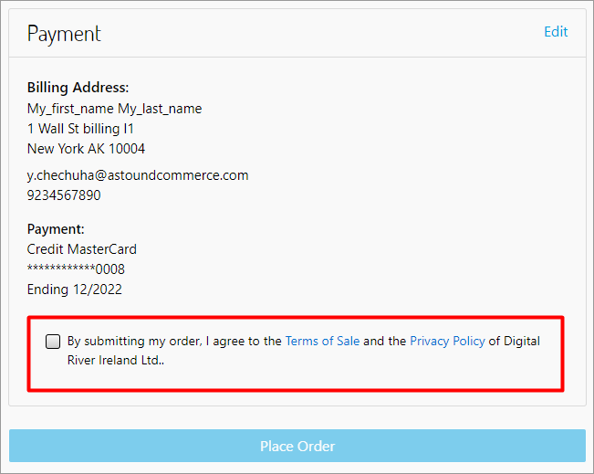

# Customize the Customer Credit Cartridge

This section describes changes you can make to the cartridge to use the customer credit feature.  The section also describes changes you may need to make to other templates or scripts to support client-specific use cases and integration choices associated with customer credit.&#x20;

## Customize related templates

This section describes changes that have been made to the Customer Credit cartridge and related templates and scripts to support the feature.


**Note:** Any line numbers referred to in the following code samples and example screenshots are relative.  For the location of the code changes being discussed, refer to the highlighted areas in the screenshots that are isolated with a green or red border around the code.


### Customize the Checkout template for use with Customer Credit

Use the Checkout (`checkout.isml`) template to add the Digital River styles, the Drop-in styles, and the checkbox needed to confirm agreement with the Terms of Sale and the Privacy Policy of Digital River to the Checkout page when the customer is ready to place an order. &#x20;

You can also use it with the Customer Credit feature to customize that feature for your specific integration. The rest of this section presents you with some examples of how to customize the Checkout template specifically for use with the customer credit feature.

#### Checkout template customization example 1

Follow this example to understand the changes made to the general Checkout template to display customer credit lines in order of Totals, Details, and Summary. Do this by adding the customer credit feature template to the Checkout page. The changes made are the following:

**Template**: `int_digitalriver_customercredit\cartridge\templates\default\checkout\checkout.isml`

Added the Digital River Customer Credit template Checkout page (see highlighted area).

```
<isinclude template="digitalriver/credits/customerCreditTotalCheckout" />
```

.png>)

#### Checkout template customization example 2

Follow this example to customize the Checkout template to add the Digital River styles, the Drop-in styles, and the check box to confirm agreement with the Terms of Sale and the Privacy Policy of Digital River to the Checkout page. Make these changes to add important features to your Customer Customer Credit application.

**Template**: `cartridge/templates/default/checkout/checkout.isml`



Added the Digital River Drop-in styles.

```markup
<link rel="stylesheet" href="https://js.digitalriverws.com/v1/css/DigitalRiver.css" type="text/css"/>
```

Included the Digital River styles.

```
assets.addCss('/css/digitalRiver.css');
assets.addCss('/css/drAccordion.css');
```


Added the Digital River confirm disclosure checkbox to the checkout page.

```markup
<isinclude template="digitalriver/confirmDisclosure" />
```

Added a condition that will control the submit payment button display.

```
<isset name="submitPaymentShow" value="${!pdict.digitalRiverUseDropInFeature || (pdict.customer.registeredUser && pdict.customer.customerPaymentInstruments.length)  ? '' : 'digitalriver-hide'}" scope="page" />
<button class="btn btn-primary btn-block submit-payment ${submitPaymentShow}" type="submit" name="submit" value="submit-payment">
```

Added the Digital River compliance section to the checkout page.

```markup
<div class="row">
    <div class="col-12 next-step-button">
        <div class="mb-sm-3" id="ch">
            <isinclude url="${URLUtils.url('DigitalRiver-DisplayCompliance', 'complianceId', 'checkoutCompliance')}" />
        </div>
    </div>
</div>
```

Added rows (highlighted section).

```
<isset name="submitPaymentToggle" value="${pdict.customer.registeredUser && !!pdict.customer.customerPaymentInstruments.length}" scope="page" />
<isset name="submitPaymentShow" value="${!pdict.digitalRiverUseDropInFeature || (pdict.customer.registeredUser && pdict.customer.customerPaymentInstruments.length && (pdict.amountRemainingToBeContributed !== 0 || pdict.primarySource))  ? '' : 'digitalriver-hide'}" scope="page" />
```

Extended the `<button>` tag (highlighted section).

```
<button class="btn btn-primary btn-block submit-payment ${submitPaymentShow}" type="submit" name="submit" value="submit-payment" data-toggle="${submitPaymentToggle}">
```


### Customize the Customer Credit Checkout template

Make changes to the Customer Credit Checkout template to add the Customer Credits section to the accordion area in the billing page.

**Template**: `int_digitalriver_customercredit/cartridge/templates/default/checkout/checkout.isml`

Added rows. (see highlighted area).

```
<isset name="submitPaymentToggle" value="${pdict.customer.registeredUser && !!pdict.customer.customerPaymentInstruments.length}" scope="page" />
<isset name="submitPaymentShow" value="${!pdict.digitalRiverUseDropInFeature || (pdict.customer.registeredUser && pdict.customer.customerPaymentInstruments.length && (pdict.amountRemainingToBeContributed !== 0 || pdict.primarySource))  ? '' : 'digitalriver-hide'}" scope="page" />

```

Extended button tag. (see highlighted area).

```
<button class="btn btn-primary btn-block submit-payment ${submitPaymentShow}" type="submit" name="submit" value="submit-payment" data-toggle="${submitPaymentToggle}">
```


### Customize the paymentOptionsSummary template

Use the following changes to add the Customer Credits section to the payment info section of the Order Review page in the `paymentOptionsSummary` template.

**Template**: `int_digitalriver_customercredit/templates/default/checkout/billing/paymentOptions/paymentOptionsSummary.isml`&#x20;

Added additional rows (line 2).

```
<div class="row leading-lines">
    <isset name="index" value="1" scope="page" />
    <isloop items="${pdict.order.billing.payment.selectedPaymentInstruments}" var="payment">
        <!-- @IG: Modify the following condition depending on your implementation of secondary payment -->
        <isif condition="${payment.paymentMethod === 'GIFT_CERTIFICATE'}" />
            <div class="col-6 start-lines">
                <span class="order-receipt-label">${Resource.msg('label.order.sales.customerCredit','digitalriver', null) + ' ' + index++}</span>
            </div>
            <div class="col-6 end-lines">
                <div class="text-right"><span>${payment.formattedAmount}</span></div>
            </div>
        </isif>
    </isloop>
</div>

```

.png>)

Changed the code to support the `GIFT_CERTIFICATE` payment method used for that specific Customer Credit use case (line 6).

.png>)

## Customize customer credit and related scripts

Read this section to understand changes made to the `CustomerCredit` cartridge and its script code to support the feature. Use these changes to create a successful integration based on your Customer Credit method choice.


**Note:** Do not forget to compile client-side scripts after making your changes in the source code.


### Customize the Checkout script

You can customize the cartridge Checkout script (`int_digitalriver_customercredit/cartridge/client/default/js/checkout/billing.js`) to update the customer credit amount in the payment section. Refer to the Checkout script section of [Extend the Salesforce B2C LINK Cartridge](./) for an example.

### Customize the Billing Script

This customization example outlines changes you can make to the cartridge Billing script (`int_digitalriver_customercredit/cartridge/client/default/js/checkout/billing.js`).  Use these changes to update the customer credit amount in the payment section. These changes are the following:

Change the `updatePaymentInformation` function so that it updates the customer credit information in the payment section on the Checkout page.

```
output.methods.updatePaymentInformation = function (order) {
    // update payment details
    var $paymentSummary = $('.payment-details');
    var htmlToAppend = '';
    var htmlGiftToAppend = '';

    if (order.billing.payment && order.billing.payment.selectedPaymentInstruments
        && order.billing.payment.selectedPaymentInstruments.length > 0) {
        var paymentInstruments = order.billing.payment.selectedPaymentInstruments;
        var index = 1;
        /*
            @IG:
            Modify labelCustomerCredit value with the value you want to be displayed on the UI
        */
        var labelCustomerCredit = $('#dr-list-of-applied-customercredits').data('payment-info-text');
        for (var i = 0; i < paymentInstruments.length; i++) {
            /*
                @IG:
                Modify the following condition depending on your implementation of secondary payment
            */
            if (paymentInstruments[i].paymentMethod === 'GIFT_CERTIFICATE' && paymentInstruments[i].giftCertificateCode === 'customer_credit_code') {
                htmlGiftToAppend += '<div class="col-6 start-lines">'
                    + '<span class="order-receipt-label">' + labelCustomerCredit + ' ' + index + '</span>'
                    + '</div><div class="col-6 end-lines">'
                    + '<div class="text-right">'
                    + '<span>' + paymentInstruments[i].formattedAmount + '</span></div></div>';
                index++;
            } else if (paymentInstruments[i].paymentType === 'creditCard') {
                htmlToAppend += '<div class="row leading-lines">'
                    + '<div class="col-6 start-lines">'
                    + '<span>' + order.resources.cardType + ' ' + paymentInstruments[i].type + '</span></div>'
                    + '<div class="col-6 end-lines"><div class="text-right">'
                    + '<span>' + paymentInstruments[i].formattedAmount + '</span></div></div></div>'
                    + '<div>' + paymentInstruments[i].maskedCreditCardNumber + '</div>'
                    + '<div><span>'
                    + order.resources.cardEnding + ' '
                    + paymentInstruments[i].expirationMonth
                    + '/' + paymentInstruments[i].expirationYear
                    + '</span></div>';
            } else if (order.billing.payment.selectedPaymentInstruments[0].paymentMethod !== 'DIGITAL_RIVER_ZERO_PAYMENT') {
                htmlToAppend += '<div class="row leading-lines">'
                + '<div class="col-6 start-lines">'
                + '<span>' + paymentInstruments[i].paymentType + '</span></div>'
                + '<div class="col-6 end-lines"><div class="text-right">'
                + '<span>' + paymentInstruments[i].formattedAmount + '</span></div></div></div>';
            }
        }
        if (htmlGiftToAppend) {
            htmlGiftToAppend = '<div class="row leading-lines">' + htmlGiftToAppend + '</div>';
        }
    }

    $paymentSummary.empty().append(htmlGiftToAppend + htmlToAppend);
}
```

.png>)

.png>)

Modify the `labelCustomerCredit` value to align with the value you want to be displayed in the user interface.

```
var labelCustomerCredit = $('#dr-list-of-applied-customercredits').data('payment-info-text');
```

Modify the code as follows depending on the payment method being used for Customer Credit.

```
if (paymentInstruments[i].paymentMethod === 'GIFT_CERTIFICATE' && paymentInstruments[i].giftCertificateCode === 'customer_credit_code') {
```

.png>)

### Customize the Summary script

In this example, you make changes to the Summary script (`int_digitalriver_customercredit/cartridge/client/default/js/checkout/summary.js` ). Use these changes to update the customer credit lines in order of Totals, Details, and Summary. The changes are the following:

Add a row and change the `updateTotals` function so that it updates the customer credit lines in order of Totals, Details, and Summary.&#x20;

```
var drHelper = require('./drHelper.js');
```

Add a totals row to the end of the function `updateTotals`.&#x20;

```
drHelper.updateCustomerCreditTotal(totals.adjustedGrandTotal);
```

.png>)

## Customize server scripts

This section describes changes you can make to customize server script code to work well with your integration. You can customize things such as payment method, multiple payment instruments, payment processors, etc. These changes are the following.

#### Payment server script

Change the Payment server script (`cartridge/models/payment.js`) to implement the customer credit feature.  Modify the code at line 23 depending on the payment method that is used for Customer Credit.

```
} else if (paymentInstrument.paymentMethod === 'GIFT_CERTIFICATE'
   && paymentInstrument.giftCertificateCode === 'customer_credit_code') {
```

.png>)

#### CheckoutHelper server script

You can also make changes to the `checkoutHelper` server script (`cartridge/scripts/checkout/checkoutHelpers.js`) to implement the customer credit feature. Modify the `calculatePaymentTransaction` function at line 13 depending on your method of supporting multiple payment instruments.

.png>)

#### Basic\_customer\_credit script

This script was added for testing purposes only and SHOULD NOT be used as is. Either delete it or modify it based on the payment method that is being used for Customer Credit.

.png>)

#### drTaxHelper script

Make changes to the `drTaxHelper` server script (`cartridge/scripts/digitalRiver/drTaxHelper.js`) when implementing the customer credit feature.&#x20;

Modify the `getNonGiftCertificatePriceTotal`function  based on the payment method used for Customer Credit.

```
var paymentInstruments = basket.getGiftCertificatePaymentInstruments();
```

```
return (paymentInstrument.giftCertificateCode === 'customer_credit_code')
```

.png>)

Modify the `resetBasketCheckoutData` function depending on the payment method used for Customer Credit.

```
var paymentInstruments = basket.getGiftCertificatePaymentInstruments();
```

```
if (paymentInstrument.giftCertificateCode === 'customer_credit_code') {
```

.png>)
