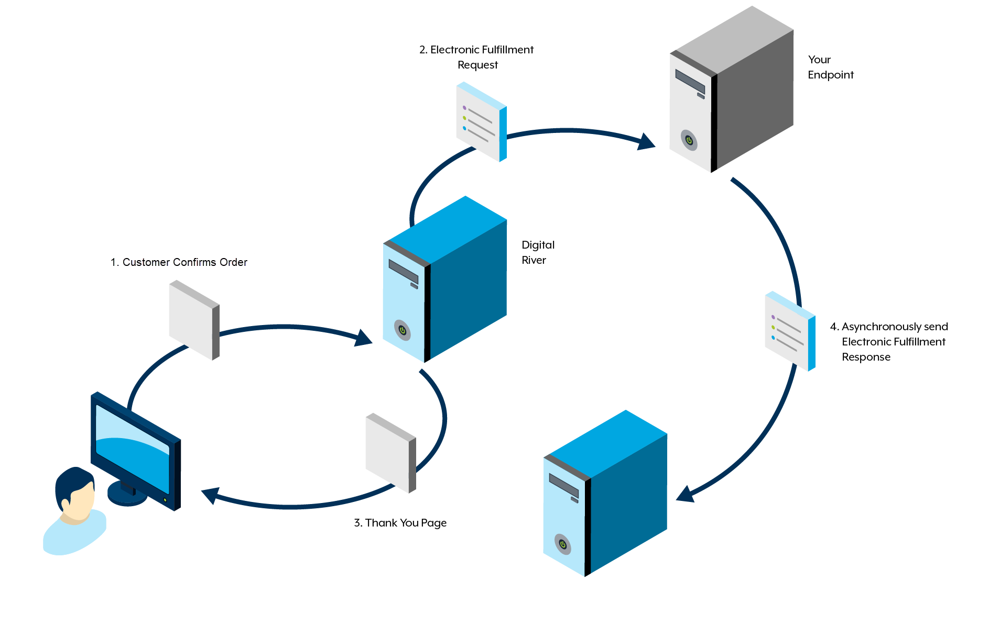
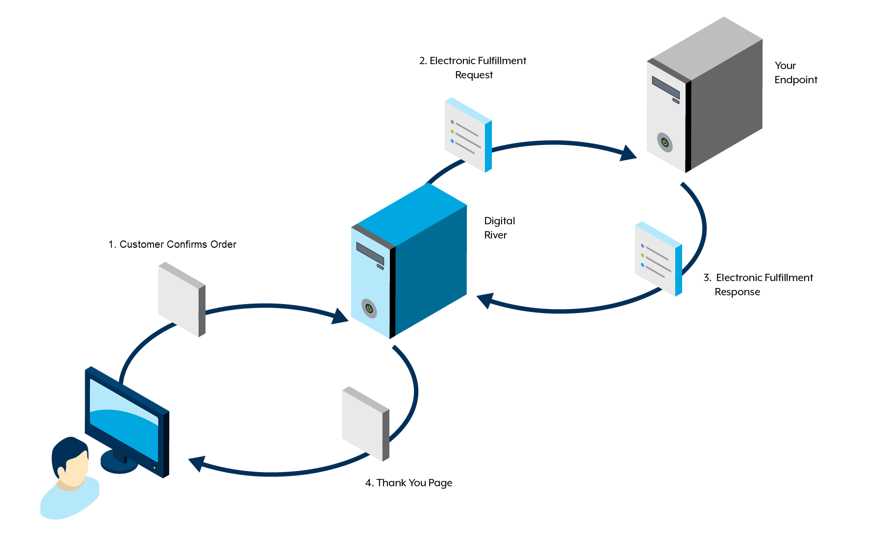

# Electronic Fulfillment Service (OFI)

The OFI serves as the automated mechanism through which Digital River communicates the fulfillment of licenses, warranties, storage space, secure certificates, PINs digital activation, and various service products.

## Supported scenarios

The Electronic Fulfillment service supports the following fulfillment scenarios:

| Type                                | Description                                                                                              |
| ----------------------------------- | -------------------------------------------------------------------------------------------------------- |
| Real-time Synchronous Line          | When you send a request, the response is expected at a later point per line item.                        |
| Real-time Asynchronous Line         | When you send a request, the response is expected at a later point per line item.                        |
| Non Real-time Line                  | A bulk option for sending a request for multiple line items and a response is expected at a later point. |
| Real-time Synchronous Order         | When you send a request, the response is expected in real-time per order.                                |
| Real-time Asynchronous Order        | When you send a request, the response is expected at a later point per order.                            |
| Electronic Fulfillment Revoke       | When you send a revoke, a response is expected in real-time.                                             |
| Electronic Fulfillment Notification | The standard response for all asynchronous and non-real-time types.                                      |


**Note**: Until a completed status is received for `<electronicFulfillmentResponse>` or `<electronicFulfillmentNotice>`, the customer will not be charged.


## Asynchronous

When a customer purchases a product, Digital River sends an Electronic Fulfillment Request and expects a fulfillment response at a later point because the client-side requires further processing.


**Example**:

1. A customer buys a product.
2. Digital River generates an Electronic Fulfillment Request and sends it to the client's endpoint.
3. Digital River informs the customer that the order was submitted and they will receive the details shortly on the Thank you page or in the notification email.
4. The client verifies and evaluates whether to provide the services or not.
5. If everything is OK, the client asynchronously sends the Electronic Fulfillment Response to Digital River containing the fulfillment details. The client's endpoint must respond with an Electronic Fulfillment Response at a later point.
6. Digital River sends an email to the customer that contains the fulfillment details.
7. The settlement is executed.




## Synchronous

When a customer purchases a product, the Digital River sends an Electronic Fulfillment Request and expects an Electronic Fulfillment Response from the client in real-time.


**Example**:

1. A customer buys a product
2. Digital River generates an Electronic Fulfillment Request and sends it to the client's endpoint.
3. The client sends the Electronic Fulfillment Response to Digital River containing the fulfillment details. The client's endpoint must respond with an Electronic Fulfillment Response in real-time.
4. Digital River presents the access credentials to the customer in the Thank you page and in the notification email.
5. The settlement is executed.




## Electronic fulfillment service request/response

A successful electronicFulfillmentResponse/electronicFulfillmentNotice results in a response that contains a non-null, non-empty item element. The `isAutoRetriable`, `responseCode`, `responseType`, `responseMessage`, and `reasonCode` elements will be ignored. These elements only appear in an unsuccessful scenario.

When the successful element is set to false, this signifies an unsuccessful response. In this situation, Digital River uses the `isAutoRetriable`, `responseCode`, `responseType`, `responseMessage`, and `reasonCode` elements to fix the issue causing the non-successful response, and tries again.

When the `isAutoRetriable` flag is set to false, there is a missing required field or a problem with data in the request and Digital River does not automatically retry the request. If the `isAutoRetriable` element is set to true, Digital River automatically retries the request every hour for 21 days.

The fulfillment company can cancel the whole order or part of the line item.



```javascript
{
	"ElectronicFulfillmentRequest": {
		"lineItemID": {
			"_xmlns:xsi": "https://www.w3.org/2001/XMLSchema-instance",
			"_xmlns:xsd": "https://www.w3.org/2001/XMLSchema",
			"_xsi:type": "xsd:string",
			"__text": "15611960011"
		},
		"lineItemExternalReferenceID": {
			"_xmlns:xsi": "https://www.w3.org/2001/XMLSchema-instance",
			"_xmlns:xsd": "https://www.w3.org/2001/XMLSchema",
			"_xsi:type": "xsd:string",
			"_xsi:nil": "true"
		},
		"quantity": {
			"_xmlns:xsi": "https://www.w3.org/2001/XMLSchema-instance",
			"_xmlns:xsd": "https://www.w3.org/2001/XMLSchema",
			"_xsi:type": "xsd:integer",
			"__text": "1"
		},
		"productKey": {
			"productID": {
				"_xmlns:xsd": "https://www.w3.org/2001/XMLSchema",
				"_xsi:type": "xsd:string",
				"__text": "283900600"
			},
			"externalReferenceID": {
				"_xmlns:xsd": "https://www.w3.org/2001/XMLSchema",
				"_xsi:type": "xsd:string",
				"_xsi:nil": "true"
			},
			"companyID": {
				"_xmlns:xsd": "https://www.w3.org/2001/XMLSchema",
				"_xsi:type": "xsd:string",
				"__text": "companyID"
			},
			"locale": {
				"_xmlns:xsd": "https://www.w3.org/2001/XMLSchema",
				"_xsi:type": "xsd:string",
				"__text": "de_DE"
			},
			"_xmlns:xsi": "https://www.w3.org/2001/XMLSchema-instance",
			"_xmlns:ns2": "https://integration.digitalriver.com/Common/1.0",
			"_xsi:type": "ns2:ProductKey"
		},
		"productInfo": {
			"productDataID": {
				"_xmlns:xsd": "https://www.w3.org/2001/XMLSchema",
				"_xsi:type": "xsd:string",
				"__text": "4848922500"
			},
			"mfrPartNumber": {
				"_xmlns:xsd": "https://www.w3.org/2001/XMLSchema",
				"_xsi:type": "xsd:string",
				"__text": "LC.BAG11.002"
			},
			"shipperPartNumber": {
				"_xmlns:xsd": "https://www.w3.org/2001/XMLSchema",
				"_xsi:type": "xsd:string",
				"_xsi:nil": "true"
			},
			"sku": {
				"_xmlns:xsd": "https://www.w3.org/2001/XMLSchema",
				"_xsi:type": "xsd:string",
				"__text": "LC.BAG11.002"
			},
			"name": {
				"_xmlns:xsd": "https://www.w3.org/2001/XMLSchema",
				"_xsi:type": "xsd:string",
				"__text": "TestICONIA B1-71x SERIES POCKET"
			},
			"platform": {
				"_xmlns:xsd": "https://www.w3.org/2001/XMLSchema",
				"_xsi:type": "xsd:string",
				"_xsi:nil": "true"
			},
			"year": {
				"_xmlns:xsd": "https://www.w3.org/2001/XMLSchema",
				"_xsi:type": "xsd:string",
				"_xsi:nil": "true"
			},
			"seats": {
				"_xmlns:xsd": "https://www.w3.org/2001/XMLSchema",
				"_xsi:type": "xsd:string",
				"_xsi:nil": "true"
			},
			"companyID": {
				"_xmlns:xsd": "https://www.w3.org/2001/XMLSchema",
				"_xsi:type": "xsd:string",
				"__text": "comnpanyID"
			},
			"exportCountry": {
				"_xmlns:xsd": "https://www.w3.org/2001/XMLSchema",
				"_xsi:type": "xsd:string",
				"_xsi:nil": "true"
			},
			"manufactureCountry": {
				"_xmlns:xsd": "https://www.w3.org/2001/XMLSchema",
				"_xsi:type": "xsd:string",
				"__text": "CN"
			},
			"harmonizeCode": {
				"_xmlns:xsd": "https://www.w3.org/2001/XMLSchema",
				"_xsi:type": "xsd:string",
				"__text": "42021219"
			},
			"eccn": {
				"_xmlns:xsd": "https://www.w3.org/2001/XMLSchema",
				"_xsi:type": "xsd:string",
				"__text": "EAR99"
			},
			"licenseException": {
				"_xmlns:xsd": "https://www.w3.org/2001/XMLSchema",
				"_xsi:type": "xsd:string",
				"_xsi:nil": "true"
			},
			"ccats": {
				"_xmlns:xsd": "https://www.w3.org/2001/XMLSchema",
				"_xsi:type": "xsd:string",
				"_xsi:nil": "true"
			},
			"extendedAttributes": {
				"item": {
					"name": {
						"_xmlns:xsd": "https://www.w3.org/2001/XMLSchema",
						"_xsi:type": "xsd:string",
						"__text": "weight"
					},
					"value": {
						"_xmlns:xsd": "https://www.w3.org/2001/XMLSchema",
						"_xsi:type": "xsd:string",
						"__text": "0.100 kg"
					},
					"valueDataType": {
						"_xmlns:xsd": "https://www.w3.org/2001/XMLSchema",
						"_xsi:type": "xsd:string",
						"__text": "string"
					},
					"_xsi:type": "ns4:ExtendedAttributesInfo"
				},
				"_xmlns:ns4": "https://integration.digitalriver.com/Common/1.0",
				"_xsi:type": "ns4:ExtendedAttributesInfoArray"
			},
			"_xmlns:xsi": "https://www.w3.org/2001/XMLSchema-instance",
			"_xmlns:ns3": "https://integration.digitalriver.com/commonRequisition/1.0",
			"_xsi:type": "ns3:ProductDataInfo"
		},
		"preOrder": {
			"_xmlns:xsi": "https://www.w3.org/2001/XMLSchema-instance",
			"_xmlns:soapenc": "https://schemas.xmlsoap.org/soap/encoding/",
			"_xsi:type": "soapenc:boolean",
			"__text": "false"
		},
		"preOrderReleaseDate": {
			"_xmlns:xsi": "https://www.w3.org/2001/XMLSchema-instance",
			"_xmlns:xsd": "https://www.w3.org/2001/XMLSchema",
			"_xsi:type": "xsd:dateTime",
			"__text": "2013-11-29T15:12:29.810Z"
		},
		"digitalRightInfoArray": {
			"_xmlns:xsi": "https://www.w3.org/2001/XMLSchema-instance",
			"_xmlns:ns5": "https://integration.digitalriver.com/commonRequisition/1.0",
			"_xsi:type": "ns5:LineItemDigitalInfoArray"
		},
		"lineItemLevelPricing": {
			"unitPrice": {
				"currencyCode": {
					"_xmlns:xsd": "https://www.w3.org/2001/XMLSchema",
					"_xsi:type": "xsd:string",
					"__text": "EUR"
				},
				"amount": {
					"_xmlns:xsd": "https://www.w3.org/2001/XMLSchema",
					"_xsi:type": "xsd:decimal",
					"__text": "19.90"
				},
				"_xmlns:ns7": "https://integration.digitalriver.com/Common/1.0",
				"_xsi:type": "ns7:MoneyInfo"
			},
			"listPrice": {
				"currencyCode": {
					"_xmlns:xsd": "https://www.w3.org/2001/XMLSchema",
					"_xsi:type": "xsd:string",
					"__text": "EUR"
				},
				"amount": {
					"_xmlns:xsd": "https://www.w3.org/2001/XMLSchema",
					"_xsi:type": "xsd:decimal",
					"__text": "19.90"
				},
				"_xmlns:ns8": "https://integration.digitalriver.com/Common/1.0",
				"_xsi:type": "ns8:MoneyInfo"
			},
			"distributorPrice": {
				"currencyCode": {
					"_xmlns:xsd": "https://www.w3.org/2001/XMLSchema",
					"_xsi:type": "xsd:string",
					"__text": "EUR"
				},
				"amount": {
					"_xmlns:xsd": "https://www.w3.org/2001/XMLSchema",
					"_xsi:type": "xsd:decimal",
					"__text": "0.00"
				},
				"_xmlns:ns9": "https://integration.digitalriver.com/Common/1.0",
				"_xsi:type": "ns9:MoneyInfo"
			},
			"pricePerQty": {
				"currencyCode": {
					"_xmlns:xsd": "https://www.w3.org/2001/XMLSchema",
					"_xsi:type": "xsd:string",
					"__text": "EUR"
				},
				"amount": {
					"_xmlns:xsd": "https://www.w3.org/2001/XMLSchema",
					"_xsi:type": "xsd:decimal",
					"__text": "16.72"
				},
				"_xmlns:ns10": "https://integration.digitalriver.com/Common/1.0",
				"_xsi:type": "ns10:MoneyInfo"
			},
			"tax": {
				"currencyCode": {
					"_xmlns:xsd": "https://www.w3.org/2001/XMLSchema",
					"_xsi:type": "xsd:string",
					"__text": "EUR"
				},
				"amount": {
					"_xmlns:xsd": "https://www.w3.org/2001/XMLSchema",
					"_xsi:type": "xsd:decimal",
					"__text": "3.84"
				},
				"_xmlns:ns11": "https://integration.digitalriver.com/Common/1.0",
				"_xsi:type": "ns11:MoneyInfo"
			},
			"productTax": {
				"currencyCode": {
					"_xmlns:xsd": "https://www.w3.org/2001/XMLSchema",
					"_xsi:type": "xsd:string",
					"__text": "EUR"
				},
				"amount": {
					"_xmlns:xsd": "https://www.w3.org/2001/XMLSchema",
					"_xsi:type": "xsd:decimal",
					"__text": "3.18"
				},
				"_xmlns:ns12": "https://integration.digitalriver.com/Common/1.0",
				"_xsi:type": "ns12:MoneyInfo"
			},
			"shippingTax": {
				"currencyCode": {
					"_xmlns:xsd": "https://www.w3.org/2001/XMLSchema",
					"_xsi:type": "xsd:string",
					"__text": "EUR"
				},
				"amount": {
					"_xmlns:xsd": "https://www.w3.org/2001/XMLSchema",
					"_xsi:type": "xsd:decimal",
					"__text": "0.66"
				},
				"_xmlns:ns13": "https://integration.digitalriver.com/Common/1.0",
				"_xsi:type": "ns13:MoneyInfo"
			},
			"shipping": {
				"currencyCode": {
					"_xmlns:xsd": "https://www.w3.org/2001/XMLSchema",
					"_xsi:type": "xsd:string",
					"__text": "EUR"
				},
				"amount": {
					"_xmlns:xsd": "https://www.w3.org/2001/XMLSchema",
					"_xsi:type": "xsd:decimal",
					"__text": "3.46"
				},
				"_xmlns:ns14": "https://integration.digitalriver.com/Common/1.0",
				"_xsi:type": "ns14:MoneyInfo"
			},
			"handling": {
				"currencyCode": {
					"_xmlns:xsd": "https://www.w3.org/2001/XMLSchema",
					"_xsi:type": "xsd:string",
					"__text": "EUR"
				},
				"amount": {
					"_xmlns:xsd": "https://www.w3.org/2001/XMLSchema",
					"_xsi:type": "xsd:decimal",
					"__text": "0.00"
				},
				"_xmlns:ns15": "https://integration.digitalriver.com/Common/1.0",
				"_xsi:type": "ns15:MoneyInfo"
			},
			"incentive": {
				"currencyCode": {
					"_xmlns:xsd": "https://www.w3.org/2001/XMLSchema",
					"_xsi:type": "xsd:string",
					"__text": "EUR"
				},
				"amount": {
					"_xmlns:xsd": "https://www.w3.org/2001/XMLSchema",
					"_xsi:type": "xsd:decimal",
					"__text": "0.00"
				},
				"_xmlns:ns16": "https://integration.digitalriver.com/Common/1.0",
				"_xsi:type": "ns16:MoneyInfo"
			},
			"reqLevelIncentivePerQuantity": {
				"currencyCode": {
					"_xmlns:xsd": "https://www.w3.org/2001/XMLSchema",
					"_xsi:type": "xsd:string",
					"__text": "EUR"
				},
				"amount": {
					"_xmlns:xsd": "https://www.w3.org/2001/XMLSchema",
					"_xsi:type": "xsd:decimal",
					"__text": "0.00"
				},
				"_xmlns:ns17": "https://integration.digitalriver.com/Common/1.0",
				"_xsi:type": "ns17:MoneyInfo"
			},
			"lineItemLevelIncentivePerQuantity": {
				"currencyCode": {
					"_xmlns:xsd": "https://www.w3.org/2001/XMLSchema",
					"_xsi:type": "xsd:string",
					"__text": "EUR"
				},
				"amount": {
					"_xmlns:xsd": "https://www.w3.org/2001/XMLSchema",
					"_xsi:type": "xsd:decimal",
					"__text": "0.00"
				},
				"_xmlns:ns18": "https://integration.digitalriver.com/Common/1.0",
				"_xsi:type": "ns18:MoneyInfo"
			},
			"taxableFees": {
				"currencyCode": {
					"_xmlns:xsd": "https://www.w3.org/2001/XMLSchema",
					"_xsi:type": "xsd:string",
					"__text": "EUR"
				},
				"amount": {
					"_xmlns:xsd": "https://www.w3.org/2001/XMLSchema",
					"_xsi:type": "xsd:decimal",
					"__text": "0.00"
				},
				"_xmlns:ns19": "https://integration.digitalriver.com/Common/1.0",
				"_xsi:type": "ns19:MoneyInfo"
			},
			"taxOnTaxableFees": {
				"currencyCode": {
					"_xmlns:xsd": "https://www.w3.org/2001/XMLSchema",
					"_xsi:type": "xsd:string",
					"__text": "EUR"
				},
				"amount": {
					"_xmlns:xsd": "https://www.w3.org/2001/XMLSchema",
					"_xsi:type": "xsd:decimal",
					"__text": "0.00"
				},
				"_xmlns:ns20": "https://integration.digitalriver.com/Common/1.0",
				"_xsi:type": "ns20:MoneyInfo"
			},
			"nonTaxableFees": {
				"currencyCode": {
					"_xmlns:xsd": "https://www.w3.org/2001/XMLSchema",
					"_xsi:type": "xsd:string",
					"__text": "EUR"
				},
				"amount": {
					"_xmlns:xsd": "https://www.w3.org/2001/XMLSchema",
					"_xsi:type": "xsd:decimal",
					"__text": "0.00"
				},
				"_xmlns:ns21": "https://integration.digitalriver.com/Common/1.0",
				"_xsi:type": "ns21:MoneyInfo"
			},
			"recurringFee": {
				"currencyCode": {
					"_xmlns:xsd": "https://www.w3.org/2001/XMLSchema",
					"_xsi:type": "xsd:string",
					"__text": "EUR"
				},
				"amount": {
					"_xmlns:xsd": "https://www.w3.org/2001/XMLSchema",
					"_xsi:type": "xsd:decimal",
					"__text": "0.00"
				},
				"_xmlns:ns22": "https://integration.digitalriver.com/Common/1.0",
				"_xsi:type": "ns22:MoneyInfo"
			},
			"shippingBeforeDiscount": {
				"currencyCode": {
					"_xmlns:xsd": "https://www.w3.org/2001/XMLSchema",
					"_xsi:type": "xsd:string",
					"__text": "EUR"
				},
				"amount": {
					"_xmlns:xsd": "https://www.w3.org/2001/XMLSchema",
					"_xsi:type": "xsd:decimal",
					"__text": "3.46"
				},
				"_xmlns:ns23": "https://integration.digitalriver.com/Common/1.0",
				"_xsi:type": "ns23:MoneyInfo"
			},
			"lineItemFees": {
				"_xsi:type": "ns6:FeePriceInfoArray"
			},
			"_xmlns:xsi": "https://www.w3.org/2001/XMLSchema-instance",
			"_xmlns:ns6": "https://integration.digitalriver.com/commonRequisition/1.0",
			"_xsi:type": "ns6:LineItemPriceInfo"
		},
		"replacementInfo": {
			"_xmlns:xsi": "https://www.w3.org/2001/XMLSchema-instance",
			"_xmlns:ns24": "https://integration.digitalriver.com/commonRequisition/1.0",
			"_xsi:type": "ns24:ReplacementInfo",
			"_xsi:nil": "true"
		},
		"lineItemExtendedAttributes": {
			"item": {
				"name": {
					"_xmlns:xsd": "https://www.w3.org/2001/XMLSchema",
					"_xsi:type": "xsd:string",
					"__text": "externalWarehouseIDFromRealtimeShippingResponse"
				},
				"value": {
					"_xmlns:xsd": "https://www.w3.org/2001/XMLSchema",
					"_xsi:type": "xsd:string",
					"__text": "gTNL"
				},
				"valueDataType": {
					"_xmlns:xsd": "https://www.w3.org/2001/XMLSchema",
					"_xsi:type": "xsd:string",
					"__text": "string"
				},
				"_xsi:type": "ns25:ExtendedAttributesInfo"
			},
			"_xmlns:xsi": "https://www.w3.org/2001/XMLSchema-instance",
			"_xmlns:ns25": "https://integration.digitalriver.com/Common/1.0",
			"_xsi:type": "ns25:ExtendedAttributesInfoArray"
		},
		"requisitionID": {
			"_xmlns:xsi": "https://www.w3.org/2001/XMLSchema-instance",
			"_xmlns:xsd": "https://www.w3.org/2001/XMLSchema",
			"_xsi:type": "xsd:string",
			"__text": "17877680045"
		},
		"orderExternalReferenceID": {
			"_xmlns:xsi": "https://www.w3.org/2001/XMLSchema-instance",
			"_xmlns:xsd": "https://www.w3.org/2001/XMLSchema",
			"_xsi:type": "xsd:string",
			"_xsi:nil": "true"
		},
		"submissionDate": {
			"_xmlns:xsi": "https://www.w3.org/2001/XMLSchema-instance",
			"_xmlns:xsd": "https://www.w3.org/2001/XMLSchema",
			"_xsi:type": "xsd:dateTime",
			"__text": "2013-11-28T18:26:12.000Z"
		},
		"shopperPassword": {
			"_xmlns:xsi": "https://www.w3.org/2001/XMLSchema-instance",
			"_xmlns:xsd": "https://www.w3.org/2001/XMLSchema",
			"_xsi:type": "xsd:string",
			"_xsi:nil": "true"
		},
		"shopperInfo": {
			"userKey": {
				"userID": {
					"_xmlns:xsd": "https://www.w3.org/2001/XMLSchema",
					"_xsi:type": "xsd:string",
					"__text": "299163539513"
				},
				"externalReferenceID": {
					"_xmlns:xsd": "https://www.w3.org/2001/XMLSchema",
					"_xsi:type": "xsd:string",
					"_xsi:nil": "true"
				},
				"companyID": {
					"_xmlns:xsd": "https://www.w3.org/2001/XMLSchema",
					"_xsi:type": "xsd:string",
					"__text": "1"
				},
				"loginID": {
					"_xmlns:xsd": "https://www.w3.org/2001/XMLSchema",
					"_xsi:type": "xsd:string",
					"__text": "test@testing.com"
				},
				"siteID": {
					"_xmlns:xsd": "https://www.w3.org/2001/XMLSchema",
					"_xsi:type": "xsd:string",
					"__text": "comnpanyID"
				},
				"_xsi:type": "ns26:UserKey"
			},
			"firstName": {
				"_xmlns:xsd": "https://www.w3.org/2001/XMLSchema",
				"_xsi:type": "xsd:string",
				"__text": "Helmut"
			},
			"lastName": {
				"_xmlns:xsd": "https://www.w3.org/2001/XMLSchema",
				"_xsi:type": "xsd:string",
				"__text": "Galonska"
			},
			"email": {
				"_xmlns:xsd": "https://www.w3.org/2001/XMLSchema",
				"_xsi:type": "xsd:string",
				"__text": "test@testing.com"
			},
			"locale": {
				"_xmlns:xsd": "https://www.w3.org/2001/XMLSchema",
				"_xsi:type": "xsd:string",
				"__text": "de_DE"
			},
			"homePhone": {
				"_xmlns:xsd": "https://www.w3.org/2001/XMLSchema",
				"_xsi:type": "xsd:string",
				"_xsi:nil": "true"
			},
			"faxPhone": {
				"_xmlns:xsd": "https://www.w3.org/2001/XMLSchema",
				"_xsi:type": "xsd:string",
				"_xsi:nil": "true"
			},
			"shippingAddress": {
				"addressID": {
					"_xmlns:xsd": "https://www.w3.org/2001/XMLSchema",
					"_xsi:type": "xsd:string",
					"__text": "158311314313"
				},
				"city": {
					"_xmlns:xsd": "https://www.w3.org/2001/XMLSchema",
					"_xsi:type": "xsd:string",
					"__text": "Meerbusch"
				},
				"countryA2": {
					"_xmlns:xsd": "https://www.w3.org/2001/XMLSchema",
					"_xsi:type": "xsd:string",
					"_xsi:nil": "true"
				},
				"country": {
					"_xmlns:xsd": "https://www.w3.org/2001/XMLSchema",
					"_xsi:type": "xsd:string",
					"__text": "DE"
				},
				"countryName": {
					"_xmlns:xsd": "https://www.w3.org/2001/XMLSchema",
					"_xsi:type": "xsd:string",
					"__text": "Germany"
				},
				"line1": {
					"_xmlns:xsd": "https://www.w3.org/2001/XMLSchema",
					"_xsi:type": "xsd:string",
					"__text": "In der Wasserstadt 12"
				},
				"line2": {
					"_xmlns:xsd": "https://www.w3.org/2001/XMLSchema",
					"_xsi:type": "xsd:string",
					"_xsi:nil": "true"
				},
				"line3": {
					"_xmlns:xsd": "https://www.w3.org/2001/XMLSchema",
					"_xsi:type": "xsd:string",
					"_xsi:nil": "true"
				},
				"locationCode": {
					"_xmlns:xsd": "https://www.w3.org/2001/XMLSchema",
					"_xsi:type": "xsd:string",
					"_xsi:nil": "true"
				},
				"name1": {
					"_xmlns:xsd": "https://www.w3.org/2001/XMLSchema",
					"_xsi:type": "xsd:string",
					"__text": "Helmut"
				},
				"name2": {
					"_xmlns:xsd": "https://www.w3.org/2001/XMLSchema",
					"_xsi:type": "xsd:string",
					"__text": "Galonska"
				},
				"phoneNumber": {
					"_xmlns:xsd": "https://www.w3.org/2001/XMLSchema",
					"_xsi:type": "xsd:string",
					"__text": "02150608806"
				},
				"postalCode": {
					"_xmlns:xsd": "https://www.w3.org/2001/XMLSchema",
					"_xsi:type": "xsd:string",
					"__text": "40668"
				},
				"state": {
					"_xmlns:xsd": "https://www.w3.org/2001/XMLSchema",
					"_xsi:type": "xsd:string",
					"_xsi:nil": "true"
				},
				"email": {
					"_xmlns:xsd": "https://www.w3.org/2001/XMLSchema",
					"_xsi:type": "xsd:string",
					"__text": "test@testing.com"
				},
				"faxPhone": {
					"_xmlns:xsd": "https://www.w3.org/2001/XMLSchema",
					"_xsi:type": "xsd:string",
					"_xsi:nil": "true"
				},
				"companyName": {
					"_xmlns:xsd": "https://www.w3.org/2001/XMLSchema",
					"_xsi:type": "xsd:string",
					"_xsi:nil": "true"
				},
				"phoneNumber2": {
					"_xmlns:xsd": "https://www.w3.org/2001/XMLSchema",
					"_xsi:type": "xsd:string",
					"_xsi:nil": "true"
				},
				"countyName": {
					"_xmlns:xsd": "https://www.w3.org/2001/XMLSchema",
					"_xsi:type": "xsd:string",
					"_xsi:nil": "true"
				},
				"extendedAttributes": {
					"_xsi:type": "ns26:ExtendedAttributesInfoArray"
				},
				"_xsi:type": "ns26:AddressInfo"
			},
			"billingAddress": {
				"addressID": {
					"_xmlns:xsd": "https://www.w3.org/2001/XMLSchema",
					"_xsi:type": "xsd:string",
					"__text": "113111"
				},
				"city": {
					"_xmlns:xsd": "https://www.w3.org/2001/XMLSchema",
					"_xsi:type": "xsd:string",
					"__text": "test"
				},
				"countryA2": {
					"_xmlns:xsd": "https://www.w3.org/2001/XMLSchema",
					"_xsi:type": "xsd:string",
					"_xsi:nil": "true"
				},
				"country": {
					"_xmlns:xsd": "https://www.w3.org/2001/XMLSchema",
					"_xsi:type": "xsd:string",
					"__text": "DE"
				},
				"countryName": {
					"_xmlns:xsd": "https://www.w3.org/2001/XMLSchema",
					"_xsi:type": "xsd:string",
					"__text": "Germany"
				},
				"line1": {
					"_xmlns:xsd": "https://www.w3.org/2001/XMLSchema",
					"_xsi:type": "xsd:string",
					"__text": "In der Wasserstadt 12"
				},
				"line2": {
					"_xmlns:xsd": "https://www.w3.org/2001/XMLSchema",
					"_xsi:type": "xsd:string",
					"_xsi:nil": "true"
				},
				"line3": {
					"_xmlns:xsd": "https://www.w3.org/2001/XMLSchema",
					"_xsi:type": "xsd:string",
					"_xsi:nil": "true"
				},
				"locationCode": {
					"_xmlns:xsd": "https://www.w3.org/2001/XMLSchema",
					"_xsi:type": "xsd:string",
					"_xsi:nil": "true"
				},
				"name1": {
					"_xmlns:xsd": "https://www.w3.org/2001/XMLSchema",
					"_xsi:type": "xsd:string",
					"__text": "Helmut"
				},
				"name2": {
					"_xmlns:xsd": "https://www.w3.org/2001/XMLSchema",
					"_xsi:type": "xsd:string",
					"__text": "Galonska"
				},
				"phoneNumber": {
					"_xmlns:xsd": "https://www.w3.org/2001/XMLSchema",
					"_xsi:type": "xsd:string",
					"__text": "02150608806"
				},
				"postalCode": {
					"_xmlns:xsd": "https://www.w3.org/2001/XMLSchema",
					"_xsi:type": "xsd:string",
					"__text": "40668"
				},
				"state": {
					"_xmlns:xsd": "https://www.w3.org/2001/XMLSchema",
					"_xsi:type": "xsd:string",
					"_xsi:nil": "true"
				},
				"email": {
					"_xmlns:xsd": "https://www.w3.org/2001/XMLSchema",
					"_xsi:type": "xsd:string",
					"__text": "test@testing.com"
				},
				"faxPhone": {
					"_xmlns:xsd": "https://www.w3.org/2001/XMLSchema",
					"_xsi:type": "xsd:string",
					"_xsi:nil": "true"
				},
				"companyName": {
					"_xmlns:xsd": "https://www.w3.org/2001/XMLSchema",
					"_xsi:type": "xsd:string",
					"_xsi:nil": "true"
				},
				"phoneNumber2": {
					"_xmlns:xsd": "https://www.w3.org/2001/XMLSchema",
					"_xsi:type": "xsd:string",
					"_xsi:nil": "true"
				},
				"countyName": {
					"_xmlns:xsd": "https://www.w3.org/2001/XMLSchema",
					"_xsi:type": "xsd:string",
					"_xsi:nil": "true"
				},
				"extendedAttributes": {
					"item": {
						"name": {
							"_xmlns:xsd": "https://www.w3.org/2001/XMLSchema",
							"_xsi:type": "xsd:string",
							"__text": "payerIdentifier"
						},
						"value": {
							"_xmlns:xsd": "https://www.w3.org/2001/XMLSchema",
							"_xsi:type": "xsd:string",
							"__text": "F57DFF7B12E04F94D23CEC919DF44394403EA3A0DA005E989F261A655737B1F2"
						},
						"valueDataType": {
							"_xmlns:xsd": "https://www.w3.org/2001/XMLSchema",
							"_xsi:type": "xsd:string",
							"__text": "string"
						},
						"_xsi:type": "ns26:ExtendedAttributesInfo"
					},
					"_xsi:type": "ns26:ExtendedAttributesInfoArray"
				},
				"_xsi:type": "ns26:AddressInfo"
			},
			"_xmlns:xsi": "https://www.w3.org/2001/XMLSchema-instance",
			"_xmlns:ns26": "https://integration.digitalriver.com/Common/1.0",
			"_xsi:type": "ns26:UserInfo"
		},
		"orderExtendedAttributes": {
			"item": {
				"name": {
					"_xmlns:xsd": "https://www.w3.org/2001/XMLSchema",
					"_xsi:type": "xsd:string",
					"__text": "feeJurisdiction"
				},
				"value": {
					"_xmlns:xsd": "https://www.w3.org/2001/XMLSchema",
					"_xsi:type": "xsd:string",
					"__text": "DE"
				},
				"valueDataType": {
					"_xmlns:xsd": "https://www.w3.org/2001/XMLSchema",
					"_xsi:type": "xsd:string",
					"__text": "string"
				},
				"_xsi:type": "ns27:ExtendedAttributesInfo"
			},
			"_xmlns:xsi": "https://www.w3.org/2001/XMLSchema-instance",
			"_xmlns:ns27": "https://integration.digitalriver.com/Common/1.0",
			"_xsi:type": "ns27:ExtendedAttributesInfoArray"
		},
		"_xmlns:ns1": "https://integration.digitalriver.com/ElectronicFulfillmentService",
		"__prefix": "ns1"
	}
}
```



```javascript
{
	"ElectronicFulfillmentResponse": {
		"successful": "true",
		"electronicFulfillmentNotices": {
			"item": {
				"requisitionID": "7351151490",
				"lineItemID": "8410539790",
				"productKey": {
					"productID": "8777656"
				},
				"fulfillmentDate": "2009-01-01T09:24:41.121Z",
				"electronicFulfillmentNoticeItems": {
					"item": {
						"status": "Completed",
						"quantity": "1",
						"electronicContentType": "User warranty",
						"electronicContent": "User warranty certified"
					}
				}
			}
		}
	}
}
```



```javascript
{
	"ElectronicFulfillmentNotice": {
		"requisitionID": "7351151490",
		"lineItemID": "8410539790",
		"productKey": {
			"productID": "8777656"
		},
		"fulfillmentDate": "2009-01-01T09:24:41.121Z",
		"electronicFulfillmentNoticeItems": {
			"item": {
				"status": "Completed",
				"quantity": "1",
				"electronicContentType": "User warranty",
				"electronicContent": "User warranty certified"
			}
		}
	}
}
```



```javascript
{
	"ElectronicFulfillmentResponse": {
		"successful": "false",
		"isAutoRetriable": "false",
		"responseCode": "1",
		"responseType": "Unrecognized orderExternalReferenceID",
		"responseMessage": "Unrecognized orderExternalReferenceID - \nplease supply correct value",
		"electronicFulfillmentNotices": {
			"item": {
				"requisitionID": "7351151490",
				"lineItemID": "8410539790",
				"productKey": {
					"productID": "8777656"
				},
				"electronicFulfillmentNoticeItems": {
					"item": {
						"status": "Error",
						"reasonCode": "Unrecognized \norderExternalReferenceID - please supply correct value",
						"quantity": "1"
					}
				}
			}
		}
	}
}
```



```javascript
{
	"ElectronicFulfillmentNotice": {
		"requisitionID": "7351151490",
		"lineItemID": "8410539790",
		"productKey": {
			"productID": "8777656"
		},
		"electronicFulfillmentNoticeItems": {
			"item": {
				"status": "Cancelled",
				"reasonCode": "Cancel order",
				"electronicContentType": "User warranty",
				"electronicContent": "User warranty not certified. \nUser does not exist.",
				"quantity": "1"
			}
		}
	}
}
```



```javascript
{
	"ElectronicFulfillmentResponse": {
		"successful": "false",
		"responseCode": "10",
		"responseMessage": "Cancel order - User not in our system",
		"electronicFulfillmentNotices": {
			"item": {
				"requisitionID": "7351151490",
				"lineItemID": "8410539790",
				"productKey": {
					"productID": "8777656"
				},
				"electronicFulfillmentNoticeItems": {
					"item": {
						"status": "Cancelled",
						"reasonCode": "Cancel order",
						"electronicContentType": "User warranty",
						"electronicContent": "User warranty not certified. \nUser does not exist.",
						"quantity": "1"
					}
				}
			}
		}
	}
}
```



## Order level

An order-level request is sent to the fulfiller and the fulfiller sends a response.



```javascript
{
	"OrderLevelElectronicFulfillmentRequest": {
		"requisitionID": {
			"_xmlns:xsi": "https://www.w3.org/2001/XMLSchema-instance",
			"_xmlns:xsd": "https://www.w3.org/2001/XMLSchema",
			"_xsi:type": "xsd:string",
			"__text": "12870359111"
		},
		"orderExternalReferenceID": {
			"_xmlns:xsi": "https://www.w3.org/2001/XMLSchema-instance",
			"_xmlns:xsd": "https://www.w3.org/2001/XMLSchema",
			"_xsi:type": "xsd:string",
			"_xsi:nil": "true"
		},
		"submissionDate": {
			"_xmlns:xsi": "https://www.w3.org/2001/XMLSchema-instance",
			"_xmlns:xsd": "https://www.w3.org/2001/XMLSchema",
			"_xsi:type": "xsd:dateTime",
			"__text": "2013-11-29T10:56:36.368Z"
		},
		"shopperPassword": {
			"_xmlns:xsi": "https://www.w3.org/2001/XMLSchema-instance",
			"_xmlns:xsd": "https://www.w3.org/2001/XMLSchema",
			"_xsi:type": "xsd:string",
			"_xsi:nil": "true"
		},
		"shopperInfo": {
			"userKey": {
				"userID": {
					"_xmlns:xsd": "https://www.w3.org/2001/XMLSchema",
					"_xsi:type": "xsd:string",
					"__text": "297167588111"
				},
				"externalReferenceID": {
					"_xmlns:xsd": "https://www.w3.org/2001/XMLSchema",
					"_xsi:type": "xsd:string",
					"_xsi:nil": "true"
				},
				"companyID": {
					"_xmlns:xsd": "https://www.w3.org/2001/XMLSchema",
					"_xsi:type": "xsd:string",
					"__text": "1"
				},
				"loginID": {
					"_xmlns:xsd": "https://www.w3.org/2001/XMLSchema",
					"_xsi:type": "xsd:string",
					"__text": "wart@dr.com"
				},
				"siteID": {
					"_xmlns:xsd": "https://www.w3.org/2001/XMLSchema",
					"_xsi:type": "xsd:string",
					"__text": "comapnyID"
				},
				"_xsi:type": "ns2:UserKey"
			},
			"firstName": {
				"_xmlns:xsd": "https://www.w3.org/2001/XMLSchema",
				"_xsi:type": "xsd:string",
				"__text": "prasad"
			},
			"lastName": {
				"_xmlns:xsd": "https://www.w3.org/2001/XMLSchema",
				"_xsi:type": "xsd:string",
				"__text": "km"
			},
			"email": {
				"_xmlns:xsd": "https://www.w3.org/2001/XMLSchema",
				"_xsi:type": "xsd:string",
				"__text": "wart@dr.com"
			},
			"locale": {
				"_xmlns:xsd": "https://www.w3.org/2001/XMLSchema",
				"_xsi:type": "xsd:string",
				"__text": "en_US"
			},
			"homePhone": {
				"_xmlns:xsd": "https://www.w3.org/2001/XMLSchema",
				"_xsi:type": "xsd:string",
				"_xsi:nil": "true"
			},
			"faxPhone": {
				"_xmlns:xsd": "https://www.w3.org/2001/XMLSchema",
				"_xsi:type": "xsd:string",
				"_xsi:nil": "true"
			},
			"shippingAddress": {
				"addressID": {
					"_xmlns:xsd": "https://www.w3.org/2001/XMLSchema",
					"_xsi:type": "xsd:string",
					"__text": "90117485111"
				},
				"city": {
					"_xmlns:xsd": "https://www.w3.org/2001/XMLSchema",
					"_xsi:type": "xsd:string",
					"__text": "plano"
				},
				"countryA2": {
					"_xmlns:xsd": "https://www.w3.org/2001/XMLSchema",
					"_xsi:type": "xsd:string",
					"_xsi:nil": "true"
				},
				"country": {
					"_xmlns:xsd": "https://www.w3.org/2001/XMLSchema",
					"_xsi:type": "xsd:string",
					"__text": "US"
				},
				"countryName": {
					"_xmlns:xsd": "https://www.w3.org/2001/XMLSchema",
					"_xsi:type": "xsd:string",
					"__text": "United States"
				},
				"line1": {
					"_xmlns:xsd": "https://www.w3.org/2001/XMLSchema",
					"_xsi:type": "xsd:string",
					"__text": "bangalore"
				},
				"line2": {
					"_xmlns:xsd": "https://www.w3.org/2001/XMLSchema",
					"_xsi:type": "xsd:string",
					"_xsi:nil": "true"
				},
				"line3": {
					"_xmlns:xsd": "https://www.w3.org/2001/XMLSchema",
					"_xsi:type": "xsd:string",
					"_xsi:nil": "true"
				},
				"locationCode": {
					"_xmlns:xsd": "https://www.w3.org/2001/XMLSchema",
					"_xsi:type": "xsd:string",
					"_xsi:nil": "true"
				},
				"name1": {
					"_xmlns:xsd": "https://www.w3.org/2001/XMLSchema",
					"_xsi:type": "xsd:string",
					"__text": "prasad"
				},
				"name2": {
					"_xmlns:xsd": "https://www.w3.org/2001/XMLSchema",
					"_xsi:type": "xsd:string",
					"__text": "km"
				},
				"phoneNumber": {
					"_xmlns:xsd": "https://www.w3.org/2001/XMLSchema",
					"_xsi:type": "xsd:string",
					"__text": "1234567111"
				},
				"postalCode": {
					"_xmlns:xsd": "https://www.w3.org/2001/XMLSchema",
					"_xsi:type": "xsd:string",
					"__text": "75025"
				},
				"state": {
					"_xmlns:xsd": "https://www.w3.org/2001/XMLSchema",
					"_xsi:type": "xsd:string",
					"__text": "TX"
				},
				"email": {
					"_xmlns:xsd": "https://www.w3.org/2001/XMLSchema",
					"_xsi:type": "xsd:string",
					"__text": "wart@dr.com"
				},
				"faxPhone": {
					"_xmlns:xsd": "https://www.w3.org/2001/XMLSchema",
					"_xsi:type": "xsd:string",
					"_xsi:nil": "true"
				},
				"companyName": {
					"_xmlns:xsd": "https://www.w3.org/2001/XMLSchema",
					"_xsi:type": "xsd:string",
					"__text": "testSite"
				},
				"phoneNumber2": {
					"_xmlns:xsd": "https://www.w3.org/2001/XMLSchema",
					"_xsi:type": "xsd:string",
					"_xsi:nil": "true"
				},
				"countyName": {
					"_xmlns:xsd": "https://www.w3.org/2001/XMLSchema",
					"_xsi:type": "xsd:string",
					"_xsi:nil": "true"
				},
				"extendedAttributes": {
					"_xsi:type": "ns2:ExtendedAttributesInfoArray"
				},
				"_xsi:type": "ns2:AddressInfo"
			},
			"billingAddress": {
				"addressID": {
					"_xmlns:xsd": "https://www.w3.org/2001/XMLSchema",
					"_xsi:type": "xsd:string",
					"__text": "90117485111"
				},
				"city": {
					"_xmlns:xsd": "https://www.w3.org/2001/XMLSchema",
					"_xsi:type": "xsd:string",
					"__text": "plano"
				},
				"countryA2": {
					"_xmlns:xsd": "https://www.w3.org/2001/XMLSchema",
					"_xsi:type": "xsd:string",
					"_xsi:nil": "true"
				},
				"country": {
					"_xmlns:xsd": "https://www.w3.org/2001/XMLSchema",
					"_xsi:type": "xsd:string",
					"__text": "US"
				},
				"countryName": {
					"_xmlns:xsd": "https://www.w3.org/2001/XMLSchema",
					"_xsi:type": "xsd:string",
					"__text": "United States"
				},
				"line1": {
					"_xmlns:xsd": "https://www.w3.org/2001/XMLSchema",
					"_xsi:type": "xsd:string",
					"__text": "bangalore"
				},
				"line2": {
					"_xmlns:xsd": "https://www.w3.org/2001/XMLSchema",
					"_xsi:type": "xsd:string",
					"_xsi:nil": "true"
				},
				"line3": {
					"_xmlns:xsd": "https://www.w3.org/2001/XMLSchema",
					"_xsi:type": "xsd:string",
					"_xsi:nil": "true"
				},
				"locationCode": {
					"_xmlns:xsd": "https://www.w3.org/2001/XMLSchema",
					"_xsi:type": "xsd:string",
					"_xsi:nil": "true"
				},
				"name1": {
					"_xmlns:xsd": "https://www.w3.org/2001/XMLSchema",
					"_xsi:type": "xsd:string",
					"__text": "prasad"
				},
				"name2": {
					"_xmlns:xsd": "https://www.w3.org/2001/XMLSchema",
					"_xsi:type": "xsd:string",
					"__text": "km"
				},
				"phoneNumber": {
					"_xmlns:xsd": "https://www.w3.org/2001/XMLSchema",
					"_xsi:type": "xsd:string",
					"__text": "1234567890"
				},
				"postalCode": {
					"_xmlns:xsd": "https://www.w3.org/2001/XMLSchema",
					"_xsi:type": "xsd:string",
					"__text": "75025"
				},
				"state": {
					"_xmlns:xsd": "https://www.w3.org/2001/XMLSchema",
					"_xsi:type": "xsd:string",
					"__text": "TX"
				},
				"email": {
					"_xmlns:xsd": "https://www.w3.org/2001/XMLSchema",
					"_xsi:type": "xsd:string",
					"__text": "wart@dr.com"
				},
				"faxPhone": {
					"_xmlns:xsd": "https://www.w3.org/2001/XMLSchema",
					"_xsi:type": "xsd:string",
					"_xsi:nil": "true"
				},
				"companyName": {
					"_xmlns:xsd": "https://www.w3.org/2001/XMLSchema",
					"_xsi:type": "xsd:string",
					"__text": "testSite"
				},
				"phoneNumber2": {
					"_xmlns:xsd": "https://www.w3.org/2001/XMLSchema",
					"_xsi:type": "xsd:string",
					"_xsi:nil": "true"
				},
				"countyName": {
					"_xmlns:xsd": "https://www.w3.org/2001/XMLSchema",
					"_xsi:type": "xsd:string",
					"_xsi:nil": "true"
				},
				"extendedAttributes": {
					"item": {
						"name": {
							"_xmlns:xsd": "https://www.w3.org/2001/XMLSchema",
							"_xsi:type": "xsd:string",
							"__text": "STANDARD_ADDRESS_VALIDATION_IS_ADDRESS_PROCESSED"
						},
						"value": {
							"_xmlns:xsd": "https://www.w3.org/2001/XMLSchema",
							"_xsi:type": "xsd:string",
							"__text": "true"
						},
						"valueDataType": {
							"_xmlns:xsd": "https://www.w3.org/2001/XMLSchema",
							"_xsi:type": "xsd:string",
							"__text": "string"
						},
						"_xsi:type": "ns2:ExtendedAttributesInfo"
					},
					"_xsi:type": "ns2:ExtendedAttributesInfoArray"
				},
				"_xsi:type": "ns2:AddressInfo"
			},
			"_xmlns:xsi": "https://www.w3.org/2001/XMLSchema-instance",
			"_xmlns:ns2": "https://integration.digitalriver.com/Common/1.0",
			"_xsi:type": "ns2:UserInfo"
		},
		"orderExtendedAttributes": {
			"item": {
				"name": {
					"_xmlns:xsd": "https://www.w3.org/2001/XMLSchema",
					"_xsi:type": "xsd:string",
					"__text": "SELECTED_SHIPPING_ADDRESS_BOOK_ENTRY"
				},
				"value": {
					"_xmlns:xsd": "https://www.w3.org/2001/XMLSchema",
					"_xsi:type": "xsd:string",
					"__text": "3496409669"
				},
				"valueDataType": {
					"_xmlns:xsd": "https://www.w3.org/2001/XMLSchema",
					"_xsi:type": "xsd:string",
					"__text": "string"
				},
				"_xsi:type": "ns3:ExtendedAttributesInfo"
			},
			"_xmlns:xsi": "https://www.w3.org/2001/XMLSchema-instance",
			"_xmlns:ns3": "https://integration.digitalriver.com/Common/1.0",
			"_xsi:type": "ns3:ExtendedAttributesInfoArray"
		},
		"lineItemLevelRequest": {
			"lineItemID": {
				"_xmlns:xsd": "https://www.w3.org/2001/XMLSchema",
				"_xsi:type": "xsd:string",
				"__text": "18897544560"
			},
			"lineItemExternalReferenceID": {
				"_xmlns:xsd": "https://www.w3.org/2001/XMLSchema",
				"_xsi:type": "xsd:string",
				"_xsi:nil": "true"
			},
			"quantity": {
				"_xmlns:xsd": "https://www.w3.org/2001/XMLSchema",
				"_xsi:type": "xsd:integer",
				"__text": "104"
			},
			"productKey": {
				"productID": {
					"_xmlns:xsd": "https://www.w3.org/2001/XMLSchema",
					"_xsi:type": "xsd:string",
					"__text": "286479900"
				},
				"externalReferenceID": {
					"_xmlns:xsd": "https://www.w3.org/2001/XMLSchema",
					"_xsi:type": "xsd:string",
					"__text": "EPAYLM-AA-MR"
				},
				"companyID": {
					"_xmlns:xsd": "https://www.w3.org/2001/XMLSchema",
					"_xsi:type": "xsd:string",
					"__text": "comapnyID"
				},
				"locale": {
					"_xmlns:xsd": "https://www.w3.org/2001/XMLSchema",
					"_xsi:type": "xsd:string",
					"__text": "en_US"
				},
				"_xmlns:ns4": "https://integration.digitalriver.com/Common/1.0",
				"_xsi:type": "ns4:ProductKey"
			},
			"productInfo": {
				"productDataID": {
					"_xmlns:xsd": "https://www.w3.org/2001/XMLSchema",
					"_xsi:type": "xsd:string",
					"__text": "4839778400"
				},
				"mfrPartNumber": {
					"_xmlns:xsd": "https://www.w3.org/2001/XMLSchema",
					"_xsi:type": "xsd:string",
					"_xsi:nil": "true"
				},
				"shipperPartNumber": {
					"_xmlns:xsd": "https://www.w3.org/2001/XMLSchema",
					"_xsi:type": "xsd:string",
					"_xsi:nil": "true"
				},
				"sku": {
					"_xmlns:xsd": "https://www.w3.org/2001/XMLSchema",
					"_xsi:type": "xsd:string",
					"__text": "EPAYLM-AA"
				},
				"name": {
					"_xmlns:xsd": "https://www.w3.org/2001/XMLSchema",
					"_xsi:type": "xsd:string",
					"__text": "EPA - testSite Endpoint Protection - Advanced Suite (Support Only)"
				},
				"platform": {
					"_xmlns:xsd": "https://www.w3.org/2001/XMLSchema",
					"_xsi:type": "xsd:string",
					"__text": "Windows XP/Vista/Win7"
				},
				"year": {
					"_xmlns:xsd": "https://www.w3.org/2001/XMLSchema",
					"_xsi:type": "xsd:string",
					"_xsi:nil": "true"
				},
				"seats": {
					"_xmlns:xsd": "https://www.w3.org/2001/XMLSchema",
					"_xsi:type": "xsd:string",
					"_xsi:nil": "true"
				},
				"companyID": {
					"_xmlns:xsd": "https://www.w3.org/2001/XMLSchema",
					"_xsi:type": "xsd:string",
					"__text": "comapnyID"
				},
				"exportCountry": {
					"_xmlns:xsd": "https://www.w3.org/2001/XMLSchema",
					"_xsi:type": "xsd:string",
					"_xsi:nil": "true"
				},
				"manufactureCountry": {
					"_xmlns:xsd": "https://www.w3.org/2001/XMLSchema",
					"_xsi:type": "xsd:string",
					"__text": "US"
				},
				"harmonizeCode": {
					"_xmlns:xsd": "https://www.w3.org/2001/XMLSchema",
					"_xsi:type": "xsd:string",
					"_xsi:nil": "true"
				},
				"eccn": {
					"_xmlns:xsd": "https://www.w3.org/2001/XMLSchema",
					"_xsi:type": "xsd:string",
					"__text": "EAR99"
				},
				"licenseException": {
					"_xmlns:xsd": "https://www.w3.org/2001/XMLSchema",
					"_xsi:type": "xsd:string",
					"_xsi:nil": "true"
				},
				"ccats": {
					"_xmlns:xsd": "https://www.w3.org/2001/XMLSchema",
					"_xsi:type": "xsd:string",
					"_xsi:nil": "true"
				},
				"extendedAttributes": {
					"item": {
						"name": {
							"_xmlns:xsd": "https://www.w3.org/2001/XMLSchema",
							"_xsi:type": "xsd:string",
							"__text": "compare29"
						},
						"value": {
							"_xmlns:xsd": "https://www.w3.org/2001/XMLSchema",
							"_xsi:type": "xsd:string",
							"__text": "false"
						},
						"valueDataType": {
							"_xmlns:xsd": "https://www.w3.org/2001/XMLSchema",
							"_xsi:type": "xsd:string",
							"__text": "string"
						},
						"_xsi:type": "ns6:ExtendedAttributesInfo"
					},
					"_xmlns:ns6": "https://integration.digitalriver.com/Common/1.0",
					"_xsi:type": "ns6:ExtendedAttributesInfoArray"
				},
				"_xmlns:ns5": "https://integration.digitalriver.com/commonRequisition/1.0",
				"_xsi:type": "ns5:ProductDataInfo"
			},
			"preOrder": {
				"_xmlns:soapenc": "https://schemas.xmlsoap.org/soap/encoding/",
				"_xsi:type": "soapenc:boolean",
				"__text": "false"
			},
			"preOrderReleaseDate": {
				"_xmlns:xsd": "https://www.w3.org/2001/XMLSchema",
				"_xsi:type": "xsd:dateTime",
				"__text": "2013-11-29T10:56:36.382Z"
			},
			"digitalRightInfoArray": {
				"_xmlns:ns7": "https://integration.digitalriver.com/commonRequisition/1.0",
				"_xsi:type": "ns7:LineItemDigitalInfoArray"
			},
			"lineItemLevelPricing": {
				"unitPrice": {
					"currencyCode": {
						"_xmlns:xsd": "https://www.w3.org/2001/XMLSchema",
						"_xsi:type": "xsd:string",
						"__text": "USD"
					},
					"amount": {
						"_xmlns:xsd": "https://www.w3.org/2001/XMLSchema",
						"_xsi:type": "xsd:decimal",
						"__text": "106.98"
					},
					"_xmlns:ns9": "https://integration.digitalriver.com/Common/1.0",
					"_xsi:type": "ns9:MoneyInfo"
				},
				"listPrice": {
					"currencyCode": {
						"_xmlns:xsd": "https://www.w3.org/2001/XMLSchema",
						"_xsi:type": "xsd:string",
						"__text": "USD"
					},
					"amount": {
						"_xmlns:xsd": "https://www.w3.org/2001/XMLSchema",
						"_xsi:type": "xsd:decimal",
						"__text": "106.98"
					},
					"_xmlns:ns10": "https://integration.digitalriver.com/Common/1.0",
					"_xsi:type": "ns10:MoneyInfo"
				},
				"distributorPrice": {
					"currencyCode": {
						"_xmlns:xsd": "https://www.w3.org/2001/XMLSchema",
						"_xsi:type": "xsd:string",
						"__text": "USD"
					},
					"amount": {
						"_xmlns:xsd": "https://www.w3.org/2001/XMLSchema",
						"_xsi:type": "xsd:decimal",
						"__text": "0.00"
					},
					"_xmlns:ns11": "https://integration.digitalriver.com/Common/1.0",
					"_xsi:type": "ns11:MoneyInfo"
				},
				"pricePerQty": {
					"currencyCode": {
						"_xmlns:xsd": "https://www.w3.org/2001/XMLSchema",
						"_xsi:type": "xsd:string",
						"__text": "USD"
					},
					"amount": {
						"_xmlns:xsd": "https://www.w3.org/2001/XMLSchema",
						"_xsi:type": "xsd:decimal",
						"__text": "106.98"
					},
					"_xmlns:ns12": "https://integration.digitalriver.com/Common/1.0",
					"_xsi:type": "ns12:MoneyInfo"
				},
				"tax": {
					"currencyCode": {
						"_xmlns:xsd": "https://www.w3.org/2001/XMLSchema",
						"_xsi:type": "xsd:string",
						"__text": "USD"
					},
					"amount": {
						"_xmlns:xsd": "https://www.w3.org/2001/XMLSchema",
						"_xsi:type": "xsd:decimal",
						"__text": "917.89"
					},
					"_xmlns:ns13": "https://integration.digitalriver.com/Common/1.0",
					"_xsi:type": "ns13:MoneyInfo"
				},
				"productTax": {
					"currencyCode": {
						"_xmlns:xsd": "https://www.w3.org/2001/XMLSchema",
						"_xsi:type": "xsd:string",
						"__text": "USD"
					},
					"amount": {
						"_xmlns:xsd": "https://www.w3.org/2001/XMLSchema",
						"_xsi:type": "xsd:decimal",
						"__text": "917.89"
					},
					"_xmlns:ns14": "https://integration.digitalriver.com/Common/1.0",
					"_xsi:type": "ns14:MoneyInfo"
				},
				"shippingTax": {
					"currencyCode": {
						"_xmlns:xsd": "https://www.w3.org/2001/XMLSchema",
						"_xsi:type": "xsd:string",
						"__text": "USD"
					},
					"amount": {
						"_xmlns:xsd": "https://www.w3.org/2001/XMLSchema",
						"_xsi:type": "xsd:decimal",
						"__text": "0.00"
					},
					"_xmlns:ns15": "https://integration.digitalriver.com/Common/1.0",
					"_xsi:type": "ns15:MoneyInfo"
				},
				"shipping": {
					"currencyCode": {
						"_xmlns:xsd": "https://www.w3.org/2001/XMLSchema",
						"_xsi:type": "xsd:string",
						"__text": "USD"
					},
					"amount": {
						"_xmlns:xsd": "https://www.w3.org/2001/XMLSchema",
						"_xsi:type": "xsd:decimal",
						"__text": "0.00"
					},
					"_xmlns:ns16": "https://integration.digitalriver.com/Common/1.0",
					"_xsi:type": "ns16:MoneyInfo"
				},
				"handling": {
					"currencyCode": {
						"_xmlns:xsd": "https://www.w3.org/2001/XMLSchema",
						"_xsi:type": "xsd:string",
						"__text": "USD"
					},
					"amount": {
						"_xmlns:xsd": "https://www.w3.org/2001/XMLSchema",
						"_xsi:type": "xsd:decimal",
						"__text": "0.00"
					},
					"_xmlns:ns17": "https://integration.digitalriver.com/Common/1.0",
					"_xsi:type": "ns17:MoneyInfo"
				},
				"incentive": {
					"currencyCode": {
						"_xmlns:xsd": "https://www.w3.org/2001/XMLSchema",
						"_xsi:type": "xsd:string",
						"__text": "USD"
					},
					"amount": {
						"_xmlns:xsd": "https://www.w3.org/2001/XMLSchema",
						"_xsi:type": "xsd:decimal",
						"__text": "0.00"
					},
					"_xmlns:ns18": "https://integration.digitalriver.com/Common/1.0",
					"_xsi:type": "ns18:MoneyInfo"
				},
				"reqLevelIncentivePerQuantity": {
					"currencyCode": {
						"_xmlns:xsd": "https://www.w3.org/2001/XMLSchema",
						"_xsi:type": "xsd:string",
						"__text": "USD"
					},
					"amount": {
						"_xmlns:xsd": "https://www.w3.org/2001/XMLSchema",
						"_xsi:type": "xsd:decimal",
						"__text": "0.00"
					},
					"_xmlns:ns19": "https://integration.digitalriver.com/Common/1.0",
					"_xsi:type": "ns19:MoneyInfo"
				},
				"lineItemLevelIncentivePerQuantity": {
					"currencyCode": {
						"_xmlns:xsd": "https://www.w3.org/2001/XMLSchema",
						"_xsi:type": "xsd:string",
						"__text": "USD"
					},
					"amount": {
						"_xmlns:xsd": "https://www.w3.org/2001/XMLSchema",
						"_xsi:type": "xsd:decimal",
						"__text": "0.00"
					},
					"_xmlns:ns20": "https://integration.digitalriver.com/Common/1.0",
					"_xsi:type": "ns20:MoneyInfo"
				},
				"taxableFees": {
					"currencyCode": {
						"_xmlns:xsd": "https://www.w3.org/2001/XMLSchema",
						"_xsi:type": "xsd:string",
						"__text": "USD"
					},
					"amount": {
						"_xmlns:xsd": "https://www.w3.org/2001/XMLSchema",
						"_xsi:type": "xsd:decimal",
						"__text": "0.00"
					},
					"_xmlns:ns21": "https://integration.digitalriver.com/Common/1.0",
					"_xsi:type": "ns21:MoneyInfo"
				},
				"taxOnTaxableFees": {
					"currencyCode": {
						"_xmlns:xsd": "https://www.w3.org/2001/XMLSchema",
						"_xsi:type": "xsd:string",
						"__text": "USD"
					},
					"amount": {
						"_xmlns:xsd": "https://www.w3.org/2001/XMLSchema",
						"_xsi:type": "xsd:decimal",
						"__text": "0.00"
					},
					"_xmlns:ns22": "https://integration.digitalriver.com/Common/1.0",
					"_xsi:type": "ns22:MoneyInfo"
				},
				"nonTaxableFees": {
					"currencyCode": {
						"_xmlns:xsd": "https://www.w3.org/2001/XMLSchema",
						"_xsi:type": "xsd:string",
						"__text": "USD"
					},
					"amount": {
						"_xmlns:xsd": "https://www.w3.org/2001/XMLSchema",
						"_xsi:type": "xsd:decimal",
						"__text": "0.00"
					},
					"_xmlns:ns23": "https://integration.digitalriver.com/Common/1.0",
					"_xsi:type": "ns23:MoneyInfo"
				},
				"recurringFee": {
					"currencyCode": {
						"_xmlns:xsd": "https://www.w3.org/2001/XMLSchema",
						"_xsi:type": "xsd:string",
						"__text": "USD"
					},
					"amount": {
						"_xmlns:xsd": "https://www.w3.org/2001/XMLSchema",
						"_xsi:type": "xsd:decimal",
						"__text": "0.00"
					},
					"_xmlns:ns24": "https://integration.digitalriver.com/Common/1.0",
					"_xsi:type": "ns24:MoneyInfo"
				},
				"shippingBeforeDiscount": {
					"currencyCode": {
						"_xmlns:xsd": "https://www.w3.org/2001/XMLSchema",
						"_xsi:type": "xsd:string",
						"__text": "USD"
					},
					"amount": {
						"_xmlns:xsd": "https://www.w3.org/2001/XMLSchema",
						"_xsi:type": "xsd:decimal",
						"__text": "0.00"
					},
					"_xmlns:ns25": "https://integration.digitalriver.com/Common/1.0",
					"_xsi:type": "ns25:MoneyInfo"
				},
				"lineItemFees": {
					"_xsi:type": "ns8:FeePriceInfoArray"
				},
				"_xmlns:ns8": "https://integration.digitalriver.com/commonRequisition/1.0",
				"_xsi:type": "ns8:LineItemPriceInfo"
			},
			"replacementInfo": {
				"_xmlns:ns26": "https://integration.digitalriver.com/commonRequisition/1.0",
				"_xsi:type": "ns26:ReplacementInfo",
				"_xsi:nil": "true"
			},
			"lineItemExtendedAttributes": {
				"item": {
					"name": {
						"_xmlns:xsd": "https://www.w3.org/2001/XMLSchema",
						"_xsi:type": "xsd:string",
						"__text": "SubscriptionActivationDate"
					},
					"value": {
						"_xmlns:xsd": "https://www.w3.org/2001/XMLSchema",
						"_xsi:type": "xsd:string",
						"__text": "Fri Oct 25 00:00:00 CDT 2013"
					},
					"valueDataType": {
						"_xmlns:xsd": "https://www.w3.org/2001/XMLSchema",
						"_xsi:type": "xsd:string",
						"__text": "string"
					},
					"_xsi:type": "ns27:ExtendedAttributesInfo"
				},
				"_xmlns:ns27": "https://integration.digitalriver.com/Common/1.0",
				"_xsi:type": "ns27:ExtendedAttributesInfoArray"
			},
			"_xmlns:xsi": "https://www.w3.org/2001/XMLSchema-instance",
			"_xsi:type": "ns1:ElectronicFulfillmentLineItemInfo"
		},
		"_xmlns:ns1": "https://integration.digitalriver.com/ElectronicFulfillmentService",
		"__prefix": "ns1"
	}
}
```



```javascript
{
	"ElectronicFulfillmentResponse": {
		"successful": "true",
		"isAutoRetriable": "false",
		"responseCode": "",
		"responseType": "",
		"responseMessage": "The request has been successfully processed by testSite",
		"electronicFulfillmentNotices": "",
		"_xmlns:ns1": "https://integration.digitalriver.com/ElectronicFulfillmentService",
		"_xmlns:xsi": "https://www.w3.org/2001/XMLSchema-instance",
		"_xmlns:xsd": "https://www.w3.org/2001/XMLSchema",
		"__prefix": "ns1"
	}
}
```



## Revocation

When a revocation request is successful, the fulfiller sends a response that indicates the revocation request was successfully handled.

When a revocation request is unsuccessful, the fulfiller sends a response that indicates there was a problem handling the revocation request.

### Successful electronic fulfillment revocation response

When a revocation request is successful, the fulfiller sends a response that indicates the revocation request was successfully handled.

### Unsuccessful electronic fulfillment revocation response

When a revocation request is unsuccessful, the fulfiller sends a response that indicates there was a problem handling the revocation request.



```javascript
{
	"ElectronicFulfillmentRevocationRequest": {
		"revokedElectronicFulfillmentNotice": {
			"requisitionID": {
				"_xmlns:xsd": "https://www.w3.org/2001/XMLSchema",
				"_xsi:type": "xsd:string",
				"__text": "123456789"
			},
			"lineItemID": {
				"_xmlns:xsd": "https://www.w3.org/2001/XMLSchema",
				"_xsi:type": "xsd:string",
				"__text": "213456789"
			},
			"noticeExternalReferenceID": {
				"_xmlns:xsd": "https://www.w3.org/2001/XMLSchema",
				"_xsi:type": "xsd:string",
				"__text": "312456789"
			},
			"productKey": {
				"productID": {
					"_xmlns:xsd": "https://www.w3.org/2001/XMLSchema",
					"_xsi:type": "xsd:string",
					"__text": "412356789"
				},
				"externalReferenceID": {
					"_xmlns:xsd": "https://www.w3.org/2001/XMLSchema",
					"_xsi:type": "xsd:string",
					"__text": "512346789"
				},
				"companyID": {
					"_xmlns:xsd": "https://www.w3.org/2001/XMLSchema",
					"_xsi:type": "xsd:string",
					"__text": "company"
				},
				"locale": {
					"_xmlns:xsd": "https://www.w3.org/2001/XMLSchema",
					"_xsi:type": "xsd:string",
					"__text": "en_US"
				},
				"_xmlns:ns2": "https://integration.digitalriver.com/Common/1.0",
				"_xsi:type": "ns2:ProductKey"
			},
			"fulfillmentDate": {
				"_xmlns:xsd": "https://www.w3.org/2001/XMLSchema",
				"_xsi:type": "xsd:dateTime",
				"__text": "2014-08-08T20:42:22.000Z"
			},
			"fulfillmentCompanyID": {
				"_xmlns:xsd": "https://www.w3.org/2001/XMLSchema",
				"_xsi:type": "xsd:string",
				"__text": "fulfillmentCompanyIDExample"
			},
			"electronicFulfillmentNoticeItems": {
				"item": {
					"status": {
						"_xmlns:xsd": "https://www.w3.org/2001/XMLSchema",
						"_xsi:type": "xsd:string",
						"__text": "revoked"
					},
					"reasonCode": {
						"_xmlns:xsd": "https://www.w3.org/2001/XMLSchema",
						"_xsi:type": "xsd:string",
						"__text": "Dispute-Lineitem"
					},
					"quantity": {
						"_xmlns:xsd": "https://www.w3.org/2001/XMLSchema",
						"_xsi:type": "xsd:integer",
						"__text": "1"
					},
					"electronicContentType": {
						"_xmlns:xsd": "https://www.w3.org/2001/XMLSchema",
						"_xsi:type": "xsd:string",
						"__text": "RegularInstaller"
					},
					"electronicContent": {
						"_xmlns:xsd": "https://www.w3.org/2001/XMLSchema",
						"_xsi:type": "xsd:string",
						"__text": "test"
					},
					"attributes": {
						"_xmlns:ns3": "https://integration.digitalriver.com/Common/1.0",
						"_xsi:type": "ns3:ExtendedAttributesInfoArray"
					},
					"_xsi:type": "ns1:ElectronicFulfillmentNoticeItem"
				},
				"_xsi:type": "ns1:ElectronicFulfillmentNoticeItemArray"
			},
			"_xmlns:xsi": "https://www.w3.org/2001/XMLSchema-instance",
			"_xsi:type": "ns1:ElectronicFulfillmentNotice"
		},
		"revocationReason": {
			"_xmlns:xsi": "https://www.w3.org/2001/XMLSchema-instance",
			"_xmlns:xsd": "https://www.w3.org/2001/XMLSchema",
			"_xsi:type": "xsd:string",
			"__text": "Dispute-Lineitem"
		},
		"revocationInfo": {
			"disputeInfo": {
				"disputeID": {
					"_xmlns:xsd": "https://www.w3.org/2001/XMLSchema",
					"_xsi:type": "xsd:string",
					"__text": "987654321"
				},
				"disputeReason": {
					"_xmlns:xsd": "https://www.w3.org/2001/XMLSchema",
					"_xsi:type": "xsd:string",
					"__text": "DISPUTE_REASON_OTHER"
				},
				"disputeStatus": {
					"_xmlns:xsd": "https://www.w3.org/2001/XMLSchema",
					"_xsi:type": "xsd:string",
					"__text": "STATUS_DISPUTE_CHARGE_BACK"
				},
				"disputeDate": {
					"_xmlns:xsd": "https://www.w3.org/2001/XMLSchema",
					"_xsi:type": "xsd:dateTime",
					"__text": "2014-08-20T22:10:10.000Z"
				},
				"disputeNote": {
					"_xmlns:xsd": "https://www.w3.org/2001/XMLSchema",
					"_xsi:type": "xsd:string",
					"_xsi:nil": "true"
				},
				"_xsi:type": "ns1:DisputeRevocationInfo"
			},
			"suppressionInfo": {
				"_xsi:type": "ns1:SuppressionRevocationInfo",
				"_xsi:nil": "true"
			},
			"returnInfo": {
				"_xsi:type": "ns1:ReturnRevocationInfo",
				"_xsi:nil": "true"
			},
			"_xmlns:xsi": "https://www.w3.org/2001/XMLSchema-instance",
			"_xsi:type": "ns1:RevocationInfo"
		},
		"replacementInfo": {
			"_xmlns:xsi": "https://www.w3.org/2001/XMLSchema-instance",
			"_xmlns:ns4": "https://integration.digitalriver.com/commonRequisition/1.0",
			"_xsi:type": "ns4:ReplacementInfo",
			"_xsi:nil": "true"
		},
		"_xmlns:ns1": "https://integration.digitalriver.com/ElectronicFulfillmentService",
		"__prefix": "ns1"
	}
}
```



```javascript
{
	"ElectronicFulfillmentResponse": {
		"successful": "true",
		"electronicFulfillmentNotices": {
			"item": {
				"requisitionID": "7351151490",
				"lineItemID": "8410539790",
				"productKey": {
					"productID": "8777656"
				},
				"fulfillmentDate": "2009-01-01T09:24:41.121Z",
				"electronicFulfillmentNoticeItems": {
					"item": {
						"status": "Completed",
						"quantity": "1",
						"electronicContentType": "User warranty",
						"electronicContent": "User warranty certified"
					}
				}
			}
		}
	}
}
```



```javascript
{
	"ElectronicFulfillmentRevocationResponse": {
		"successful": "false",
		"errorCode": "errorCODE",
		"errorMessage": "errorMESSAGE"
	}
}
```



## Schemas

| Version     | Schema Components Table                                                                              | Raw Schema                                                                               | Sample XML                                                                                                                                                                                        |
| ----------- | ---------------------------------------------------------------------------------------------------- | ---------------------------------------------------------------------------------------- | ------------------------------------------------------------------------------------------------------------------------------------------------------------------------------------------------- |
| 5 (Current) | [View](https://drhadmin.digitalriver.com/integration/isg/schematable/ElectronicFulfillmentService/5) | [View](https://drhadmin.digitalriver.com/integration/xsd/ElectronicFulfillmentService/5) | [View](https://drhadmin.digitalriver.com/integration/isg/example/ElectronicFulfillmentService/5)                                                                                                  |
| 4           | [View](https://drhadmin.digitalriver.com/integration/isg/schematable/ElectronicFulfillmentService/4) | [View](https://drhadmin.digitalriver.com/integration/xsd/ElectronicFulfillmentService/4) | [View](https://drhadmin.digitalriver.com/integration/isg/example/ElectronicFulfillmentService/4)                                                                                                  |
| 3           | [View](https://drhadmin.digitalriver.com/integration/isg/schematable/ElectronicFulfillmentService/3) | [View](https://drhadmin.digitalriver.com/integration/xsd/ElectronicFulfillmentService/3) | [View](https://drhadmin.digitalriver.com/integration/isg/example/ElectronicFulfillmentService/3) [View](https://drhadmin.digitalriver.com/integration/isg/example/ElectronicFulfillmentService/3) |
