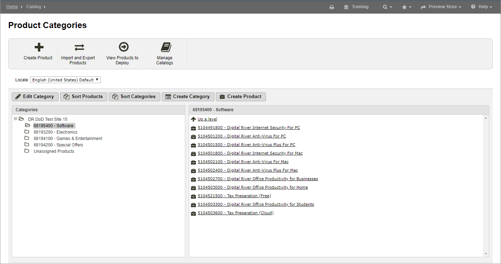

# Categories

A category is a collection of grouped products within your Global Commerce catalog. You can create, manage, delete, and add products to categories within your catalog via the [Global Commerce UI](https://gc.digitalriver.com/gc/ent/login.do). You can also [retrieve categories programmatically](../../../../shopper-apis/product-discovery/categories.md).

You can retrieve your catalog category information by leveraging the available category endpoints.

The following image shows an example of a category page:

