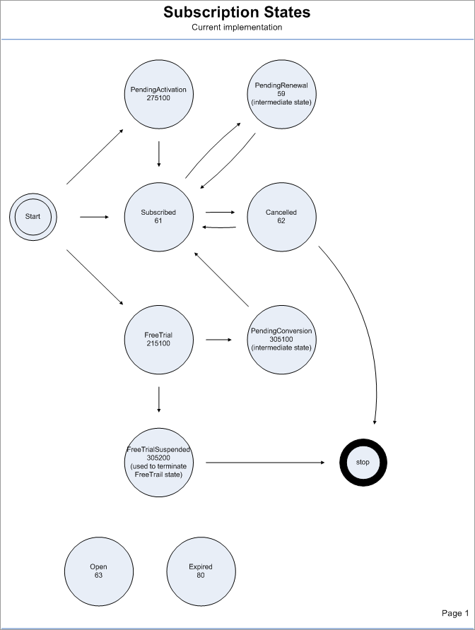

# Subscription state

A subscription has a `state` attribute that describes the current status of the subscription. The `state` of a Subscription is enumerated by the following values: `Subscribed`, `PendingActivation`, `Cancelled`, `PendingRenewal`, and `FreeTrial`.

[Activating a subscription](../../../admin-apis/subscription-management/activating-a-subscription.md) changes the `state` from `PendingActivation` to `Subscribed`.

[Cancelling a subscription](../../../common-shopper-and-admin-apis/subscriptions/cancelling-a-subscription.md) changes the `state` from `Subscribed` or `FreeTrial` to `Cancelled`.

Converting a trial subscription changes the `state` from `FreeTrial` to `Subscribed`.

`PendingRenewal` is an intermediate state when a subscription is getting renewed.

The following diagram shows the subscription states.

