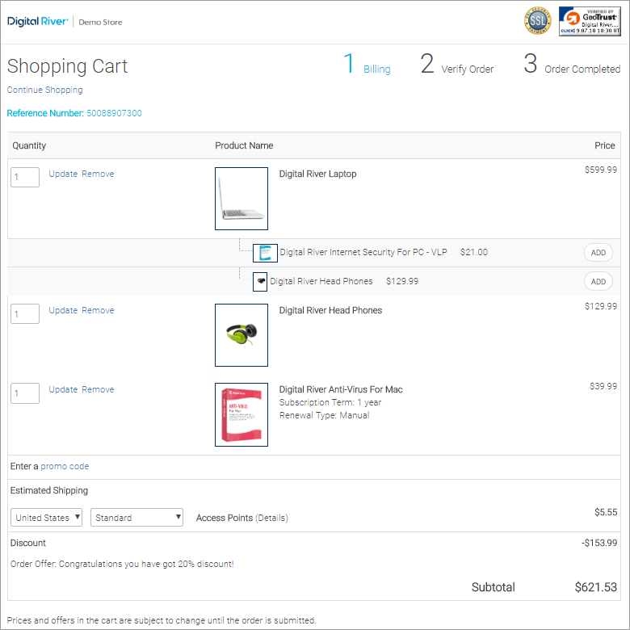

# Carts

The [Carts ](https://www.digitalriver.com/docs/commerce-shopper-api/#tag/Carts)resource provides access to a customer's cart and cart data. Use the Cart resource to get, update, or modify a cart.


**Important**: All methods in this API require an anonymous (limited access) or authenticated (full access) token.


<figure><figcaption></figcaption></figure>

## Cart resource

The following describes some of the key attributes of a [cart](https://www.digitalriver.com/docs/commerce-shopper-api/#tag/Carts/paths/\~1v1\~1shoppers\~1me\~1carts\~1active/post).

### Billing Address

The `billingAddress` object contains the shopper's billing information.

### Charge type

The `chargeType` specifies the charge type for the transaction. The valid values are:

* `customer_initiated`: The shopper initiates the transaction. For example, when shopper first purchases the subscription.
* `merchant_initiated`: The merchant initiates the transaction. For example, when the subscription automatically renews.
* `moto`: Customer service initiates the transaction. For example, a mail order or telephone order transaction.

### Custom attributes

The `customAttributes` is an object that lists the default custom attributes.

### IP address

The `ipAddress` is the shopper's IP address for the current session.

### Line items

The `lineItems` is an object containing the line items associated with the cart.

#### Line item

The `lineItem` is an array of objects that define the line item.

* **Quantity**: The `quantity` is the number of products added to the cart. The value must be a valid integer. If the quantity is not explicitly specified, the default is 1.
* **Product**: The `product` object.
  * `id`: The [product identifier](../../common-shoppers-and-admin-apis-reference/product-identifier.md).
* **Custom attributes**: An customAttributes object contains the default custom attributes.
  * `attribute`: An `attribute` is an array of objects that define the specific qualities of the line item.
    * `name`:  The attribute's name.
    * `value`:  The `value` associated with the attribute.
    * `type`: The type of attribute.
* **Pricing**: The `pricing` object allows you to set the sale price for a line item in a cart. Only available for [unit price override](https://www.digitalriver.com/docs/commerce-shopper-api/#tag/Price-override) and [line item price override](https://www.digitalriver.com/docs/commerce-shopper-api/#tag/Price-override/paths/\~1v1\~1shoppers\~1me\~1carts\~1active%20\(line%20Item%20price\)/post).
  * `currency`: A three-letter [ISO 4217](https://www.xe.com/iso4217.php) currency code. Only available for [unit price override](https://www.digitalriver.com/docs/commerce-shopper-api/#tag/Price-override).
  * `value`: The value of the price override or sale price. Only available for [unit price override](https://www.digitalriver.com/docs/commerce-shopper-api/#tag/Price-override).
  * `itemPrice`: This object allows you to set the overall total item price with quantity (`salePriceWithQuantity`). Only available for [line item price override](https://www.digitalriver.com/docs/commerce-shopper-api/#tag/Price-override/paths/\~1v1\~1shoppers\~1me\~1carts\~1active%20\(line%20Item%20price\)/post).
    * `value`: The value of the overall total item price with quantity.&#x20;
    * `currency`: A three-letter [ISO 4217](https://www.xe.com/iso4217.php) currency code.&#x20;

### Organization identifier

The `organizationId` is the identifier used to identify the business. This string allows a maximum of 50 characters. You can use it to supply the shopper's [`companyId`](./#company-identifier) when they choose [TreviPay](../../../payments/supported-payment-methods/trevipay.md) as the payment method.

### Shipping address

The `shippingAddress` object contains the shopper's shipping information.

### Suppress order confirmation email

A real order uses `suppressorderconfirmationemail` to suppress the order confirmation email. If you want to use this feature, contact your Customer Success Manager.

### Terms of sales acceptance

The `termsOfSalesAcceptance` indicates whether or not the shopper accepted the [Terms of Service](../../../shopper-apis/cart/creating-or-updating-a-cart/terms-of-sale-acceptance.md).

## Pricing fields

When the value for `taxIncludedPrice` is `true`, the listed price information in the response is tax inclusive. When the value is `false`, the listed price information in the response is tax exclusive.

* The following fields display prices based on the `taxIncludedPrice` field's value at the line item level.
  * [`listPrice`](../orders/pricing.md#list-price)
  * [`listPriceWithQuantity`](../orders/pricing.md#list-price-with-quantity)
  * [`salePrice`](../orders/pricing.md#sale-price)
  *   [`salePriceWithQuantity`](../orders/pricing.md#sales-price-with-quantity): This is the total calculated price for the line item with quantity. The sales price with quantity includes:

      * The line item level discount.
      * The "Included in Price fee ( an invisible fee) if it is configured for the line item.
      * If the price list is set to tax-inclusive, this price will include tax.

      It does not include:

      * The order level discount.
      * The "Excluded from price" fee (a visible fee).
      * If the price is set to tax-exclusive, this price will **not** include tax.
* At the order level, the following fields display prices based on the value of the `taxIncludedPrice` field.
  * [`Subtotal`](../orders/pricing.md#subtotal): sum([`salePriceWithQuantity`](../orders/pricing.md#sales-price-with-quantity)) + sum(visible fee)
  * [`subtotalWithDiscount`](../orders/pricing.md#subtotal-with-discount)
  * [`discount`](../orders/pricing.md#discount)
  * [`shippingAndHandling`](../orders/pricing.md#shipping-and-handling)

The following fields are not `taxinclusive`/`exclusive` related. However, they are taxes or include taxes such as [`orderTotal`:](../orders/pricing.md#order-total)

* At the line item level:
  * [`productTax`](../orders/pricing.md#product-tax)
  * [`shippingTax`](../orders/pricing.md#shipping-tax)
  * [`feeTax`](../orders/pricing.md#fee-tax)
  * [`importTax`](../orders/pricing.md#import-tax)
  * [`importDuty`](../orders/pricing.md#import-duty)
* At the order level:
  * [`tax`](../orders/pricing.md#tax)
  * [`importTaxAndDuty`](../orders/pricing.md#import-tax-and-duty)
  * [`orderTotal`](../orders/pricing.md#order-total)
