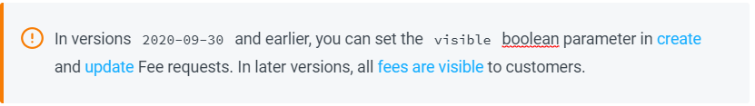

# Versioning

Your account's API version determines the allowable requests and the response structure returned by those requests. The version also defines the structure of generated events. Your account is automatically set to the latest version when you sign up for the Digital River API.

We try to maintain backward compatibility. We do, however, version the Digital River API when a change creates compatibility issues. Each version contains [breaking changes](versioning.md#breaking-changes) that may require you to update your workflow. All versions are dated and we allow you to remain on your current version until you're ready to [update to the latest version](../administration/dashboard/developers/api-keys/updating-your-api-version.md). Once you've upgraded, you still have the ability to [roll back your API version](versioning.md#rolling-back-your-api-version). We also provide you a number of other options for [configuring and testing versions](versioning.md#configuring-and-testing-versions).

## Non-breaking changes

We will release non-breaking changes without introducing new versions. Your code will be able to handle these changes no matter what version it's on. The following changes are non-breaking, and the descriptions for these non-breaking changes appear in the latest version of the documentation:

* Adding a new API resource
* Adding a new method to an API resource
* Adding new optional request parameters to existing API methods
* Adding new properties to an existing API resource
* Changing the order of properties in existing API responses
* Changing existing error response codes or messages
* Adding a field to a request or response
* Adding a value to an enum
* Adding new event types
* Adding or removing prefixes (such as `sku_` for SKU IDs)
* Changing the length or format of strings, such as object IDs, error messages, and other human-readable strings

## Breaking changes

Periodically we release new features that require you to apply changes to your application before you can safely [update to the latest version](../administration/dashboard/developers/api-keys/updating-your-api-version.md) without disruption. These features are "breaking changes."

The following changes are breaking:

* Adding new or modifying existing validation to an existing API resource
* Requiring a parameter that was not required before
* Modifying the expected payload of webhooks and async callbacks
* Changing the data type of an existing field
* Changing the supported filtering for existing API resources
* Renaming a field or API resource
* Adding a new feature that will change the meaning of a field
* Removing an existing field or API resource
* Changing the URL structure of an existing API resource

Whenever we release these breaking changes, we create a new version of the Digital River API and the [API reference portal](https://www.digitalriver.com/docs/digital-river-api-reference/). In the [documentation portal](../), we add notes that describe the breaking changes, such as in the sample below.

## Updating your API version

To see what API version you're currently running and [update to the latest API version](../administration/dashboard/developers/api-keys/updating-your-api-version.md), navigate to the **API keys** section in [Digital River Dashboard](https://dashboard.digitalriver.com/login). If you're running an older version of the API, you can update to the latest version to take advantage of new features and improvements.


Test the new API before updating to the new version. Digital River provides a [test environment](../administration/dashboard/test-and-production-environments.md) where you test Digital River features without affecting live data.


## Rolling back your API version

You can safely [roll back to the previous version](../administration/dashboard/developers/api-keys/updating-your-api-version.md) from your [Dashboard](https://dashboard.digitalriver.com/login).

## Configuring and testing versions

You should always ensure that your [API keys](../developer-resources/api-structure.md#api-keys) are configured for the version expected by your code. In other words, when your code is deployed from test to production, the version on the keys should match the code version.

When performing configurations, we provide you the ability to [test a new version](versioning.md#testing-a-new-version), [create a restricted key and assign it to a version](versioning.md#creating-a-restricted-key-and-assigning-it-to-a-version), [create a webhook and assign it to a version](versioning.md#creating-a-webhook-and-assigning-it-to-a-version), and [test a version with a single API request](versioning.md#testing-a-version-with-a-single-api-request).

### Testing a new version

We recommend that you [update ](../administration/dashboard/developers/api-keys/updating-your-api-version.md)and test a new API version in your [test environment](../administration/dashboard/test-and-production-environments.md) before you update the API version in the [production environment](../administration/dashboard/test-and-production-environments.md). Your production environment can remain on the production version until you are ready to upgrade to the latest version. This allows you to continue using your API keys associated with your production environment while testing a new version in your test environment. When you finish testing, you can [update ](../administration/dashboard/developers/api-keys/updating-your-api-version.md)your production environment.

### Creating a restricted key and assigning it to a version

We recommend that you [create a restricted API key](../administration/dashboard/developers/api-keys/creating-a-restricted-key.md) when you want to limit an application, batch job, or partner to a specific API version. You can also use it to allow your teams to choose when they want to upgrade their API version. You can [create](../administration/dashboard/developers/api-keys/creating-a-restricted-key.md), [edit](../administration/dashboard/developers/api-keys/editing-a-restricted-key.md), [delete](../administration/dashboard/developers/api-keys/deleting-a-restricted-key.md), and [rotate restricted keys](../administration/dashboard/developers/api-keys/rotating-keys.md).

### Creating a webhook and assigning it to a version

You can [create a webhook](../administration/dashboard/developers/webhooks/creating-a-webhook.md) and assign it to a specific version. This allows you to send a specific notification to a team or partner.

### Testing a version with a single API request

You can test a single API request without upgrading your API key. Select a version of the library to change the API version used and [create a webhook endpoint](../administration/dashboard/developers/webhooks/creating-a-webhook.md) with the same API version as the `DigitalRiver.API_VERSION` property in the library. Use the [Release notes](release-notes.md) to find the API version you need and view all breaking changes.

To set an API version with a specific request, send the version number in the header: `digitalriver-version=2020-09-30`
