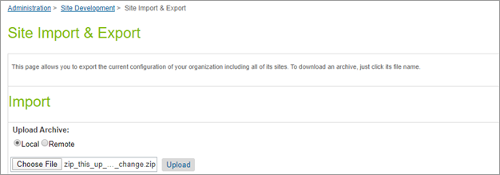
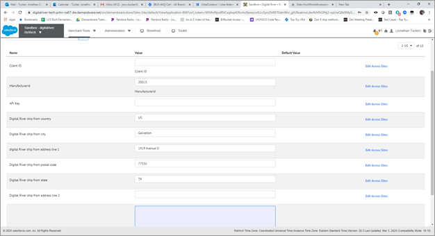

# Implementation guide

## Step 1: Set up Business Manager

To update your storefront’s cartridge path:

1. Sign in to your Salesforce B2C Commerce account.
2. Click Administration, click Sites, and then click Manage Sites. The Storefront Sites page appears.
3. Click the link for the site you want to update under the Name column. The General tab for your site appears.
4. Click the Settings tab.
5. In the Cartridges field, add `int_digitalriver:int_digitalriver_sfra` to your cartridge path. Add `int_digitalriver` to the front of the `cartridge path`, and `int_digitalriver_sfra` before the main storefront cartridge.
6. Click Apply.
7. To update your cartridge path for business manager click Administration, click Sites, and then click Manage Sites.
8. From the Storefront Site page, click the Business Manager Link under Business Manager Site. The Settings tab appears for Business Manager – Settings.
9. Add `bm_digitalriver` to the front of your cartridge path.
10. Add `int_digitalriver:int_digitalriver_sfra` to the end of the cartridge path.
11. Scroll right and click Apply.


## Step 2: Import the custom metadata to the instance

To import the custom metadata to your instance:

1. Navigate to the **metadata** folder in the release package. Inside, find the folder folder called **zip\_this\_up\_after\_site\_change** and enter that folder.
2. Change the name of the folder called **ChangeThisToSiteID** to the Site ID of your current site.
3. Create a ZIP file (for this example, the ZIP file is called **zip\_this\_up\_after\_site\_change.zip**) of the main folder.
4. From Salesforce, click **Administration**, click **Site Development**, and then click **Site Import & Export**. The Site Import and Export page appears.
5. Under **Import**, click **Choose File** and navigate to the **zip\_this\_up\_after\_site\_change.zip** file in **metadata** folder in the release package, and then click **Upload**.
6.  Select the radio button next to the ZIP in the list of imports.

    
7. Import the file.



The zip\_this\_up\_after\_site\_change.zip file contains custom attributes for the following system objects:

Basket & Order

* `drOrderID`
* `drTotalTax`

Product

* `drECCN`
* `drCountryOfOrigin`
* `drFulfill`
* `drPartNumber`

Profile

* `globalCommerceCustID`

Site Preferences

* `drClientID`
* `drAllowedPayments`
* `drManufacturerId`
* `drAPIKey`

Additionally, new Payment Processors are available.

* `DIGITAL_RIVER`
* `DIGITAL_RIVER_APPLE_PAY`
* `DIGITAL_RIVER_PAYPAL`

## Step 3: Enable the Digital River service checker

To enable the Digital River service checker, you must add permission to the targeted access role. This is optional to enable the Digital River Service Checker module.

In Business Manager, go to Administration, Roles & Permissions. Click on the role to modify (or create a new one) to add the Digital River Service Tester module to that role. Click on Business Manager Modules within the role.


In the next menu, add the Write permission to the DR Service Tester group as indicated below.


Lastly, the order status webhook will need to be able to access the order to update the status of the order properly. To enable this, a setting on the site must be changed.

1. Select **Merchant Tools**, select **Site Preferences**, and then click **Order**.
2. Set **Limit Storefront Order Access** to **No**.


## Configuration

### CreateSKUs job

The zip will create the initial configuration for the job used to send SKU data to Digital River. After you import the file, go to the jobstep configuration, and change the site scope to your site ID.

### **Site Preferences**

Selecg **Site**, select **Site Preferences**, select **Custom Preferences**, and then click **Digital River**.



These values to be provided by Digital River.

## Custom code

Code changes for this cartridge are minimal. Descriptions for each will be broken down by feature.

### Create a Customer Profile (during Checkout)

If a customer elects to create a Profile after completing an Order, then you must make some modifications to existing base functionality. You cannot extend this cartridge route because the profile is not passed to the viewData object, which is needed to store the globalCommerceCustID that identifies a customer to Digital River.

* Order controller (\app\_storefront\_base\cartridge\controllers\Order.js), CreateAccount route Inside the route:BeforeComplete function

Add the following in the declaration section:



```javascript
var digitalriver = require('*/cartridge/models/digitalriver');
```




Add the following code later in the same function, after the customer is created and assigned to the order:



```javascript
var drResponse = digitalriver.createCustomer(newCustomerProfile.email, newCustomerProfile.customerNo);if (drResponse.id !== null) {   newCustomerProfile.custom.globalCommerceCustID = drResponse.id;}
```




Payment implementation follows best practices for SFRA. This means the files from the base are extended. You don't need to adjust existing templates or scripts from `app_storefront_base`.

You only need to make one adjustment to base code, and that is to replace the calculateTax call. To accomplish this, delete the hook associated with the base `calculateTax` function in cartridges/app\_storefront\_base/hooks.json.


**Note**: Investigate your cartridge structure for any other potential reference.


## External interfaces

The following services share one profile and one credential:

* [DigitalRiver.createcustomer](implementation-guide.md#create-customer-service)
* [DigitalRiver.createsku](implementation-guide.md#create-sku-service)
* [DigitalRiver.request](implementation-guide.md#request-service)

### Create customer service

Sends a JSON object to Digital River consisting of email, SFCC CustomerNumber, and a metadata object.

### Create SKU service

Runs in a job context. Iterates over products assigned to the site catalog and sends them to Digital River.

### Request service

Service called for all Payments / Orders.

## Firewall requirements

No adjustments to the SFCC Firewall settings are needed.
