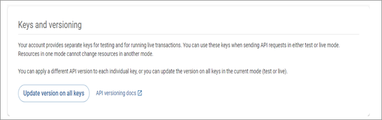
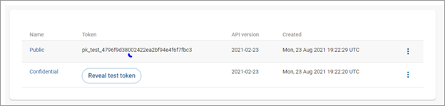
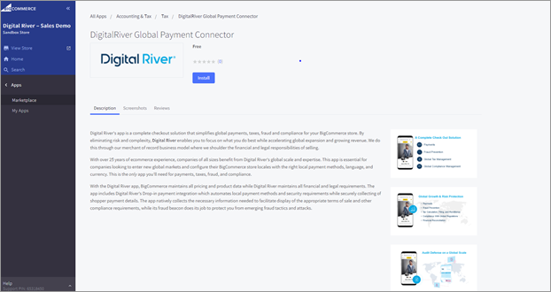
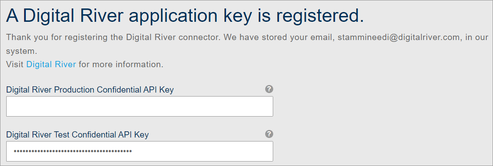
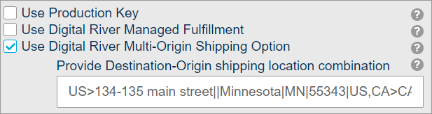
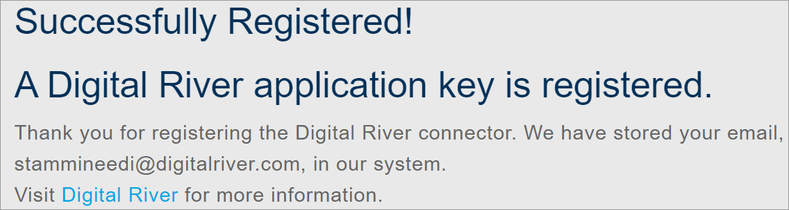

# Install the Digital River app

To install the Digital River app:

1. Use the [Quick start guide](https://docs.digitalriver.com/digital-river-api/quick-start-guide) to set up a test account and then sign in to the Digital River [Dashboard](https://dashboard.digitalriver.com/login) to access your test account, set the API version, and get your [API keys](https://docs.digitalriver.com/digital-river-api/administration/dashboard/developers/api-keys). From the Dashboard:
   1. [Set the API version to 2021-02-23](https://docs.digitalriver.com/digital-river-api/administration/dashboard/developers/api-keys/updating-your-api-version#updating-your-api-version-on-all-keys).
   2.  [Obtain both the Public and Confidential Keys](https://docs.digitalriver.com/digital-river-api/administration/dashboard/developers/api-keys/getting-your-api-keys). \

       

       
2. Sign in to [BigCommerce](https://login.bigcommerce.com/).&#x20;
   1. Go to [https://www.bigcommerce.com/apps/digital-river/](https://www.bigcommerce.com/apps/digital-river/).
   2. Install the **Digital River** app from the BigCommerce Marketplace. Note that the site owner must install the app.&#x20;

## Registering your API keys

To register your API keys:

1. In the BigCommerce platform, click **Apps** and then **Digital River** to open the Digital River Payments, Fraud, Tax & Compliance Management app.
2. Enter your test confidential key in the **Digital River Test Confidential API Key** field. These keys are available on the [Digital River Dashboard](https://dashboard.digitalriver.com/apikeys). The Digital River Production Confidential API Key field can remain empty until you provision the live site.\
   **Note**: You are not required to provide the production confidential API key. The **Digital River Production Confidential API Key** field can remain empty until you are ready to go live.
3. Choose one of the following options:
   *   Select the **Use Digital River Fulfillment** check box if you will be using Digital River managed fulfillment.

       &#x20;\

       **Important**: Do not select the **Use Production Key** check box until testing is complete and you are ready to launch your site.
   * **Required**. Select the **Use Digital River Multi-Origin Shipping Option** check box and enter the shipping location combination in the **Provide Destination-Origin shipping location combination** field. \
     \
     The shipping location combination contains the shipping address,  a pair of two-letter [Alpha-2 country codes](https://www.iban.com/country-codes) that represent the ship-to country and ship-from country delimited by a right chevron (`>`) such as `FR>FR`. Where France (FR) is the ship-to country and France (FR) is the ship-from country. When entering the shipping location, use the following format: `line1|line2|city|state|postal code|country code`.\
     You can use a comma (`,`) to delimit multiple shipping location combinations and a double pipe (`||`)such as if there is no value. For example: \
     \
     `US>134-135 main street||Minnesota|MN|55343|US,CA>CA,FR>FR,DEFAULT>CN`\
     **Note**:
     * When shipping from Canada or the United States, you must provide the full ship-from address for tax purposes.
     * If a ship-to country code is NOT found in the list provided and if the `DEFAULT` key is available, then apply the value from the `DEFAULT` key. In the example above, it would be `CN`.&#x20;
     * If there is NO `DEFAULT` key in the string, then BigCommerce will apply a tax estimate origin address country\_code/locale country\_code.&#x20;
     * If the **Provide Destination-Origin shipping location combination** field is empty, then BigCommerce will apply the tax estimate origin address country\_code/locale country\_code.
4. Click **Submit**. When you successfully register your API keys, you will see the following message:

