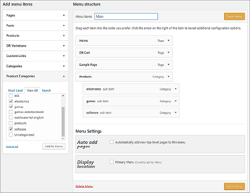

# Install the Digital River plugin

Plug Digital River into your WordPress store, and we’ll work behind the scenes to process payments, fight fraud, fulfill orders, and shield your business from a global tax and regulatory risk.‌&#x20;

## Installation is easy, just follow these steps!

## Step 1: Install WordPress

1. Download the [latest WordPress release](https://wordpress.org/download/), unzip it, and move it to the desired directory of your local server.
2. Follow [How to install WordPress](https://wordpress.org/support/article/how-to-install-wordpress/) to get started with your new site.
3. Sign in to WordPress with the credentials you created.

## Step 2: Install plugin and theme


**Important**: The WordPress Plugin does not include the Digital River theme. Contact your Account Manager for availability and pricing of integrating this theme into your WordPress storefront.


### Install the Digital River WordPress plugin and theme

1. In WordPress, click Plugins and select Add New.
2. Locate the Digital River Global Commerce plugin and click Install Now.

## Step 3: Activate the plugin and theme

1. In WordPress, click Plugins, and select Installed Plugins.
2. Click Activate under the Digital River Global Commerce plugin. Once activated, the Activate toggles to Deactivate.\
   &#x20;&#x20;
3. Click Appearance and select Themes.
4. Hover over the Digital River theme and click the Activate button. &#x20;

## Step 4: Configure the plugin

1. Click Digital River and select Settings.
2. Enter your Site ID, API Key, API Secret, Domain, Payment Services API Plugin Key, Username, Password, and choose whether you want to run a scheduled product import or import your products manually, as well as whether to enable a test order.\
   &#x20;.png>)
3. Optional. Select the payment methods you want to enable under Payments, including choosing button types and button colors. When you are finished, click the Save button to save your settings. Note that the credit card and PayPal payment methods are always enabled by default.\
   &#x20;.png>)\
   &#x20; \
   \
   **Important**: Apple Pay requires a merchant domain registration from Apple and you need to put the payment processing certificate on your sites. See [Setting Up Apple Pay Requirements](https://developer.apple.com/documentation/passkit/apple\_pay/setting\_up\_apple\_pay\_requirements/) for more information.
4. Click Digital River and select Products.
5. To import products manually, click the Import Products button and wait for the products to display. Once imported, you can see your whole product catalog, including details like currencies, locales, and categories. \
   .png>)&#x20;


**Important**: You can only update products in Global Commerce. Once updated, you must manually sync them with WordPress. See Edit your product for instructions on updating the product.

To import updated products, you must click the Import Products button on the Digital River Products page to manually sync the product updates you made in Global Commerce.


### Step 5: Add the menu to the header

1. Click Appearance and select Menus.
2. Click the Screen Options tab, and select the Product Categories check box if it is not already selected.\
   &#x20;&#x20;
3. Select the categories and subcategories you want to display on the current Menu and click the Add to Menu button. \
   &#x20;
4. Use drag and drop to arrange your menu items in the order you want them to appear.\
   &#x20;
5. Optional. Select the Primary Menu check box if you want to add this menu to the "Main Menu.". Depending on your theme, you may want to add this menu to a different menu.\
   &#x20;&#x20;
6. When you are finished, click the Save Menu button to save your changes.
7. Verify the menu appears on the home page.


**Tip:** If you get a 404 error for the Category or Product Detail page, refresh your permalinks by clicking Settings, selecting Permalinks, and clicking Save Changes. Note that you don't need to make any changes. (Refer to [https://wordpress.stackexchange.com/questions/156978/custom-post-typesingle-page-returns-404-error#answer-261763](https://wordpress.stackexchange.com/questions/156978/custom-post-typesingle-page-returns-404-error#answer-261763) for additional details.)


