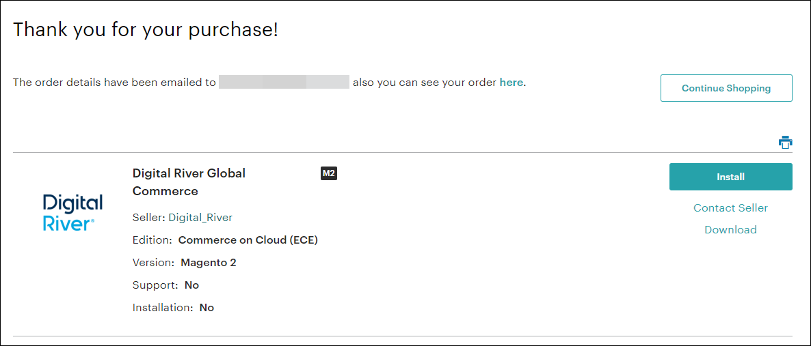
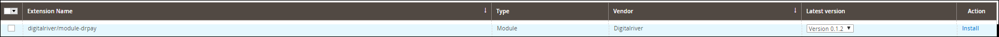
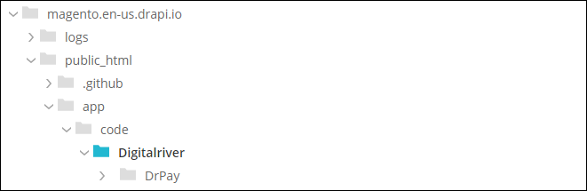
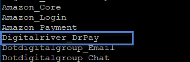
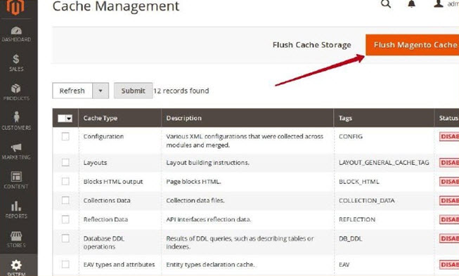

# Install the Magento Extension

Choose where you want to install the Magento Extension from:

* [Install from Magento Marketplace](install-the-magento-extension.md#install-from-magento-marketplace)
* [Install from the command line](install-the-magento-extension.md#install-from-the-command-line)

## Install from Magento Marketplace

1. Choose one of the following options to download and install the Magento Extension:
   * Go to the Magento Marketplace ([marketplace.magento.com](https://marketplace.magento.com)), enter `Digital River` in the search field, and click **Digital River Global Commerce** in the search results.\
     &#x20;.png>) &#x20;
   * Go directly to the Digital River Global Commerce module page: [https://marketplace.magento.com/digitalriver-module-drpay.html](https://marketplace.magento.com/digitalriver-module-drpay.html).
2. Select the edition. The Digital River Global Commerce (drpay) extension is available for three editions of Magento: Open Source (CE), Commerce on Prem (EE) and Commerce on Cloud (ECE). However, you must be using Magento version 2.3 or later to integrate with the Digital River Global Commerce (drpay) module.
3. Select your store version.
4. Click **Add to Cart**. The drpay module is a free add-on that works seamlessly with your Magento application.
5. Click **Checkout** () and then click **Proceed to Checkout**.
6. Register for a new account or sign in to your Magento account.
7. From the **Checkout** page, click **Place Order**. The **Thank You** page appears.\
   &#x20;&#x20;
8.  From the **Thank You** page, choose one of the following options to install the Magento Extension:\
    **Important:** After you install the drpay module, request Digital River configuration details by sending an email to [magento@digitalriver.com](mailto:magento@digitalriver.com).\
    a. From the **Thank you** page, click **Install**. The Keys page appears.\
    b. Click **Create A New Access Key**, type your access key in the **Create New Access Key** dialog box, and then click **OK**.\
    c. Copy the private and public access keys.\
    d. Log in to Magento Admin.\
    e. Select **System**, select **Web Set-up Wizard** and then click **System Config**.\
    f. Enter your Public Access Key and Private Access Key from Step c above.\
    g. Navigate to **Extension Manager** in the left navigation panel.\
    h. Click **Review and Install** in the Magento Marketplace Account.\
    i. Scroll down to locate the drpay extension and click **Install** under the **Action** column.\
    &#x20;&#x20;

    Magento will perform a Readiness Check, Create a Backup, and finish the Component Install. Your drpay extension is now available in your Magento application.

## Install from the command line

1. After downloading the extension (also accessible via github [https://github.com/DRMagento/Connector/tree/current\_release](https://github.com/DRMagento/Connector/tree/current\_release)), connect to your Magento root folder via an FTP/SFTP/SSH client, go to the /app/code directory, and create a new subdirectory named `Digitalriver`.\
   \
   **Note:** If the `code` folder does not exist you must create it. Please ensure capitalization matches exactly with the path provided (For more information on creating modules, see [https://devdocs.magento.com/videos/fundamentals/create-a-new-module/](https://devdocs.magento.com/videos/fundamentals/create-a-new-module/)).
2. Upload the `DrPay` folder to the new Digitalriver directory created in the previous step.\
   &#x20;&#x20;
3. Connect to your Magento root folder via SSH and run the following commands:`$ php bin/magento module:enable Digitalriver_DrPay`\
   `$ php bin/magento setup:upgrade`
4. The following commands can also be run, but are considered optional:
   * To clear static view files, run\
     `$ php bin/magento module:enable --clear-static-content--all option`
   * To clear previously generated JS code if it exists, run\
     `$ rm pub/static/_requirejs/frontend/Magento/luma/en_US/ requirejs-config.js`
5. To confirm the Digitalriver\_DrPay is enabled, run the following command:\
   `$ php bin/magento module:status`\
   response: Digitalriver\_DrPay is included in the list of enabled modules.\
   &#x20;&#x20;
6.  To confirm the module is active, run the following command:\
    `$ grep Digitalriver_DrPay app/etc/config.php`

    response: `'Digitalriver_DrPay' => 1,`
7.  From your Magento dashboard, select **System**, select **Cache Management**, and then click **Flush Magento Cache**. \
    &#x20; \
    Alternatively, you can execute the following two commands from the command line after upgrade:

    _`$ php bin/magento cache:flush`_

    _`$ php bin/magento cache:clean`_
