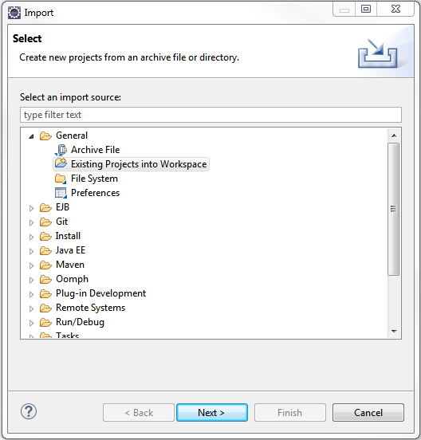
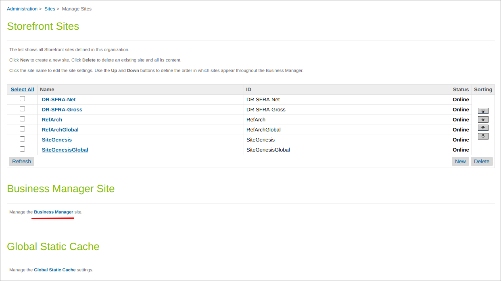
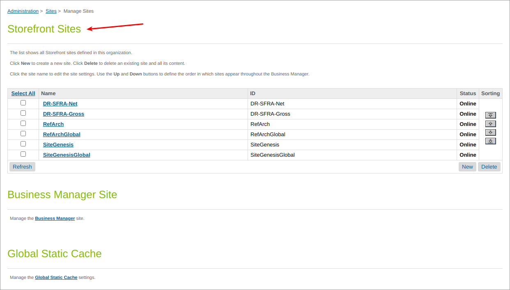
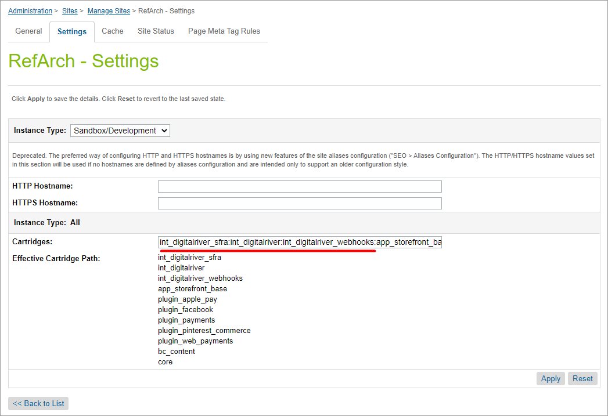
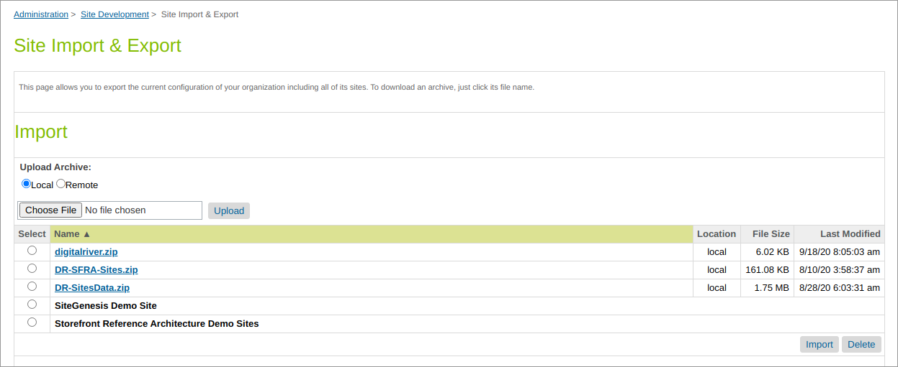

# Install the Salesforce B2C LINK Cartridge

You can install the Salesforce B2C LINK Cartridge in two easy steps:

* [Step 1: Set up the Business Manager](install-the-salesforce-b2c-link-cartridge.md#importing-cartridges)
* [Step 2: Import metadata](install-the-salesforce-b2c-link-cartridge.md#step-2-import-metadata)

## Step 1: Set up the Business Manager 

### Importing cartridges


**Note**: The following steps detail how to deploy the cartridges using Salesforce UX Studio for Eclipse. Alternatively, you can use Visual Studio Code with the Prophet Debugger extension.


1. Establish a new digital server connection with your SFCC Instance.
2. Import cartridges to a workspace in Salesforce UX Studio. \
   
3. Add cartridges to the Project Reference of Server Connection.\
   &#x20;
4. Wait until Studio completes the workspace build and uploads source codes to the sandbox.

### Assigning cartridges to the site

1. Select **Administration**, select **Sites**, and then click **Manage Sites**. Click the **Business Manager** link.\
   
2. At the beginning of the cartridge path, add the following: `bm_digitalriver:` and `:int_digitalriver`. Click **Apply**. \
   .png>)
3. Select **Administration**, select **Sites**, and then click **Manage Sites**. Select your site from the list named **Storefront Sites**. \
   
4. Click the **Settings** tab. At the beginning of the cartridge path, add the following: `int_digitalriver_sfra:int_digitalriver:int_digitalriverwebhooks`. Click **Apply**. \
   

## Step 2: Import metadata

Select **Administration**, select **Site Development**, and then click **Site Import & Export**. Upload the **digitalriver.zip** file from the metadata folder.

Select **digitalriver.zip** and finish the import process.


**Note**: We configured the **digitalriver.zip** metadata specifically for the RefArch site. If you have another site, unpack the zip file and rename the folder inside the Sites directory to exactly match your site ID. Then create a new zip archive from the `digitalriver`folder and use it to import the metadata.


### Jobs  

The zip file creates the initial configuration for the jobs used to send SKU data to Digital River. Once the file is imported, you must select **Administration**, select **Operations**, select **Jobs**, and then click the **Job Steps Configuration** tab and change the site **Scope** to your site ID. See the [user guide](user-guide.md) for more information on jobs.

Additionally, you should schedule the jobs to run regularly. See the [user guide](user-guide.md) for detailed information about each of the jobs.
