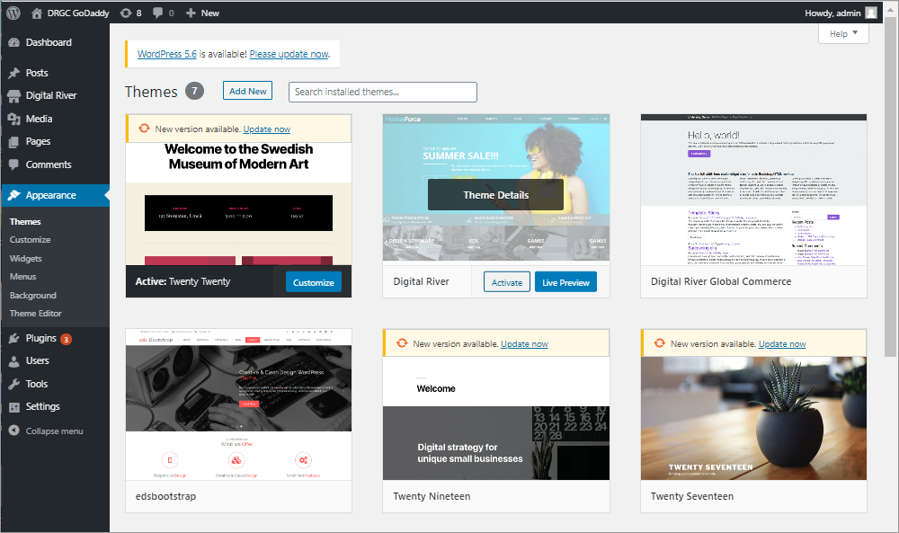

# Install the WordPress Plugin

Plug Digital River into your WordPress store, and we’ll work behind the scenes to process payments, fight fraud, and shield your business from a global tax and regulatory risk.‌

## Installation is easy, just follow these steps!

Follow the first three steps to install the WordPress plugin. When the installation is complete, configure the plugin by following the last three steps.

* [Step 1: Install WordPress](install-the-wordpress-plugin.md#step-1-install-wordpress)
* [Step 2: Install plugin and theme](install-the-wordpress-plugin.md#step-2-install-plugin-and-theme)
* [Step 3: Activate the plugin and theme](install-the-wordpress-plugin.md#step-3-activate-the-plugin-and-theme)

## Step 1: Install WordPress

1. Download the [latest WordPress release](https://wordpress.org/download/) (version 5.1 or later), unzip it, and move it to the desired directory of your local server.
2. Follow [How to install WordPress](https://wordpress.org/support/article/how-to-install-wordpress/) to get started with your new site.
3. Sign in to WordPress with the credentials you created.

## Step 2: Install plugin and theme


**Important**: The WordPress Plugin does not include the Digital River theme. Contact your Account Manager for availability and pricing of integrating this theme into your WordPress storefront.


1. In WordPress, click **Plugins** and select **Add New**.
2. Locate the Digital River Global Commerce plugin and click **Install Now**.

## Step 3: Activate the plugin and theme

1. In WordPress, click **Plugins**, and select **Installed Plugins**.
2. Click **Activate** under the Digital River Global Commerce plugin. Once activated, the Activate link toggles to Deactivate.\
   &#x20;.png>)   &#x20;
3. Click **Appearance** and select **Themes**.
4. Hover over the Digital River theme and click **Activate**.\
   &#x20;&#x20;
