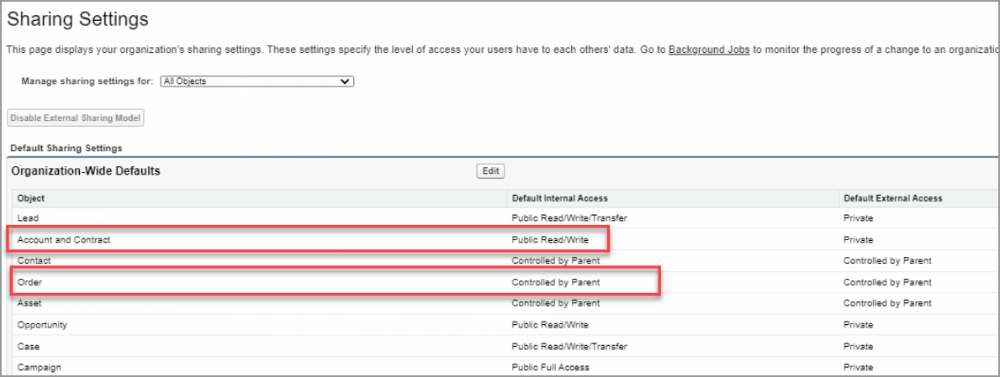

# Step 13: Manage permission sets

### General permissions

All storefront users must be granted the following permissions. Add these permissions to a permission set(s) that gets assigned to all storefront users.

| Object        | Permission type                                         |
| ------------- | ------------------------------------------------------- |
| Cart          | Grant **Create**, **Edit**, and **Delete** permissions. |
| Order Product | Grant **Read** access to all fields.                    |

### Sharing settings 

Ensure that the Sharing Settings for the Order object are set to **Public Read/Write**. If the Order object is set to **Controlled by Parent**, the Sharing Settings for Account and Contract should be **Public Read/Write**.

### Digital River permission sets

| Permission set                       | Description                                                                                                                          |
| ------------------------------------ | ------------------------------------------------------------------------------------------------------------------------------------ |
| Digital River Connector - Admin      | Assign this permission set to Admin users to access the **Digital River App Configuration** page and to update configurations in it. |
| DigitalRiver Connector - Shopper     | Assign this permission set to all Storefront users.                                                                                  |
| DigitalRiver Connector - Integration | Assign this permission set to the Integration users.                                                                                 |
| DigitalRiver Connector - Refunds     | Assign this permission set to customer service representatives (CSRs) who initiate the refunds.                                      |

### Assign users to a permission set

To assign users to a permission set:

1. Type **Permission Sets** in the **Search** field and press **Enter**.\
     
2. Click **Permission Sets**. The **Permission Sets** page appears.
3.  In the **Permission Set Label** column, click the permission set you want to add users to.\
      

    This example shows how to assign a **Digital River Connector – Admin** permission set to users. .png>) 
4. On the **Permission Set** page, click **Manage Assignments**.\
     
5. Click **Add Assignments**.\
     
6. Select one or more users who you want to assign to this permission set and click **Assign**. The assigned users now appear in the modified permission set.\
     

See the [Digital River permission sets table](step-13-manage-permission-sets.md) to repeat the above-mentioned steps for assigning relevant permission sets.
