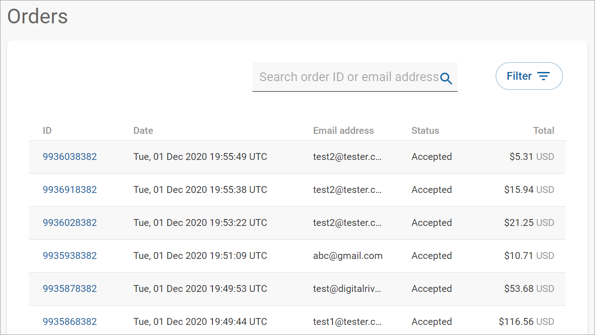
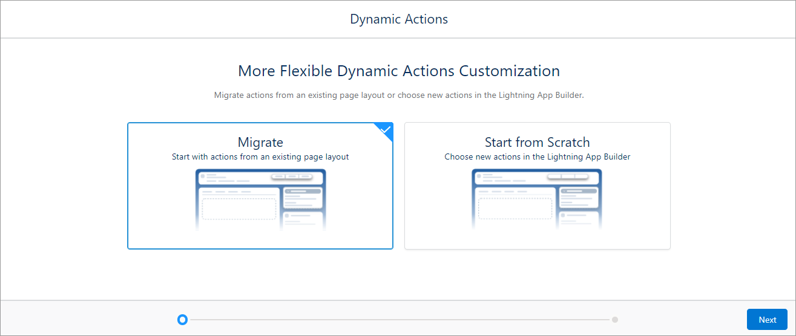

# Step 15: Integrating refunds

You can manage refunds at the order and line-item level from the Digital River [Dashboard](https://dashboard.digitalriver.com). The Salesforce Lightning app provides a Refunds button on the order. When you click the **Refunds** button, you will be redirected to the Order details page in the Dashboard.


The Refunds button is only available to users assigned to the [DigitalRiver Connector - Refunds permission set](step-13-manage-permission-sets.md).


To add the Refunds button to your Order layout:

1. Click the App Launcher .
2. Type `Orders` in the **Search** field and click **Orders**.\
   
3. Click a link under the **Order Number** column.\
   
4. Click **Setup** .png>) and select **Edit Page**.\
   
5. Click the top panel.\
   
6. Click **Upgrade Now** button on the panel to the right of the Lightning App Builder.
7. Click **Migrate** from the **Dynamic Actions** dialog and then click **Next**.\
   
8. Select **Order Layout** and click **Finish**.
9. Click **Add Action** in the panel to the right.\
   
10. Type `Refunds` in the **Search actions** field and click **Refunds**.
11. Click **+ Add Filter** to set the action visibility.\
    
12. Clicked the **Advanced** tab and then click the **Select** button.\
    
13. Select **Permissions** from the filter list in the **Select field** dialog.
14. Select **Custom Permission** from the next filter list.\
    
15. Select **digitalriverv3.Enable\_Refunds\_Button** from the next filter list.
16. Click **Done**.
17. Set the **Value** field to **True** and click **Done**.\
    
18. Click **Done**.\
    \
    The Refunds button appears in the top panel.\
    
19. Click **Save** and then click **Activate**.
