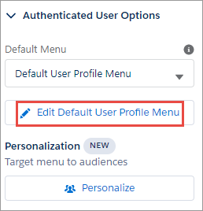

# Drag and drop (custom) components

## Custom pages and menu items

The app provides custom components for three custom pages: My Wallet, My Tax Certificates, and My Tax Identifiers. We recommended that you create these custom pages as required.

To customize a page in Experience Builder:

1. Click **Setup** .
2.  Type `All Sites` in the **Quick Find** field and click **All Sites**. The All Sites page appears.

    
3. From the All sites page, click **Builder**.\
   
4. Click **Builder**. The Experience Builder page appears\
   .
5. Click **Home** at the top left corner. \
   &#x20;
6. To create a new custom page, click **+ New Page**.  \
   .png>) \
   The page will also appear on the **Menu Item**.\
   &#x20;&#x20;
7. Click **Standard Page**.\
   
8. Select a preconfigured page from the list or click **+ New Blank Page**.
9. Complete the prompts and click **Create**.

## Create a custom menu

To add a menu:

1. Click **Setup** .
2.  Type `All Sites` in the **Quick Find** field and click **All Sites**. The All Sites page appears.

    
3. From the All sites page, click **Builder**.\
   
4. Click the customizable user profile dropdown in the toolbar\
   .
5. From the **Customizable User Profile** dropdown, select **Authenticated User Options**..png>)
6. Click the **Edit Default User Profile Menu** dropdown.\
   
7. Click **+ Add Menu item**.\
   \
   &#x20;&#x20;
8. Select **Site Page** from the **Type** dropdown.&#x20;
   * Type a name for the menu item in the **New menu Item**  field.
   * Select the custom page you want to use from the **Page** dropdown list.\
     &#x20;
9. Click **Save Menu**.
10. Click **Publish**.

## Add a custom component to a custom page

To add a custom component to a custom page:

1. Click **Setup** .
2.  Type `All Sites` in the **Quick Find** field and click **All Sites**. The All Sites page appears.

    
3. From the All sites page, click **Builder**.\
   
4. Click **Home** at the top left corner. \
   &#x20;
5. Type the name of the custom page in the **Find a page** field, and click the custom page in the results list.\
   
6. Click Components  on the upper left side of the page. The list displays the components that you can add to the page.\
   
7. Drag and drop the custom component on the custom page.
8. Click **Publish**.
9. Repeat steps 5 through 8 for remaining custom components you want to add to various pages.

## Add Tax Certificates component on the My Account page

This example shows how to add the Tax Certificates component to the **My Account** page.

To add a tax certificate component on the **My Account** page:

1. Click **Setup** .
2.  Type `All Sites` in the **Quick Find** field and click **All Sites**. The All Sites page appears.

    
3. From the All sites page, click **Builder**.\
   
4. Click **Home** at the top left corner. \
   &#x20;
5. Type `My Account` in the **Find a page** field, and click **My Account**.\
   
6. Click Components  on the upper left side of the page. The list displays the components that you can add to the page.\
   
7. Scroll down to **drb2b\_usersTaxCertificates**.&#x20;
8. Drag and drop **drb2b\_usersTaxCertificates** to the My Accounts page.
9. Click **Publish**.
