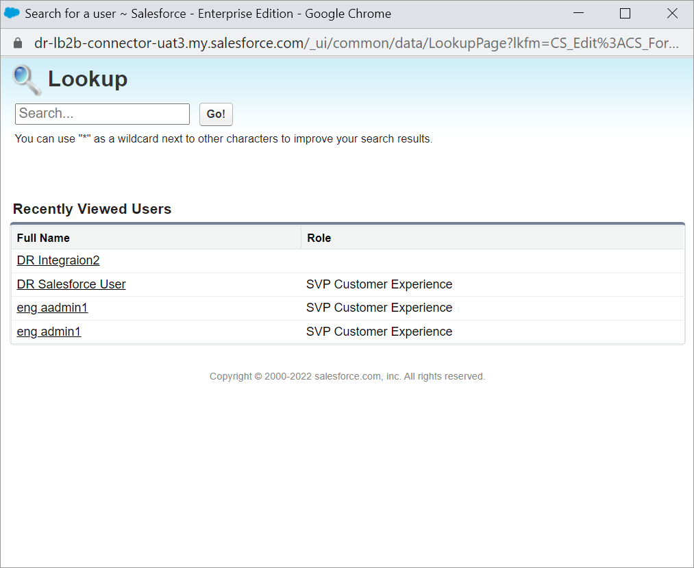

# Step 4: Configure DCM logs

A `Custom` object called DCM Application Logs captures all application logs for the Salesforce Lightning app.


The default Logging Level is always set to ERROR. Set the default Logging Level to WARN in production. Valid values for the Logging Level include DEBUG, INFO, WARN, and ERROR. &#x20;


The Logging framework comes with options to configure the Logging Level and Retention Days at the Org Level, Profile Level, and User Level.

1. Click **Setup** .png>) and select **Setup** from the dropdown list.\
   &#x20;&#x20;
2. Type `Custom Settings` in the **Quick Find** field and click **Custom Settings**.\
   
3. Click **Manage** next to the **Digital River - Logger Settings** link under **Label**.\
   &#x20;&#x20;
4. Click **New** to configure the logger settings. \
   &#x20;
5. Select either **Profile** or **User** from the **Location** dropdown, click the **Location Lookup**  icon, and then click the appropriate profile or user from the **Lookup** list.
6. Enter values for the **Logging level** and **Retention Days**. Valid values for the Logging Level include **DEBUG**, **INFO**, **WARN**, **ERROR**, and **NONE**.\
    &#x20;
7. Optional. Enter the number of days to retain the log record in the **Retention Days** field.&#x20;
8. Click **Save**.
