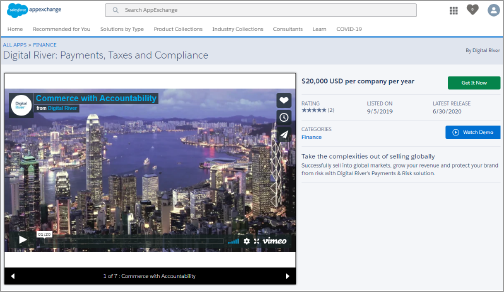
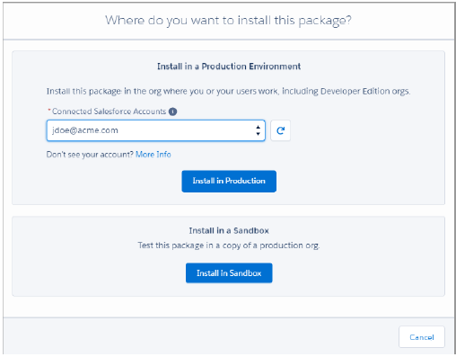
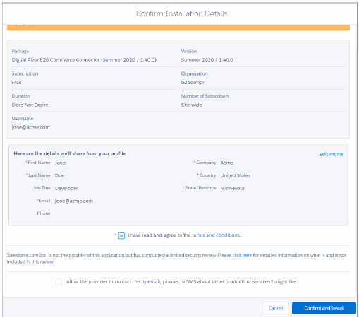
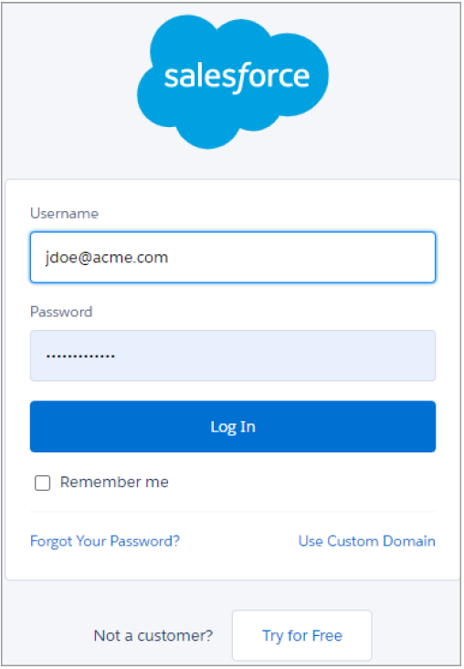
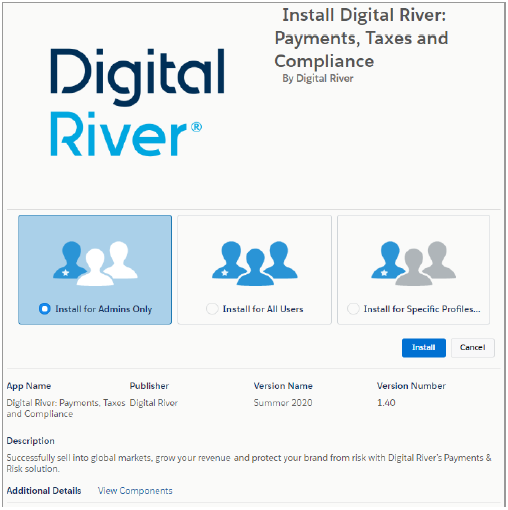
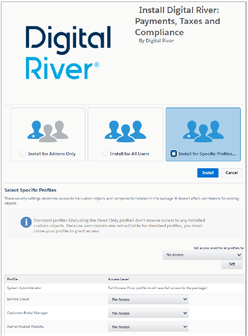
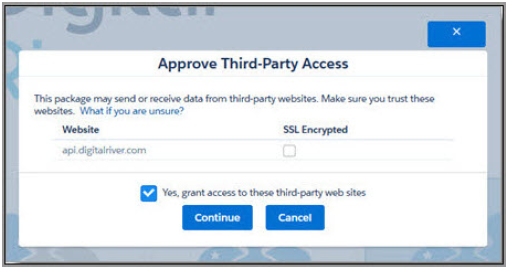
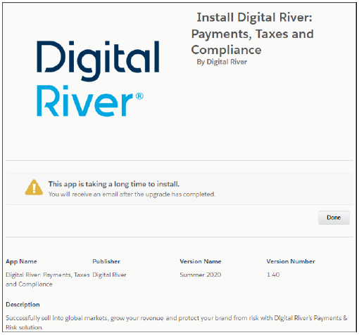

# Step 1: Install the Salesforce B2B Commerce App

To install the Salesforce B2B Commerce App:


Before you click Install, you must map your B2B Customer profile to provide the appropriate access and permissions.


1. Go to the [AppExchange](https://appexchange.salesforce.com/appxListingDetail?listingId=a0N3A00000FR4bwUAD). \
   
2. Click **Get It Now**.
3. Select your account from the **Connected Salesforce Accounts** drop-down list.
4.  Choose one of the following options:

    * **Install in Sandbox**–to install the App in your sandbox environment.
    * **Install in Production**–to install the App in your production environment.

    ​
5. From the Confirm Installation Details dialog, select the check box for **I have read and agree to the terms and conditions**, and click **Confirm and Install**.\
   &#x20;
6. Type your user credentials for your Salesforce account in the fields and click **Log In**.\
    \
   The installation wizard appears.\
   &#x20;
7. Click **Install for Specific Profiles**, and select **Full Access** for all profiles you want to use with the Salesforce B2B Commerce App.\
   &#x20;
8. Click **Install**.
9. From the Approve Third-Party Access dialog, select the **Grant Access** check box and click **Continue** to start the installation process.\
   &#x20; \
   The installation process will take approximately 5-10 minutes. \
   
10. When you receive an email stating "Package Digital River B2B Commerce App Install Successful," click **Done**. The Installed Packages page appears and displays the latest version number for the Digital River B2B Commerce App.

.png>)
