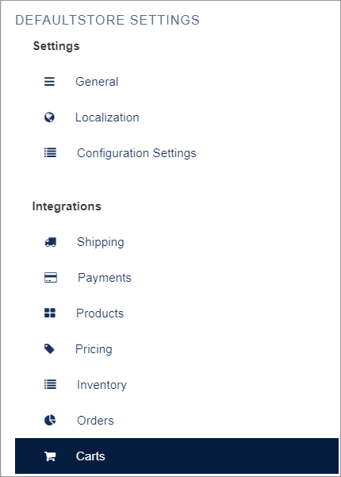
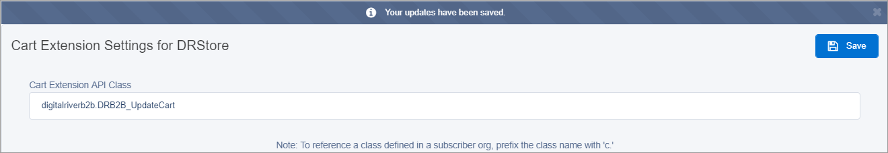
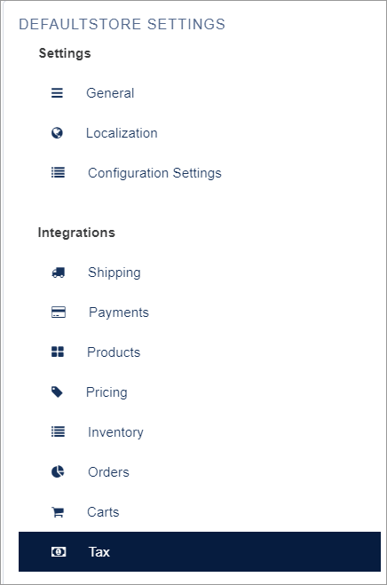
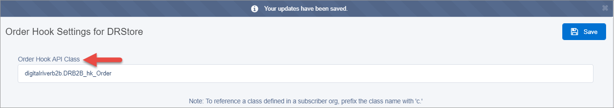

# Step 10: Create service overrides

Create the configuration settings for each module using the information in the following table. You can also find these settings on the Service Overrides tab in the DR CC Config Settings spreadsheet.

| Extension Setting                                                                                                                                               | Extension API Class                                                                                                                                                                            |
| --------------------------------------------------------------------------------------------------------------------------------------------------------------- | ---------------------------------------------------------------------------------------------------------------------------------------------------------------------------------------------- |
| [Cart Extension Settings for DefaultStore](step-10-create-service-overrides.md#step-10a-create-a-service-override-for-the-cart-extension-api-class)             | 
digitalriverb2b.DRB2B_UpdateCart

<strong>Note</strong>: This extension setting was deprecated in Salesforce B2B Commerce (CloudCraze) 4.12 and greater and is no longer required.
 |
| [Tax Calculation API Class for DefaultStore](step-10-create-service-overrides.md#step-10b-create-a-service-override-for-the-tax-calculation-api-class)          | 
digitalriverb2b.DRB2B_CartTaxCaluclation

<strong>Note</strong>: The misspelling is accurate. Do not change the spelling.
                                                   |
| [Order Hook Settings for DefaultStore](step-10-create-service-overrides.md#step-10c-create-a-service-override-for-the-order-hook-settings-for-the-defaultstore) | digitalriverb2b.DRB2B\_hk\_Order                                                                                                                                                               |

## Step 10a: Create a service override for the Cart Extension AP I class 

This service override task sets the Shipping Amount to $0.00 for digital products.

To create a service override for the Cart Extension API class:

1. Under **<**_**storefront name**_**> SETTINGS** on the **CC Admin** tab, click **Carts.**\
   
2. Copy the Extension API Class value from the table above, paste`digitalriverb2b.DRB2B_UpdateCart` in the **Cart Extension API Class** field and click **Save**.

## Step 10b: Create a service override for the Tax Calculation API class. 

Salesforce B2B Commerce (CloudCraze) does not calculate taxes out-of-the-box (OOTB). Instead, it exposes a Tax Calculation webhook which you must override. This step will implement the new business-specific tax calculations by making a call to Digital River for Tax Calculations to override the Tax Calculation webhook.

To create a service override for the Tax Calculation API class:

1. Click **Tax** under **DEFAULTSTORE SETTINGS**. \
   
2.  Copy the Tax Calculation API Class value from the table above, paste

    &#x20;`digitalriverb2b.DRB2B_CartTaxCaluclation` in the **Tax Calculation API Class** field and click Save.

## Step 10c: Create a service override for the Order Hook settings for the DefaultStore 

You need to update the CC Order status based on the Digital River Order status. To create a service override for the Order Hookup API class:

1. Click **Orders** under **DEFAULTSTORE SETTINGS**. \
   
2.  Copy the Tax Calculation API Class value from the table above, paste

    &#x20;`digitalriverb2b.DRB2B_hk_Order` in the **Order Hook API Class** field and click **Save**.

